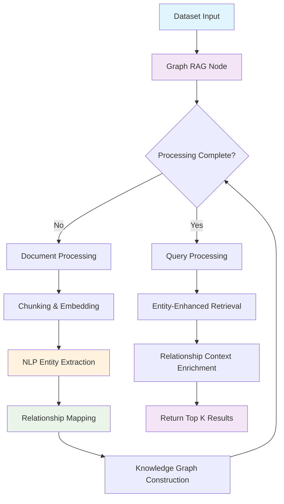
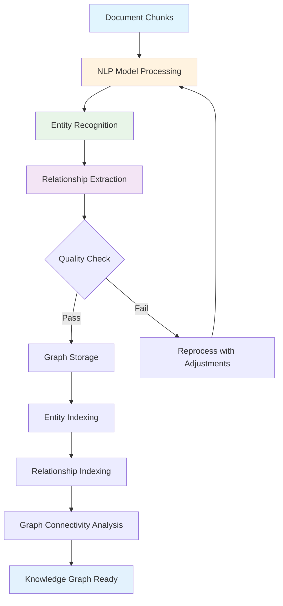
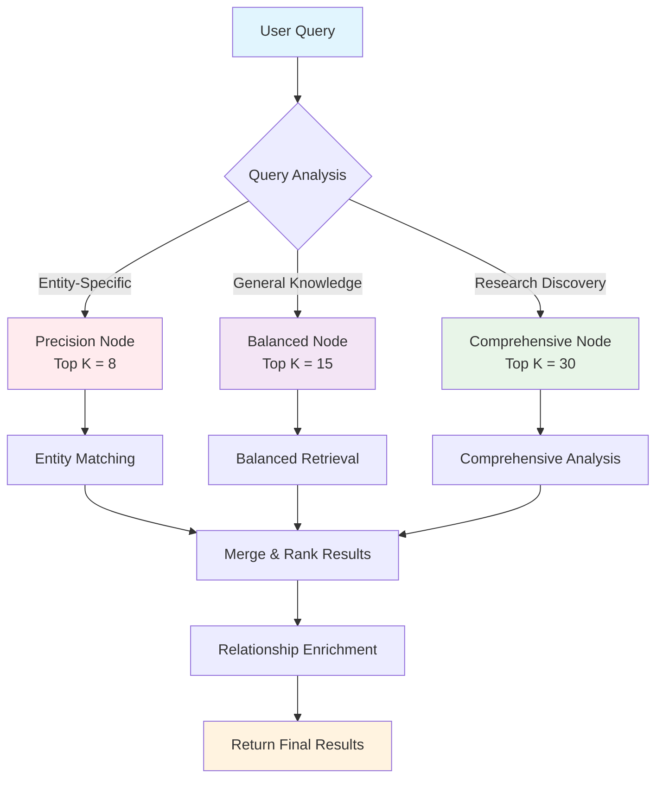

Graph RAG nodes are advanced knowledge graph-powered RAG (Retrieval-Augmented Generation) components that combine document processing, NLP entity extraction, relationship mapping, and intelligent retrieval operations into a single, semantically-aware unit. This comprehensive guide covers all aspects of managing graph RAG nodes, from knowledge graph construction to advanced entity-relationship optimization strategies.

## What are Graph RAG Nodes?

Graph RAG nodes are sophisticated RAG components that automatically handle:

- **Document Processing**: Intelligent document ingestion and preparation for knowledge extraction
- **Chunking**: Automated text segmentation optimized for entity and relationship extraction
- **NLP Entity Extraction**: Advanced entity recognition using large language models (LLM)
- **Relationship Mapping**: Automated identification and mapping of entity relationships
- **Knowledge Graph Construction**: Building and maintaining comprehensive knowledge graphs
- **Semantic Retrieval**: Query-based document retrieval enhanced with graph-based context
- **Quality Metrics**: Built-in evaluation of knowledge graph quality and retrieval effectiveness

### Key Benefits

- **Knowledge Graph Intelligence**: Leverages extracted entities and relationships for deeper understanding
- **Semantic Context**: Provides rich contextual information beyond traditional keyword matching
- **Domain Expertise**: Captures and utilizes domain-specific knowledge structures
- **Relationship Discovery**: Automatically identifies connections between concepts and entities
- **Scalable Knowledge**: Efficiently handles large-scale knowledge graph construction and querying
- **Quality Assurance**: Built-in metrics for entity extraction and relationship mapping quality

## Available Endpoints

Graph RAG nodes are managed through two primary endpoints:

| Endpoint | Method | Purpose | Documentation |
|----------|---------|---------|---------------|
| **List Graph RAG Nodes** | `GET` | Retrieve all graph RAG nodes from a flow | [📄 List Documentation](/api-reference/flows/nodes/graph-rag/list) |
| **Update Graph RAG Configuration** | `PATCH` | Modify graph RAG node settings | [🔧 Update Documentation](/api-reference/flows/nodes/graph-rag/update) |

### Base URL Structure

```
https://{flow_name}.flows.graphorlm.com/graph-rag
```

- **{flow_name}**: Your flow identifier
- All endpoints require API token authentication
- Content-Type: `application/json` for update operations

## Core Concepts

### Node Structure

Graph RAG nodes follow the standard GraphorLM node structure with knowledge graph-specific extensions:

```json
{
  "id": "graph-rag-1748287628685",
  "type": "graph-rag",
  "position": {"x": 600, "y": 300},
  "style": {"height": 220, "width": 360},
  "data": {
    "name": "Knowledge Graph RAG",
    "config": {
      "topK": 15
    },
    "result": {
      "updated": true,
      "processing": false,
      "waiting": false,
      "has_error": false,
      "updatedMetrics": true,
      "total_processed": 2150,
      "total_chunks": 640,
      "total_retrieved": 120,
      "total_entities": 1280,
      "total_relationships": 850
    }
  }
}
```

### Configuration Parameters

Graph RAG nodes have a focused configuration approach with internal knowledge graph optimization:

| Parameter | Type | Default | Description |
|-----------|------|---------|-------------|
| `topK` | integer \| null | 5 | Number of top results to retrieve after knowledge graph processing. Set to `null` for unlimited processing |

### Knowledge Graph Metrics

Graph RAG nodes provide comprehensive knowledge graph and retrieval tracking:

| Field | Type | Description |
|-------|------|-------------|
| `updated` | boolean | Node processing status with current configuration |
| `processing` | boolean | Whether the node is currently processing |
| `waiting` | boolean | Whether the node is waiting for dependencies |
| `has_error` | boolean | Error status indicator |
| `updatedMetrics` | boolean | Whether evaluation metrics have been computed |
| `total_processed` | integer | Total number of documents processed through the knowledge graph pipeline |
| `total_chunks` | integer | Number of chunks generated during document processing |
| `total_retrieved` | integer | Number of documents retrieved in recent queries |
| `total_entities` | integer | Number of entities extracted from the knowledge graph |
| `total_relationships` | integer | Number of relationships identified between entities |

### Internal Configuration

Graph RAG nodes use predefined internal configurations for optimal knowledge graph construction:

#### Chunking Configuration
```python
GRAPH_RAG_CHUNKING_CONFIG = {
    "embeddingModel": "text-embedding-3-small",
    "chunkingSplitter": "TITLE",
    "chunkSize": 5000,
    "elementsToRemove": []
}
```

#### Retrieval Configuration
```python
GRAPH_RAG_RETRIEVAL_CONFIG = {
    "searchType": "similarity",
    "topK": 5,  # Overridden by node's topK configuration
    "scoreThreshold": 0.5
}
```

#### Entity Extraction Configuration
```python
DEFAULT_ALLOWED_NODES = [
    "Person", "Organization", "Location", 
    "Product", "Technology"
]

DEFAULT_ALLOWED_EDGES = [
    "IS_A", "PART_OF", "MEMBER_OF", 
    "WORK_FOR", "KNOWS"
]

NLP_EXTRACTION_MODEL = "gpt-4.1"
```

## Graph RAG Strategies

Graph RAG nodes support multiple operational strategies based on knowledge graph complexity and domain requirements:

### Precision-Focused Strategy

**Configuration**: `topK: 5-10`

```json
{
  "config": {
    "topK": 8
  }
}
```

**Characteristics**:
- **Focus**: High-relevance entity-based retrieval with precise relationship mapping
- **Resource Usage**: Low system overhead with focused entity processing
- **Processing Speed**: Fastest knowledge graph traversal and entity matching
- **Quality Profile**: High precision with targeted entity coverage

**Best For**:
- Expert knowledge systems requiring precise entity matching
- Critical decision support with specific domain entities
- Real-time applications with strict performance requirements
- Scenarios where entity precision is more important than comprehensive coverage

**Trade-offs**:
- **Strengths**: Fast, resource-efficient, highly relevant entity-based results
- **Limitations**: May miss broader entity relationships or peripheral knowledge connections

### Balanced Strategy

**Configuration**: `topK: 12-20`

```json
{
  "config": {
    "topK": 15
  }
}
```

**Characteristics**:
- **Focus**: Optimal balance of entity coverage and relationship exploration
- **Resource Usage**: Moderate system consumption with balanced processing
- **Processing Speed**: Good knowledge graph traversal performance
- **Quality Profile**: Balanced entity precision and relationship coverage

**Best For**:
- General-purpose knowledge management systems
- Business intelligence with entity-relationship analysis
- Educational platforms requiring comprehensive knowledge coverage
- Multi-domain applications with diverse entity types

**Trade-offs**:
- **Strengths**: Good overall performance, versatile knowledge graph utilization
- **Limitations**: Not specialized for extreme precision or exhaustive relationship mapping

### Comprehensive Strategy

**Configuration**: `topK: 25-40`

```json
{
  "config": {
    "topK": 30
  }
}
```

**Characteristics**:
- **Focus**: Thorough knowledge graph exploration with extensive relationship mapping
- **Resource Usage**: Higher system consumption with intensive entity processing
- **Processing Speed**: More intensive graph traversal and analysis
- **Quality Profile**: High entity recall with comprehensive relationship coverage

**Best For**:
- Research platforms requiring extensive entity analysis
- Complex domain knowledge systems with rich entity relationships
- Investigation and discovery applications
- Academic research with comprehensive knowledge requirements

**Trade-offs**:
- **Strengths**: Comprehensive coverage, rich relationship discovery, deep domain analysis
- **Limitations**: Higher resource requirements, longer processing times

### Unlimited Strategy

**Configuration**: `topK: null`

```json
{
  "config": {
    "topK": null
  }
}
```

**Characteristics**:
- **Focus**: Complete knowledge graph analysis with exhaustive entity-relationship exploration
- **Resource Usage**: Maximum system consumption with comprehensive processing
- **Processing Speed**: Most intensive processing with full graph traversal
- **Quality Profile**: Maximum entity and relationship coverage

**Best For**:
- Exhaustive knowledge discovery projects
- Complete domain analysis and mapping
- Research scenarios requiring full knowledge graph traversal
- Resource-unlimited comprehensive entity-relationship analysis

**Trade-offs**:
- **Strengths**: Complete coverage, no missed entity connections, comprehensive domain knowledge
- **Limitations**: Highest resource usage, longest processing times

## Strategy Selection Matrix

| Use Case | Entity Need | Relationship Need | Resource Constraints | Recommended Strategy |
|----------|-------------|-------------------|---------------------|---------------------|
| Expert Systems | High | Low | High | Precision-Focused (5-10) |
| General Knowledge | Medium | Medium | Medium | Balanced (12-20) |
| Research Analysis | Medium | High | Low | Comprehensive (25-40) |
| Domain Discovery | Low | Maximum | None | Unlimited (null) |
| Real-time Systems | High | Low | High | Precision-Focused (5-10) |
| Investigation Tools | Low | High | Medium | Comprehensive (25-40) |

## Common Workflows

### Basic Graph RAG Workflow



### Knowledge Graph Construction Workflow



### Multi-Strategy Implementation



## Authentication & Authorization

All graph RAG endpoints require API token authentication:

```http
Authorization: Bearer YOUR_API_TOKEN
```

### Token Requirements
- **Scope**: Must have flow management permissions
- **Expiry**: Check token validity before operations
- **Security**: Use HTTPS for all API communications

<Note>
Generate API tokens through the [API Tokens guide](/guides/api-tokens).
</Note>

## Response Formats

### Standard Success Response

```json
{
  "success": true,
  "message": "Operation completed successfully",
  "node_id": "graph-rag-1748287628685"
}
```

### Error Response Format

```json
{
  "detail": "Descriptive error message"
}
```

### Common Status Codes

| Code | Meaning | Action Required |
|------|---------|-----------------|
| 200 | Success | Continue with result |
| 400 | Bad Request | Check request format |
| 401 | Unauthorized | Verify API token |
| 404 | Not Found | Check flow/node existence |
| 422 | Validation Error | Review configuration parameters |
| 500 | Server Error | Contact support if persistent |

## Integration Examples

### Graph RAG Knowledge Manager

```python
import requests
import time
from typing import Dict, List, Any, Optional

class GraphRagKnowledgeManager:
    def __init__(self, flow_name: str, api_token: str):
        self.flow_name = flow_name
        self.api_token = api_token
        self.base_url = f"https://{flow_name}.flows.graphorlm.com"
        self.headers = {"Authorization": f"Bearer {api_token}"}
    
    def get_all_nodes(self) -> List[Dict[str, Any]]:
        """Retrieve all graph RAG nodes"""
        response = requests.get(f"{self.base_url}/graph-rag", headers=self.headers)
        response.raise_for_status()
        return response.json()
    
    def analyze_knowledge_graph_performance(self) -> Dict[str, Any]:
        """Comprehensive knowledge graph analysis"""
        nodes = self.get_all_nodes()
        
        analysis = {
            "summary": {
                "total_nodes": len(nodes),
                "active_nodes": 0,
                "processing_nodes": 0,
                "error_nodes": 0,
                "nodes_with_metrics": 0
            },
            "knowledge_graph": {
                "total_documents": 0,
                "total_chunks": 0,
                "total_entities": 0,
                "total_relationships": 0,
                "total_retrieved": 0
            },
            "resource_usage": {
                "low": 0,
                "medium": 0,
                "high": 0,
                "unlimited": 0
            },
            "quality_metrics": {
                "avg_entity_density": 0,
                "avg_relationship_ratio": 0,
                "graph_connectivity": "unknown",
                "knowledge_coverage": "unknown"
            },
            "performance_distribution": {},
            "entity_analysis": {
                "entity_types": {},
                "relationship_types": {},
                "domain_coverage": {}
            },
            "recommendations": []
        }
        
        total_top_k = 0
        nodes_with_top_k = 0
        
        for node in nodes:
            config = node.get("data", {}).get("config", {})
            result = node.get("data", {}).get("result", {})
            
            # Node status analysis
            if result.get("processing"):
                analysis["summary"]["processing_nodes"] += 1
            elif result.get("has_error"):
                analysis["summary"]["error_nodes"] += 1
            elif result.get("updated"):
                analysis["summary"]["active_nodes"] += 1
            
            # Metrics tracking
            if result.get("updatedMetrics"):
                analysis["summary"]["nodes_with_metrics"] += 1
            
            # Resource usage categorization
            top_k = config.get("topK")
            if top_k is None:
                analysis["resource_usage"]["unlimited"] += 1
            elif top_k <= 10:
                analysis["resource_usage"]["low"] += 1
            elif top_k <= 20:
                analysis["resource_usage"]["medium"] += 1
            else:
                analysis["resource_usage"]["high"] += 1
            
            # Performance distribution
            if top_k is not None:
                performance_key = f"topK_{top_k}"
                analysis["performance_distribution"][performance_key] = (
                    analysis["performance_distribution"].get(performance_key, 0) + 1
                )
                total_top_k += top_k
                nodes_with_top_k += 1
            
            # Knowledge graph metrics
            analysis["knowledge_graph"]["total_documents"] += result.get("total_processed", 0)
            analysis["knowledge_graph"]["total_chunks"] += result.get("total_chunks", 0)
            analysis["knowledge_graph"]["total_entities"] += result.get("total_entities", 0)
            analysis["knowledge_graph"]["total_relationships"] += result.get("total_relationships", 0)
            analysis["knowledge_graph"]["total_retrieved"] += result.get("total_retrieved", 0)
        
        # Calculate quality metrics
        kg = analysis["knowledge_graph"]
        if kg["total_chunks"] > 0 and kg["total_entities"] > 0:
            analysis["quality_metrics"]["avg_entity_density"] = kg["total_entities"] / kg["total_chunks"]
        
        if kg["total_entities"] > 0 and kg["total_relationships"] > 0:
            analysis["quality_metrics"]["avg_relationship_ratio"] = kg["total_relationships"] / kg["total_entities"]
            
            # Determine graph connectivity
            connectivity = kg["total_relationships"] / kg["total_entities"]
            if connectivity > 1.5:
                analysis["quality_metrics"]["graph_connectivity"] = "high"
            elif connectivity > 0.8:
                analysis["quality_metrics"]["graph_connectivity"] = "medium"
            else:
                analysis["quality_metrics"]["graph_connectivity"] = "low"
        
        if kg["total_chunks"] > 0 and kg["total_entities"] > 0:
            coverage = kg["total_entities"] / kg["total_chunks"]
            if coverage > 3.0:
                analysis["quality_metrics"]["knowledge_coverage"] = "excellent"
            elif coverage > 1.5:
                analysis["quality_metrics"]["knowledge_coverage"] = "good"
            else:
                analysis["quality_metrics"]["knowledge_coverage"] = "limited"
        
        # Calculate averages
        if nodes_with_top_k > 0:
            analysis["performance_distribution"]["average_top_k"] = round(total_top_k / nodes_with_top_k, 1)
        
        # Generate recommendations
        analysis["recommendations"] = self._generate_knowledge_graph_recommendations(analysis)
        
        return analysis
    
    def _generate_knowledge_graph_recommendations(self, analysis: Dict[str, Any]) -> List[str]:
        """Generate knowledge graph optimization recommendations"""
        recommendations = []
        summary = analysis["summary"]
        kg = analysis["knowledge_graph"]
        quality = analysis["quality_metrics"]
        resource_usage = analysis["resource_usage"]
        
        # Node health recommendations
        if summary["error_nodes"] > 0:
            recommendations.append(
                f"Address {summary['error_nodes']} nodes with errors to improve knowledge graph reliability"
            )
        
        if summary["processing_nodes"] > summary["total_nodes"] * 0.3:
            recommendations.append(
                "High percentage of nodes are processing - consider knowledge graph resource allocation review"
            )
        
        # Knowledge graph quality recommendations
        if quality["graph_connectivity"] == "low":
            recommendations.append(
                "Low graph connectivity detected - consider comprehensive strategy for better relationship mapping"
            )
        
        if quality["knowledge_coverage"] == "limited":
            recommendations.append(
                "Limited knowledge coverage - consider increasing Top K values for better entity extraction"
            )
        
        # Resource optimization recommendations
        if resource_usage["unlimited"] > 0:
            recommendations.append(
                f"Review {resource_usage['unlimited']} unlimited nodes for knowledge graph resource optimization"
            )
        
        if resource_usage["high"] > resource_usage["low"] + resource_usage["medium"]:
            recommendations.append(
                "Consider balancing resource usage - many nodes use high Top K values for entity processing"
            )
        
        # Entity analysis recommendations
        if kg["total_entities"] > 0:
            entity_retrieval_rate = (kg["total_retrieved"] / kg["total_entities"]) * 100
            if entity_retrieval_rate < 5:
                recommendations.append(
                    "Low entity-based retrieval rate - consider optimizing knowledge graph query strategies"
                )
            elif entity_retrieval_rate > 50:
                recommendations.append(
                    "High entity retrieval rate - consider optimizing Top K values for efficiency"
                )
        
        return recommendations
    
    def print_knowledge_graph_report(self, analysis: Dict[str, Any]):
        """Print formatted knowledge graph analysis report"""
        print("🧠 Graph RAG Knowledge Graph Analysis Report")
        print("=" * 60)
        print(f"Flow: {self.flow_name}")
        print(f"Analysis Date: {time.strftime('%Y-%m-%d %H:%M:%S')}")
        
        # Summary section
        summary = analysis["summary"]
        print(f"\n📊 Node Summary:")
        print(f"  Total Nodes: {summary['total_nodes']}")
        print(f"  Active Nodes: {summary['active_nodes']}")
        print(f"  Processing Nodes: {summary['processing_nodes']}")
        print(f"  Error Nodes: {summary['error_nodes']}")
        print(f"  Nodes with Metrics: {summary['nodes_with_metrics']}")
        
        # Knowledge graph section
        kg = analysis["knowledge_graph"]
        print(f"\n🕸️  Knowledge Graph Metrics:")
        print(f"  Documents Processed: {kg['total_documents']:,}")
        print(f"  Chunks Generated: {kg['total_chunks']:,}")
        print(f"  Entities Extracted: {kg['total_entities']:,}")
        print(f"  Relationships Mapped: {kg['total_relationships']:,}")
        print(f"  Documents Retrieved: {kg['total_retrieved']:,}")
        
        # Quality metrics
        quality = analysis["quality_metrics"]
        print(f"\n🎯 Knowledge Graph Quality:")
        print(f"  Entity Density: {quality['avg_entity_density']:.2f} entities/chunk")
        print(f"  Relationship Ratio: {quality['avg_relationship_ratio']:.2f} relationships/entity")
        print(f"  Graph Connectivity: {quality['graph_connectivity']}")
        print(f"  Knowledge Coverage: {quality['knowledge_coverage']}")
        
        # Resource usage section
        resource = analysis["resource_usage"]
        print(f"\n⚡ Resource Usage Distribution:")
        print(f"  Low Usage (≤10): {resource['low']} nodes")
        print(f"  Medium Usage (11-20): {resource['medium']} nodes")
        print(f"  High Usage (>20): {resource['high']} nodes")
        print(f"  Unlimited Usage: {resource['unlimited']} nodes")
        
        # Performance metrics
        perf = analysis["performance_distribution"]
        if "average_top_k" in perf:
            print(f"\n🎯 Performance Metrics:")
            print(f"  Average Top K: {perf['average_top_k']}")
        
        # Recommendations
        if analysis["recommendations"]:
            print(f"\n💡 Knowledge Graph Optimization Recommendations:")
            for i, rec in enumerate(analysis["recommendations"], 1):
                print(f"  {i}. {rec}")
        
        print("\n" + "=" * 60)

    def optimize_knowledge_graph_strategy(self, node_id: str, 
                                        entity_density: float = None,
                                        relationship_ratio: float = None,
                                        domain_complexity: str = "medium") -> str:
        """Recommend optimal strategy based on knowledge graph characteristics"""
        
        print(f"🔍 Analyzing knowledge graph characteristics for node {node_id}...")
        
        # Default to balanced
        recommended = "balanced"
        reasoning = []
        
        # Analyze entity density
        if entity_density is not None:
            if entity_density > 4.0:
                recommended = "precision"
                reasoning.append(f"High entity density ({entity_density:.2f}) suggests precision strategy")
            elif entity_density < 1.5:
                recommended = "comprehensive" 
                reasoning.append(f"Low entity density ({entity_density:.2f}) suggests comprehensive strategy")
        
        # Analyze relationship complexity
        if relationship_ratio is not None:
            if relationship_ratio > 2.0:
                if recommended != "precision":  # Don't override precision
                    recommended = "comprehensive"
                reasoning.append(f"High relationship ratio ({relationship_ratio:.2f}) suggests comprehensive exploration")
            elif relationship_ratio < 0.5:
                recommended = "precision"
                reasoning.append(f"Low relationship ratio ({relationship_ratio:.2f}) suggests precision focus")
        
        # Consider domain complexity
        if domain_complexity == "high":
            if recommended in ["precision"]:
                recommended = "comprehensive"
                reasoning.append("High domain complexity requires comprehensive knowledge graph analysis")
        elif domain_complexity == "low":
            if recommended in ["comprehensive", "unlimited"]:
                recommended = "balanced"
                reasoning.append("Low domain complexity allows balanced approach")
        
        print(f"💡 Recommended strategy: {recommended}")
        if reasoning:
            print("   Reasoning:")
            for reason in reasoning:
                print(f"   • {reason}")
        
        return recommended

# Usage example
manager = GraphRagKnowledgeManager("my-rag-pipeline", "YOUR_API_TOKEN")
analysis = manager.analyze_knowledge_graph_performance()
manager.print_knowledge_graph_report(analysis)

# Strategy optimization
recommended = manager.optimize_knowledge_graph_strategy(
    "graph-rag-1748287628685",
    entity_density=2.8,
    relationship_ratio=1.6,
    domain_complexity="high"
)
```

### Graph RAG Strategy Optimizer

```javascript
class GraphRagStrategyOptimizer {
  constructor(flowName, apiToken) {
    this.flowName = flowName;
    this.apiToken = apiToken;
    this.baseUrl = `https://${flowName}.flows.graphorlm.com`;
  }

  async getAllNodes() {
    const response = await fetch(`${this.baseUrl}/graph-rag`, {
      headers: { 'Authorization': `Bearer ${this.apiToken}` }
    });
    
    if (!response.ok) {
      throw new Error(`Failed to fetch nodes: ${response.statusText}`);
    }
    
    return await response.json();
  }

  async optimizeKnowledgeGraphStrategy(nodeId, targetProfile = 'balanced') {
    const profiles = {
      'precision': { 
        topK: 8, 
        description: 'High-precision entity matching with focused relationships',
        entityFocus: 'high',
        relationshipFocus: 'low',
        resourceUsage: 'low'
      },
      'balanced': { 
        topK: 15, 
        description: 'Balanced entity coverage and relationship exploration',
        entityFocus: 'medium',
        relationshipFocus: 'medium',
        resourceUsage: 'medium'
      },
      'comprehensive': { 
        topK: 30, 
        description: 'Thorough knowledge graph exploration with extensive relationships',
        entityFocus: 'high',
        relationshipFocus: 'high',
        resourceUsage: 'high'
      },
      'unlimited': { 
        topK: null, 
        description: 'Complete knowledge graph analysis with exhaustive coverage',
        entityFocus: 'maximum',
        relationshipFocus: 'maximum',
        resourceUsage: 'maximum'
      }
    };

    const profile = profiles[targetProfile];
    if (!profile) {
      throw new Error(`Invalid profile: ${targetProfile}. Available: ${Object.keys(profiles).join(', ')}`);
    }

    console.log(`🧠 Optimizing Graph RAG node ${nodeId} for ${targetProfile} profile`);
    console.log(`   Configuration: Top K = ${profile.topK || 'unlimited'}`);
    console.log(`   Description: ${profile.description}`);
    console.log(`   Entity Focus: ${profile.entityFocus}`);
    console.log(`   Relationship Focus: ${profile.relationshipFocus}`);
    console.log(`   Resource Usage: ${profile.resourceUsage}`);

    const response = await fetch(`${this.baseUrl}/graph-rag/${nodeId}`, {
      method: 'PATCH',
      headers: {
        'Authorization': `Bearer ${this.apiToken}`,
        'Content-Type': 'application/json'
      },
      body: JSON.stringify({ config: { topK: profile.topK } })
    });

    if (!response.ok) {
      throw new Error(`Optimization failed: ${response.statusText}`);
    }

    const result = await response.json();
    console.log(`✅ ${result.message}`);
    return result;
  }

  async batchKnowledgeGraphOptimization(optimizations) {
    console.log(`🔄 Starting batch knowledge graph optimization for ${optimizations.length} nodes`);
    const results = [];

    for (const { nodeId, profile, reason } of optimizations) {
      try {
        console.log(`\n🎯 Processing ${nodeId}: ${reason || 'Manual optimization'}`);
        const result = await this.optimizeKnowledgeGraphStrategy(nodeId, profile);
        results.push({ nodeId, profile, success: true, result, reason });
        
        // Small delay to avoid overwhelming the API
        await new Promise(resolve => setTimeout(resolve, 800));
      } catch (error) {
        console.error(`❌ Failed to optimize ${nodeId}: ${error.message}`);
        results.push({ nodeId, profile, success: false, error: error.message, reason });
      }
    }

    this.generateKnowledgeGraphOptimizationReport(results);
    return results;
  }

  generateKnowledgeGraphOptimizationReport(results) {
    console.log('\n📋 Knowledge Graph Optimization Report');
    console.log('=====================================');
    
    const successful = results.filter(r => r.success);
    const failed = results.filter(r => !r.success);
    
    console.log(`Total Operations: ${results.length}`);
    console.log(`Successful: ${successful.length}`);
    console.log(`Failed: ${failed.length}`);
    
    if (successful.length > 0) {
      console.log('\n✅ Successful Knowledge Graph Optimizations:');
      successful.forEach(({ nodeId, profile, reason }) => {
        console.log(`   ${nodeId} → ${profile} profile (${reason})`);
      });
    }
    
    if (failed.length > 0) {
      console.log('\n❌ Failed Optimizations:');
      failed.forEach(({ nodeId, profile, error, reason }) => {
        console.log(`   ${nodeId} (${profile}): ${error} - ${reason}`);
      });
    }
  }

  async recommendKnowledgeGraphOptimizations() {
    const nodes = await this.getAllNodes();
    const recommendations = [];

    console.log('🔍 Analyzing knowledge graph nodes for optimization opportunities...\n');

    for (const node of nodes) {
      const config = node.data.config || {};
      const result = node.data.result || {};
      const topK = config.topK;
      const nodeName = node.data.name;

      let recommendation = null;

      // Knowledge graph specific analysis
      const entityDensity = result.total_chunks > 0 ? 
        (result.total_entities || 0) / result.total_chunks : 0;
      const relationshipRatio = result.total_entities > 0 ? 
        (result.total_relationships || 0) / result.total_entities : 0;

      // Analysis logic for knowledge graphs
      if (result.has_error) {
        recommendation = {
          nodeId: node.id,
          nodeName,
          currentTopK: topK,
          issue: 'Knowledge graph construction errors',
          suggestedProfile: 'precision',
          reason: 'Reduce complexity to address entity extraction stability issues',
          priority: 'high',
          entityDensity,
          relationshipRatio
        };
      } else if (entityDensity > 0 && entityDensity < 1.0) {
        recommendation = {
          nodeId: node.id,
          nodeName,
          currentTopK: topK,
          issue: `Low entity density: ${entityDensity.toFixed(2)} entities/chunk`,
          suggestedProfile: 'comprehensive',
          reason: 'Increase Top K to improve entity extraction coverage',
          priority: 'medium',
          entityDensity,
          relationshipRatio
        };
      } else if (relationshipRatio > 0 && relationshipRatio < 0.5) {
        recommendation = {
          nodeId: node.id,
          nodeName,
          currentTopK: topK,
          issue: `Low relationship ratio: ${relationshipRatio.toFixed(2)} relationships/entity`,
          suggestedProfile: 'comprehensive',
          reason: 'Increase relationship discovery through comprehensive strategy',
          priority: 'medium',
          entityDensity,
          relationshipRatio
        };
      } else if (topK && topK > 40) {
        recommendation = {
          nodeId: node.id,
          nodeName,
          currentTopK: topK,
          issue: 'Very high Top K may cause excessive resource usage',
          suggestedProfile: 'balanced',
          reason: 'Balance knowledge graph quality with resource efficiency',
          priority: 'low',
          entityDensity,
          relationshipRatio
        };
      } else if (result.processing && topK > 25) {
        recommendation = {
          nodeId: node.id,
          nodeName,
          currentTopK: topK,
          issue: 'Long processing time with high Top K for knowledge graph',
          suggestedProfile: 'balanced',
          reason: 'Balance knowledge graph construction time and quality',
          priority: 'medium',
          entityDensity,
          relationshipRatio
        };
      }

      if (recommendation) {
        recommendations.push(recommendation);
      }
    }

    this.printKnowledgeGraphRecommendations(recommendations);
    return recommendations;
  }

  printKnowledgeGraphRecommendations(recommendations) {
    if (recommendations.length === 0) {
      console.log('✅ No knowledge graph optimization recommendations - all nodes appear well-configured');
      return;
    }

    console.log(`💡 Found ${recommendations.length} knowledge graph optimization opportunities:\n`);

    const byPriority = {
      high: recommendations.filter(r => r.priority === 'high'),
      medium: recommendations.filter(r => r.priority === 'medium'),
      low: recommendations.filter(r => r.priority === 'low')
    };

    ['high', 'medium', 'low'].forEach(priority => {
      if (byPriority[priority].length > 0) {
        const icon = priority === 'high' ? '🔴' : priority === 'medium' ? '🟡' : '🟢';
        console.log(`${icon} ${priority.toUpperCase()} Priority (${byPriority[priority].length} items):`);
        
        byPriority[priority].forEach(rec => {
          console.log(`   🧠 ${rec.nodeName} (${rec.nodeId})`);
          console.log(`      Issue: ${rec.issue}`);
          console.log(`      Current Top K: ${rec.currentTopK || 'unlimited'}`);
          console.log(`      Suggested: ${rec.suggestedProfile} profile`);
          console.log(`      Reason: ${rec.reason}`);
          if (rec.entityDensity > 0) {
            console.log(`      Entity Density: ${rec.entityDensity.toFixed(2)} entities/chunk`);
          }
          if (rec.relationshipRatio > 0) {
            console.log(`      Relationship Ratio: ${rec.relationshipRatio.toFixed(2)} relationships/entity`);
          }
          console.log();
        });
      }
    });
  }

  async autoOptimizeKnowledgeGraph() {
    const recommendations = await this.recommendKnowledgeGraphOptimizations();
    
    if (recommendations.length === 0) {
      console.log('🎯 No automatic optimizations needed');
      return [];
    }

    const autoOptimizations = recommendations
      .filter(rec => rec.priority === 'high')
      .map(rec => ({
        nodeId: rec.nodeId,
        profile: rec.suggestedProfile,
        reason: rec.reason
      }));

    if (autoOptimizations.length === 0) {
      console.log('🎯 No high-priority automatic optimizations needed');
      return [];
    }

    console.log(`🤖 Auto-optimizing ${autoOptimizations.length} high-priority knowledge graph nodes...`);
    return await this.batchKnowledgeGraphOptimization(autoOptimizations);
  }
}

// Usage examples
const optimizer = new GraphRagStrategyOptimizer('my-rag-pipeline', 'YOUR_API_TOKEN');

// Single node optimization
optimizer.optimizeKnowledgeGraphStrategy('graph-rag-123', 'comprehensive').catch(console.error);

// Batch optimization
const batchOps = [
  { nodeId: 'graph-rag-123', profile: 'precision', reason: 'High entity density detected' },
  { nodeId: 'graph-rag-456', profile: 'balanced', reason: 'Optimal balance needed' },
  { nodeId: 'graph-rag-789', profile: 'comprehensive', reason: 'Low relationship ratio' }
];
optimizer.batchKnowledgeGraphOptimization(batchOps).catch(console.error);

// Get recommendations
optimizer.recommendKnowledgeGraphOptimizations().catch(console.error);

// Auto-optimize high priority issues
optimizer.autoOptimizeKnowledgeGraph().catch(console.error);
```

## Best Practices

### Knowledge Graph Management

- **Entity Quality**: Monitor entity extraction quality and domain relevance regularly
- **Relationship Mapping**: Ensure relationships between entities are meaningful and accurate
- **Graph Connectivity**: Maintain optimal connectivity ratios for effective knowledge traversal
- **Domain Alignment**: Verify that extracted entities and relationships align with your domain
- **Configuration Tuning**: Adjust Top K values based on entity density and relationship complexity

### Performance Optimization

#### Resource Management
- **System Monitoring**: Track resource usage across different Top K configurations
- **Entity Processing**: Balance entity extraction quality with processing efficiency
- **Graph Construction**: Optimize knowledge graph construction and storage operations
- **Memory Planning**: Plan memory allocation for large-scale knowledge graphs
- **Batch Processing**: Optimize entity extraction batch sizes for performance

#### Knowledge Graph Efficiency
- **Entity Focus**: Use precision strategy for entity-specific applications
- **Relationship Discovery**: Use comprehensive strategy for relationship-heavy domains
- **Graph Traversal**: Optimize graph traversal algorithms for query performance
- **Index Management**: Maintain efficient indexes for entities and relationships
- **Query Optimization**: Optimize knowledge graph query patterns and caching

### Quality Assurance

#### Entity and Relationship Quality
- **Entity Validation**: Regularly validate extracted entities for accuracy and completeness
- **Relationship Quality**: Monitor relationship extraction quality and semantic correctness
- **Domain Coverage**: Ensure comprehensive coverage of domain-specific entities
- **Graph Completeness**: Verify that important entity relationships are captured
- **Semantic Accuracy**: Validate that entities and relationships represent accurate domain knowledge

#### Continuous Improvement
- **Knowledge Graph Metrics**: Monitor entity density, relationship ratios, and graph connectivity
- **Performance Baselines**: Establish knowledge graph quality and performance benchmarks
- **Regular Reviews**: Schedule periodic knowledge graph quality reviews
- **A/B Testing**: Test different configurations with real domain queries
- **User Feedback**: Incorporate domain expert feedback into knowledge graph optimization

### Operational Excellence

#### Monitoring and Alerting
- **Graph Health**: Implement comprehensive knowledge graph health monitoring
- **Entity Tracking**: Monitor entity extraction rates and quality metrics
- **Relationship Monitoring**: Track relationship discovery and mapping quality
- **Performance Alerts**: Set up alerts for knowledge graph performance degradation
- **Resource Monitoring**: Track system resource consumption during graph operations

#### Maintenance and Updates
- **Regular Reviews**: Schedule monthly knowledge graph configuration reviews
- **Update Coordination**: Coordinate graph RAG updates with domain knowledge changes
- **Version Control**: Maintain knowledge graph configuration version history
- **Rollback Procedures**: Have tested rollback procedures for configuration changes
- **Domain Evolution**: Adapt entity and relationship types as domain knowledge evolves

### Optimization Cycles
- **Weekly Monitoring**: Monitor knowledge graph performance and quality weekly
- **Monthly Reviews**: Assess graph RAG performance and resource usage monthly
- **Quarterly Optimization**: Implement major knowledge graph optimization changes quarterly
- **Annual Strategy Review**: Review overall knowledge graph strategy and domain alignment annually
- **Continuous Quality**: Monitor entity extraction and relationship mapping quality continuously

## Troubleshooting

<AccordionGroup>
  <Accordion icon="exclamation-triangle" title="High Resource Usage in Knowledge Graph">
    **Symptoms**: High processing resource consumption, system strain during entity extraction
    
    **Common Causes**:
    - Top K values too high for domain complexity requirements
    - Unlimited processing without proper knowledge graph controls
    - High query volume with resource-intensive entity extraction
    - Multiple nodes with high Top K values for comprehensive analysis
    - Complex entity relationships requiring intensive NLP processing
    
    **Solutions**:
    - Review and reduce Top K values where appropriate for domain requirements
    - Implement resource monitoring specifically for knowledge graph operations
    - Optimize configurations based on actual entity extraction patterns
    - Consider tiered strategies for different types of domain queries
    - Monitor NLP model usage and batch processing efficiency
  </Accordion>
  
  <Accordion icon="brain" title="Poor Entity Extraction Quality">
    **Symptoms**: Users report irrelevant entities, low entity coverage, poor domain alignment
    
    **Common Causes**:
    - Top K value too low, missing important domain entities
    - Poor input quality from document processing affecting entity recognition
    - Inappropriate strategy for domain complexity and entity relationships
    - NLP model not well-suited for domain-specific entity types
    - Insufficient relationship mapping affecting entity context
    
    **Solutions**:
    - Increase Top K value to include more comprehensive entity coverage
    - Review and optimize document input quality for better entity extraction
    - Analyze domain-specific entity patterns and adjust strategy accordingly
    - Enable knowledge graph metrics to track entity extraction improvements
    - Consider domain-specific entity type configuration
  </Accordion>
  
  <Accordion icon="network-wired" title="Low Knowledge Graph Connectivity">
    **Symptoms**: Sparse relationship networks, poor entity interconnection, limited semantic context
    
    **Common Causes**:
    - Top K values insufficient for relationship discovery
    - Source documents lack relational content for entity mapping
    - NLP processing not optimized for relationship extraction
    - Entity types not conducive to meaningful relationship formation
    - Processing constraints limiting comprehensive relationship analysis
    
    **Solutions**:
    - Increase Top K values to enable more thorough relationship discovery
    - Review source document quality for relational content
    - Consider comprehensive strategy for better relationship mapping
    - Validate that allowed relationship types are appropriate for domain
    - Monitor relationship ratio metrics and optimize accordingly
  </Accordion>
  
  <Accordion icon="clock" title="Slow Knowledge Graph Processing">
    **Symptoms**: Long response times, user complaints about entity extraction speed
    
    **Common Causes**:
    - Very high Top K values requiring extensive NLP processing
    - Unlimited processing without proper knowledge graph controls
    - System resource constraints during entity extraction and graph construction
    - Large document collections without knowledge graph optimization
    - Complex entity relationships requiring intensive relationship mapping
    
    **Solutions**:
    - Reduce Top K values for performance-critical knowledge graph applications
    - Implement knowledge graph processing optimizations and caching
    - Monitor system resources during entity extraction and scale as needed
    - Optimize document processing pipeline for better entity extraction efficiency
    - Consider precision strategy for faster entity-focused processing
  </Accordion>
  
  <Accordion icon="chart-line" title="Inconsistent Knowledge Graph Results">
    **Symptoms**: Entity extraction quality varies significantly, relationship mapping inconsistencies
    
    **Common Causes**:
    - Variable document quality affecting entity recognition consistency
    - Inconsistent entity extraction or relationship processing
    - Configuration not suitable for diverse domain entity types
    - NLP processing errors or timeouts during knowledge graph construction
    - Knowledge graph storage or indexing issues
    
    **Solutions**:
    - Standardize document processing procedures for consistent entity extraction
    - Review configuration for diverse domain entity and relationship types
    - Add knowledge graph quality monitoring and alerting systems
    - Implement error handling and retry mechanisms for entity processing
    - Monitor knowledge graph storage and indexing performance
  </Accordion>
  
  <Accordion icon="wifi" title="Knowledge Graph Configuration Changes Not Applied">
    **Symptoms**: Updated configurations don't affect entity extraction or relationship mapping
    
    **Common Causes**:
    - Flow not re-run after knowledge graph configuration changes
    - Caching preventing knowledge graph updates from taking effect
    - Error in configuration update process for graph RAG nodes
    - Knowledge graph node status not properly updated
    - Entity extraction pipeline not reflecting new configurations
    
    **Solutions**:
    - Re-run the flow after knowledge graph configuration changes
    - Check node status to ensure knowledge graph updates are applied
    - Verify configuration update success for entity extraction parameters
    - Clear any relevant knowledge graph caches
    - Monitor entity extraction pipeline for configuration changes
  </Accordion>
</AccordionGroup>

## Advanced Features

### Intelligent Knowledge Graph Management
- **Dynamic Entity Types**: Automatically adjust entity types based on domain analysis
- **Relationship Discovery**: Advanced relationship pattern recognition and mapping
- **Graph Evolution**: Adaptive knowledge graph structure based on usage patterns
- **Domain Adaptation**: Automatic adaptation to domain-specific knowledge structures
- **Quality Prediction**: Predict knowledge graph quality before processing

### Entity and Relationship Optimization
- **Entity Clustering**: Automatic grouping of related entities for better organization
- **Relationship Inference**: Infer implicit relationships based on entity patterns
- **Knowledge Validation**: Automatic validation of extracted knowledge against domain rules
- **Semantic Enrichment**: Enhance entities and relationships with additional semantic information
- **Graph Pruning**: Remove low-quality or irrelevant entities and relationships

### Integration Capabilities
- **Multi-Domain Knowledge**: Coordinate knowledge graphs across multiple domains
- **External Knowledge Bases**: Connect with external knowledge sources and ontologies
- **Real-time Updates**: Dynamic knowledge graph updates without processing downtime
- **Knowledge Graph APIs**: Rich API ecosystem for custom knowledge graph integrations
- **Domain Expert Integration**: Incorporate domain expert feedback into knowledge graph construction

## Use Cases by Industry

### Technology & Software
- **Code Knowledge Graphs**: Technical documentation, API relationships, and code entity mapping
- **System Architecture**: Component relationships and technical dependency mapping
- **Support Knowledge**: Technical support entity relationships and solution mapping
- **Decision**: Balanced strategy (Top K = 12-15) for comprehensive technical knowledge

### Healthcare & Life Sciences
- **Medical Knowledge Graphs**: Medical entity relationships, drug interactions, and clinical pathways
- **Research Networks**: Research entity relationships and clinical trial connections
- **Diagnostic Support**: Symptom-disease relationships and treatment pathways
- **Decision**: Comprehensive strategy (Top K = 25-30) for complex medical relationships

### Financial Services
- **Risk Knowledge Graphs**: Risk entity relationships and compliance pathway mapping
- **Market Intelligence**: Financial entity relationships and market connection analysis
- **Regulatory Compliance**: Regulatory entity relationships and compliance requirement mapping
- **Decision**: Precision-focused strategy (Top K = 8-12) for critical financial entity accuracy

### Education & Research
- **Academic Knowledge Graphs**: Research entity relationships and academic connection mapping
- **Learning Pathways**: Educational content relationships and prerequisite mapping
- **Knowledge Discovery**: Research entity discovery and academic relationship exploration
- **Decision**: Unlimited strategy (Top K = null) for comprehensive academic knowledge coverage

### Legal Services
- **Legal Knowledge Graphs**: Case law relationships and legal precedent mapping
- **Document Analysis**: Legal entity relationships and contract connection analysis
- **Compliance Networks**: Regulatory entity relationships and legal requirement mapping
- **Decision**: Comprehensive strategy (Top K = 20-25) for thorough legal relationship analysis

### Manufacturing & Engineering
- **Product Knowledge Graphs**: Component relationships and manufacturing process mapping
- **Supply Chain Networks**: Supplier entity relationships and dependency mapping
- **Quality Systems**: Quality entity relationships and process connection analysis
- **Decision**: Balanced strategy (Top K = 15-20) for operational knowledge management

## Migration and Maintenance

### From Traditional RAG
1. **Knowledge Assessment**: Evaluate current RAG pipeline for entity extraction potential
2. **Entity Mapping**: Map existing functionality to knowledge graph-based features
3. **Graph Configuration**: Set up equivalent knowledge graph-enhanced configurations
4. **Quality Testing**: Validate knowledge graph performance and entity extraction quality
5. **Gradual Migration**: Phase migration to minimize disruption to existing knowledge workflows

### Version Management
- **Knowledge Graph Versioning**: Track knowledge graph structure and entity changes over time
- **Configuration History**: Maintain detailed history of knowledge graph configuration changes
- **Entity Evolution**: Track how domain entities and relationships evolve over time
- **Rollback Procedures**: Quick rollback to previous knowledge graph configurations
- **Change Documentation**: Document all knowledge graph and entity extraction changes

### Capacity Planning
- **Knowledge Growth**: Plan for increased entity extraction and relationship mapping volumes
- **Resource Scaling**: Scale resources based on knowledge graph complexity and usage patterns
- **Performance Benchmarking**: Maintain knowledge graph performance and quality benchmarks
- **Optimization Scheduling**: Schedule regular knowledge graph optimization reviews
- **Domain Evolution**: Plan for evolution of domain knowledge and entity types

## Relationship with Other Endpoints

Graph RAG nodes integrate with the broader GraphorLM ecosystem:

### Dataset Integration
- **Knowledge Source**: Dataset nodes provide document input for knowledge graph construction
- **Entity Extraction**: Graph RAG automatically extracts entities from connected datasets
- **Update Coordination**: Dataset changes trigger knowledge graph reconstruction and entity reprocessing

### Flow Management
- **Knowledge Orchestration**: Graph RAG nodes participate in larger knowledge-aware flow orchestrations
- **Dependency Management**: Proper handling of knowledge graph dependencies and execution order
- **State Management**: Coordinate knowledge graph processing state across flow components

### Metrics and Evaluation
- **Knowledge Quality**: Integration with evaluation systems for knowledge graph quality assessment
- **Entity Tracking**: Built-in entity extraction and relationship mapping performance tracking
- **Reporting**: Comprehensive reporting integration with GraphorLM knowledge graph analytics

## Next Steps

Explore related documentation to maximize your graph RAG implementation:

<CardGroup cols={2}>
  <Card
    title="List Graph RAG Nodes"
    icon="list"
    href="/api-reference/flows/nodes/graph-rag/list"
  >
    Learn how to retrieve and analyze graph RAG node configurations and knowledge graph metrics
  </Card>
  <Card
    title="Update Graph RAG Configuration"
    icon="cog"
    href="/api-reference/flows/nodes/graph-rag/update"
  >
    Master graph RAG configuration management and knowledge graph optimization
  </Card>
  <Card
    title="Dataset Management"
    icon="database"
    href="/api-reference/flows/nodes/datasets/overview"
  >
    Understand how datasets integrate with graph RAG nodes for knowledge extraction
  </Card>
  <Card
    title="Flow Orchestration"
    icon="diagram-project"
    href="/api-reference/flows/overview"
  >
    Learn about comprehensive flow management with knowledge graph integration
  </Card>
</CardGroup>
