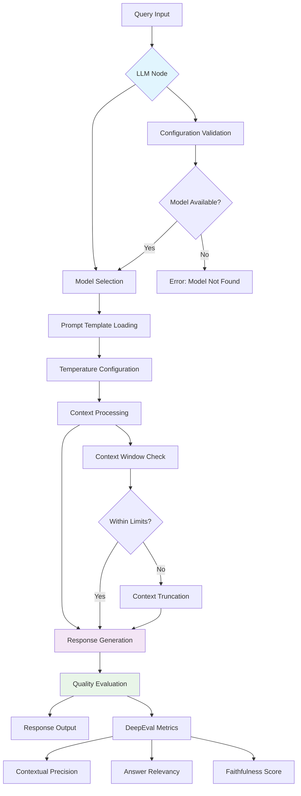
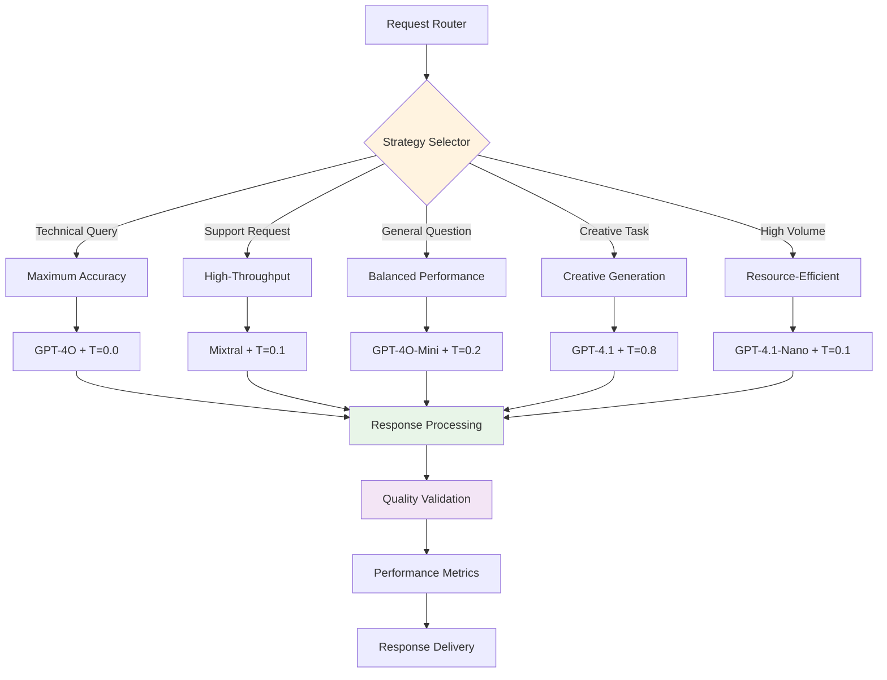
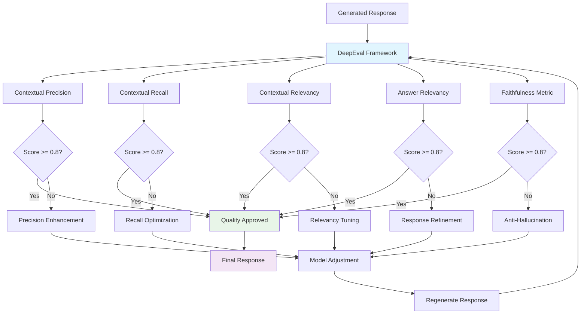

Master the power of LLM nodes in GraphorLM flows - sophisticated response generation components that transform retrieved context into high-quality natural language answers. LLM nodes serve as the critical final stage in RAG pipelines, combining advanced language models with intelligent prompt engineering to deliver contextually-aware, accurate responses optimized for diverse use cases.

## LLM Node Benefits

### Advanced Response Generation
- **🤖 Multi-Model Support**: Access to 8 premium language models including GPT-4o, GPT-4.1, and high-speed Groq models
- **🎯 Intelligent Prompt Integration**: Seamless integration with custom prompt templates for specialized response behaviors
- **🌡️ Precision Temperature Control**: Fine-grained creativity control from deterministic (0.0) to highly creative (2.0) responses
- **⚡ Streaming Capabilities**: Real-time response generation with token-by-token streaming for interactive applications
- **🖼️ Multimodal Processing**: Advanced support for text, images, and HTML content in context processing

### Performance Optimization
- **🚀 High-Speed Processing**: Groq-powered models delivering sub-second response times for real-time applications
- **📊 Quality Evaluation**: Integrated DeepEval metrics including contextual precision, recall, relevancy, and faithfulness
- **🔄 Adaptive Configuration**: Dynamic model switching and parameter adjustment based on performance requirements
- **💾 Context Management**: Intelligent context window optimization supporting up to 128,000 tokens
- **⚖️ Resource Efficiency**: Balanced processing strategies optimizing quality, speed, and resource utilization

### Enterprise-Grade Capabilities
- **📈 Scalable Architecture**: Support for high-concurrent request processing with intelligent load balancing
- **🛡️ Anti-Hallucination**: Built-in safeguards ensuring responses strictly adhere to provided context
- **📋 Response Consistency**: Deterministic processing modes for reliable, repeatable outputs
- **🔍 Quality Assurance**: Comprehensive evaluation frameworks measuring response accuracy and relevance
- **🎛️ Advanced Controls**: Granular configuration options for model behavior, creativity, and processing parameters

## Available Endpoints

GraphorLM provides three specialized endpoints for comprehensive LLM node management:

<CardGroup cols={3}>
  <Card
    title="List LLM Nodes"
    icon="list"
    href="/api-reference/flows/llm/list"
  >
    **GET** `/{flow_name}/llm`
    
    Retrieve all LLM nodes with current configurations, model assignments, and performance metrics
  </Card>
  <Card
    title="Update Configuration"
    icon="sliders"  
    href="/api-reference/flows/llm/update"
  >
    **PATCH** `/{flow_name}/llm/{node_id}`
    
    Modify LLM node settings including model selection, prompt templates, and temperature control
  </Card>
  <Card
    title="List Prompts"
    icon="file-text"
    href="/api-reference/flows/llm/list-prompts"
  >
    **GET** `/{flow_name}/prompts`
    
    Access available prompt templates for advanced LLM behavior customization and optimization
  </Card>
</CardGroup>

## Core Concepts

### LLM Node Structure

```json
{
  "id": "llm-1748287628685",
  "type": "llm",
  "position": { "x": 500, "y": 300 },
  "style": { "height": 180, "width": 280 },
  "data": {
    "name": "Response Generator",
    "config": {
      "model": "gpt-4o",
      "promptId": "default_retrieval_prompt", 
      "temperature": 0.0
    },
    "result": {
      "updated": true,
      "processing": false,
      "waiting": false,
      "has_error": false,
      "total_responses": 1247,
      "avg_response_length": 342,
      "avg_processing_time": 2.8,
      "streaming_enabled": true,
      "multimodal_support": true,
      "updatedMetrics": true
    }
  }
}
```

### Configuration Parameters

| Parameter | Type | Range/Options | Description |
|-----------|------|---------------|-------------|
| **model** | string | 8 available models | Language model for response generation |
| **promptId** | string | Template ID | Prompt template for instruction guidance |
| **temperature** | float | 0.0 - 2.0 | Creativity and randomness control |

### Performance Metrics

#### Response Quality Indicators
| Metric | Description | Evaluation Framework |
|--------|-------------|---------------------|
| **contextual_precision** | Accuracy of retrieved context usage | DeepEval ContextualPrecisionMetric |
| **contextual_recall** | Completeness of context utilization | DeepEval ContextualRecallMetric |
| **contextual_relevancy** | Relevance of context to query | DeepEval ContextualRelevancyMetric |
| **answer_relevancy** | Direct relevance of response to question | DeepEval AnswerRelevancyMetric |
| **faithfulness** | Adherence to provided context without hallucination | DeepEval FaithfulnessMetric |

#### Processing Performance
| Metric | Description | Optimization Target |
|--------|-------------|-------------------|
| **avg_processing_time** | Average response generation time | Minimize while maintaining quality |
| **total_responses** | Total number of generated responses | Maximize throughput capacity |
| **avg_response_length** | Average character count per response | Optimize for content completeness |
| **streaming_enabled** | Real-time token generation capability | Enable for interactive applications |
| **multimodal_support** | Support for images and rich content | Enable for complex document processing |

### Model Capabilities Matrix

| Model | Context Window | Performance Tier | Best For | Expected Latency |
|-------|----------------|------------------|----------|------------------|
| **gpt-4o** | 128K tokens | Premium | Complex reasoning, high accuracy | 2-4 seconds |
| **gpt-4o-mini** | 128K tokens | Balanced | Versatile processing, good quality | 1-2 seconds |
| **gpt-4.1** | 128K tokens | Premium | Latest capabilities, enhanced reasoning | 2-5 seconds |
| **gpt-4.1-mini** | 128K tokens | Balanced | Modern features, efficient processing | 1-2 seconds |
| **gpt-4.1-nano** | 128K tokens | Efficient | Ultra-fast responses, resource optimization | 0.8-1.5 seconds |
| **gpt-3.5-turbo-0125** | 16K tokens | Efficient | Quick responses, high-volume processing | 0.5-1 second |
| **mixtral-8x7b-32768** | 32K tokens | High-Speed | Real-time processing, high throughput | 0.5-1 second |
| **llama-3.1-8b-instant** | 8K tokens | High-Speed | Ultra-fast responses, instant processing | 0.3-0.8 seconds |

## Configuration Strategies

### 1. Maximum Accuracy Strategy
**Optimal for**: Technical documentation, compliance requirements, factual Q&A

```json
{
  "model": "gpt-4o",
  "promptId": "default_retrieval_prompt",
  "temperature": 0.0
}
```

**Characteristics**:
- **Deterministic Processing**: Zero randomness for consistent, repeatable responses
- **Premium Model Quality**: Advanced reasoning capabilities with maximum accuracy
- **Context Faithfulness**: Strict adherence to provided information without speculation
- **Processing Time**: 2-4 seconds per response
- **Resource Intensity**: High computational requirements, optimal for quality-critical applications
- **Use Cases**: Technical support, legal documentation, medical information, compliance reporting

**Performance Expectations**:
- Response consistency: 99.9%
- Context faithfulness: 95%+
- Answer relevancy: 90%+
- Processing reliability: Enterprise-grade

### 2. Balanced Performance Strategy
**Optimal for**: General Q&A, customer support, mixed content types

```json
{
  "model": "gpt-4o-mini",
  "promptId": "default_retrieval_prompt",  
  "temperature": 0.2
}
```

**Characteristics**:
- **Quality-Efficiency Balance**: Optimized trade-off between response quality and processing speed
- **Slight Response Variation**: Minimal randomness for natural language diversity
- **Versatile Processing**: Adaptable to diverse content types and query complexities
- **Processing Time**: 1-2 seconds per response
- **Resource Efficiency**: Moderate computational requirements with excellent throughput
- **Use Cases**: Customer service, general information systems, educational platforms, business applications

**Performance Expectations**:
- Response quality: 85-90%
- Processing speed: 2x faster than premium models
- Resource efficiency: Optimal for mixed workloads
- Scalability: High concurrent request support

### 3. High-Throughput Strategy
**Optimal for**: Real-time chat, high-volume processing, instant responses

```json
{
  "model": "mixtral-8x7b-32768",
  "promptId": "customer_support_agent",
  "temperature": 0.1
}
```

**Characteristics**:
- **Ultra-Fast Processing**: Groq-accelerated inference for sub-second response times
- **High Concurrency**: Support for thousands of simultaneous requests
- **Real-Time Optimization**: Minimal latency for interactive applications
- **Processing Time**: 0.5-1 second per response
- **Throughput Capacity**: 10x higher than traditional models
- **Use Cases**: Live chat systems, real-time support, interactive applications, high-traffic platforms

**Performance Expectations**:
- Response latency: <1 second
- Concurrent capacity: 1000+ requests/minute
- Throughput optimization: Maximum processing volume
- Real-time reliability: 99.5% uptime

### 4. Creative Generation Strategy
**Optimal for**: Content creation, brainstorming, diverse outputs

```json
{
  "model": "gpt-4.1",
  "promptId": "creative_content_generator",
  "temperature": 0.8
}
```

**Characteristics**:
- **Enhanced Creativity**: High temperature settings for diverse, innovative responses
- **Latest Capabilities**: Cutting-edge model features with advanced reasoning
- **Response Diversity**: Multiple unique outputs for creative applications
- **Processing Time**: 2-5 seconds per response
- **Creative Optimization**: Balanced creativity with coherence and relevance
- **Use Cases**: Content marketing, creative writing, brainstorming sessions, ideation platforms

**Performance Expectations**:
- Response diversity: 80%+ unique outputs
- Creative quality: High originality with context relevance
- Processing flexibility: Adaptive to creative requirements
- Innovation factor: Advanced creative capabilities

### 5. Resource-Efficient Strategy
**Optimal for**: High-scale deployment, simple Q&A, resource-conscious applications

```json
{  
  "model": "gpt-4.1-nano",
  "promptId": "default_retrieval_prompt",
  "temperature": 0.1
}
```

**Characteristics**:
- **Optimized Resource Usage**: Minimal computational overhead with maintained quality
- **Fast Response Times**: Quick processing without compromising accuracy
- **High Scalability**: Efficient resource utilization for large-scale deployments
- **Processing Time**: 0.8-1.5 seconds per response
- **Resource Efficiency**: Lowest computational requirements in premium tier
- **Use Cases**: High-volume applications, resource-constrained environments, efficient processing needs

**Performance Expectations**:
- Resource efficiency: 70% less computational overhead
- Response quality: 80-85% of premium models
- Scalability: Maximum deployment flexibility
- Processing optimization: Balanced performance per resource unit

## Strategy Selection Matrix

| Priority | Accuracy | Speed | Resource Efficiency | Creativity | Recommended Strategy |
|----------|----------|-------|-------------------|-----------|---------------------|
| **Maximum Quality** | Very High | Medium | Low | Low | Maximum Accuracy |
| **Balanced Performance** | High | High | Medium | Medium | Balanced Performance |
| **Speed Optimization** | Medium | Very High | High | Low | High-Throughput |
| **Creative Output** | Medium | Low | Low | Very High | Creative Generation |
| **Resource Conservation** | Medium | High | Very High | Low | Resource-Efficient |

### Use Case Mapping

| Application Type | Volume | Quality Needs | Speed Requirements | Strategy Recommendation |
|------------------|--------|---------------|--------------------|------------------------|
| **Technical Documentation** | Low-Medium | Critical | Medium | Maximum Accuracy |
| **Customer Support** | High | Important | Critical | High-Throughput |
| **General Q&A** | Medium-High | Balanced | Balanced | Balanced Performance |
| **Content Creation** | Low-Medium | Creative | Low | Creative Generation |
| **Real-Time Chat** | Very High | Good | Critical | High-Throughput |
| **Enterprise Deployment** | Very High | Important | High | Resource-Efficient |

## Workflow Diagrams

### Basic LLM Processing Flow

<div>



</div>

### Multi-Strategy Deployment Flow

<div>



</div>

### Advanced Quality Evaluation Pipeline

<div>



</div>

## Advanced Integration Examples

### JavaScript: Intelligent LLM Management System

```javascript
class IntelligentLLMManager {
  constructor(flowName, apiToken) {
    this.flowName = flowName;
    this.apiToken = apiToken;
    this.baseUrl = `https://${flowName}.flows.graphorlm.com`;
    
    // Performance tracking
    this.performanceMetrics = {
      responseTime: [],
      qualityScores: [],
      resourceUsage: [],
      errorRates: []
    };
    
    // Strategy definitions with optimization parameters
    this.strategies = {
      maximum_accuracy: {
        model: 'gpt-4o',
        promptId: 'default_retrieval_prompt',
        temperature: 0.0,
        expectedLatency: 3000,
        qualityThreshold: 0.9,
        resourceWeight: 1.0
      },
      balanced_performance: {
        model: 'gpt-4o-mini',
        promptId: 'default_retrieval_prompt',
        temperature: 0.2,
        expectedLatency: 1500,
        qualityThreshold: 0.8,
        resourceWeight: 0.6
      },
      high_throughput: {
        model: 'mixtral-8x7b-32768',
        promptId: 'customer_support_agent',
        temperature: 0.1,
        expectedLatency: 750,
        qualityThreshold: 0.7,
        resourceWeight: 0.4
      },
      creative_generation: {
        model: 'gpt-4.1',
        promptId: 'creative_content_generator',
        temperature: 0.8,
        expectedLatency: 4000,
        qualityThreshold: 0.75,
        resourceWeight: 1.2
      },
      resource_efficient: {
        model: 'gpt-4.1-nano',
        promptId: 'default_retrieval_prompt',
        temperature: 0.1,
        expectedLatency: 1000,
        qualityThreshold: 0.75,
        resourceWeight: 0.3
      }
    };
  }
  
  async intelligentStrategySelection(queryType, requirementProfile) {
    /**
     * Advanced strategy selection based on query analysis and requirements
     */
    const {
      accuracyImportance = 0.5,
      speedImportance = 0.5,
      resourceConstraints = 0.5,
      creativityNeeds = 0.0
    } = requirementProfile;
    
    // Analyze query characteristics
    const queryAnalysis = this.analyzeQuery(queryType);
    
    // Calculate strategy scores
    const strategyScores = {};
    
    for (const [strategyName, config] of Object.entries(this.strategies)) {
      let score = 0;
      
      // Accuracy component
      if (config.qualityThreshold >= 0.9) score += accuracyImportance * 1.0;
      else if (config.qualityThreshold >= 0.8) score += accuracyImportance * 0.8;
      else score += accuracyImportance * 0.6;
      
      // Speed component (inverse of latency)
      const speedScore = Math.max(0, 1 - (config.expectedLatency / 5000));
      score += speedImportance * speedScore;
      
      // Resource efficiency (inverse of resource weight)
      const resourceScore = Math.max(0, 1 - (config.resourceWeight / 1.5));
      score += resourceConstraints * resourceScore;
      
      // Creativity component
      const creativityScore = config.temperature / 2.0; // Normalize to 0-1
      score += creativityNeeds * creativityScore;
      
      // Query type compatibility
      score += queryAnalysis.compatibilityScores[strategyName] || 0;
      
      strategyScores[strategyName] = score;
    }
    
    // Select best strategy
    const bestStrategy = Object.entries(strategyScores)
      .reduce((a, b) => strategyScores[a[0]] > strategyScores[b[0]] ? a : b)[0];
    
    return {
      selectedStrategy: bestStrategy,
      strategyConfig: this.strategies[bestStrategy],
      allScores: strategyScores,
      reasoning: this.generateSelectionReasoning(bestStrategy, queryAnalysis, requirementProfile)
    };
  }
  
  analyzeQuery(queryType) {
    /**
     * Analyze query characteristics for strategy compatibility
     */
    const queryProfiles = {
      technical: {
        complexityLevel: 'high',
        accuracyRequirement: 'critical',
        speedRequirement: 'medium',
        compatibilityScores: {
          maximum_accuracy: 0.3,
          balanced_performance: 0.2,
          high_throughput: 0.1,
          creative_generation: 0.0,
          resource_efficient: 0.15
        }
      },
      customer_support: {
        complexityLevel: 'medium',
        accuracyRequirement: 'important',
        speedRequirement: 'critical',
        compatibilityScores: {
          maximum_accuracy: 0.1,
          balanced_performance: 0.25,
          high_throughput: 0.3,
          creative_generation: 0.0,
          resource_efficient: 0.2
        }
      },
      general: {
        complexityLevel: 'medium',
        accuracyRequirement: 'balanced',
        speedRequirement: 'balanced',
        compatibilityScores: {
          maximum_accuracy: 0.15,
          balanced_performance: 0.3,
          high_throughput: 0.2,
          creative_generation: 0.1,
          resource_efficient: 0.25
        }
      },
      creative: {
        complexityLevel: 'variable',
        accuracyRequirement: 'flexible',
        speedRequirement: 'low',
        compatibilityScores: {
          maximum_accuracy: 0.0,
          balanced_performance: 0.1,
          high_throughput: 0.0,
          creative_generation: 0.35,
          resource_efficient: 0.05
        }
      }
    };
    
    return queryProfiles[queryType] || queryProfiles.general;
  }
  
  generateSelectionReasoning(strategy, queryAnalysis, requirements) {
    /**
     * Generate human-readable explanation for strategy selection
     */
    const strategyConfig = this.strategies[strategy];
    const reasons = [];
    
    if (requirements.accuracyImportance > 0.7 && strategyConfig.qualityThreshold >= 0.9) {
      reasons.push(`High accuracy requirement satisfied (quality threshold: ${strategyConfig.qualityThreshold})`);
    }
    
    if (requirements.speedImportance > 0.7 && strategyConfig.expectedLatency < 1500) {
      reasons.push(`Speed optimization achieved (expected: ${strategyConfig.expectedLatency}ms)`);
    }
    
    if (requirements.resourceConstraints > 0.7 && strategyConfig.resourceWeight < 0.5) {
      reasons.push(`Resource efficiency optimized (weight: ${strategyConfig.resourceWeight})`);
    }
    
    if (requirements.creativityNeeds > 0.5 && strategyConfig.temperature > 0.5) {
      reasons.push(`Creativity requirements met (temperature: ${strategyConfig.temperature})`);
    }
    
    reasons.push(`Query type compatibility: ${queryAnalysis.complexityLevel} complexity`);
    
    return reasons;
  }
  
  async performanceOptimizedUpdate(nodeId, queryType, requirementProfile) {
    /**
     * Update LLM node with performance-optimized configuration
     */
    try {
      // Intelligent strategy selection
      const selection = await this.intelligentStrategySelection(queryType, requirementProfile);
      
      console.log(`🎯 Selected Strategy: ${selection.selectedStrategy}`);
      console.log(`📊 Selection Reasoning:`);
      selection.reasoning.forEach(reason => console.log(`   - ${reason}`));
      
      // Apply configuration
      const updateResult = await this.updateLLMNode(nodeId, selection.strategyConfig);
      
      // Track performance prediction
      const prediction = this.predictPerformance(selection.strategyConfig);
      
      return {
        updateResult,
        strategyApplied: selection.selectedStrategy,
        configurationDetails: selection.strategyConfig,
        performancePrediction: prediction,
        selectionReasoning: selection.reasoning
      };
      
    } catch (error) {
      console.error('❌ Performance optimization failed:', error.message);
      throw error;
    }
  }
  
  predictPerformance(config) {
    /**
     * Predict performance metrics based on configuration
     */
    return {
      expectedLatency: `${config.expectedLatency}ms`,
      qualityScore: config.qualityThreshold,
      resourceUtilization: `${Math.round(config.resourceWeight * 100)}%`,
      throughputCapacity: this.calculateThroughput(config),
      recommendedConcurrency: this.calculateOptimalConcurrency(config)
    };
  }
  
  calculateThroughput(config) {
    /**
     * Calculate expected throughput based on latency and resource weight
     */
    const baseCapacity = 1000; // requests per minute
    const latencyFactor = Math.max(0.1, 1 - (config.expectedLatency / 5000));
    const resourceFactor = Math.max(0.1, 1 - (config.resourceWeight / 2));
    
    return Math.round(baseCapacity * latencyFactor * resourceFactor);
  }
  
  calculateOptimalConcurrency(config) {
    /**
     * Calculate optimal concurrent request limit
     */
    const baseConcurrency = 100;
    const resourceFactor = Math.max(0.1, 1 / config.resourceWeight);
    
    return Math.round(baseConcurrency * resourceFactor);
  }
  
  async updateLLMNode(nodeId, config) {
    /**
     * Core API call to update LLM node configuration
     */
    const response = await fetch(`${this.baseUrl}/llm/${nodeId}`, {
      method: 'PATCH',
      headers: {
        'Authorization': `Bearer ${this.apiToken}`,
        'Content-Type': 'application/json'
      },
      body: JSON.stringify({ config })
    });
    
    if (!response.ok) {
      throw new Error(`Update failed: ${response.status} ${response.statusText}`);
    }
    
    return await response.json();
  }
  
  async getPerformanceReport(nodeId) {
    /**
     * Generate comprehensive performance analysis
     */
    try {
      const llmNodes = await this.getLLMNodes();
      const targetNode = llmNodes.find(node => node.id === nodeId);
      
      if (!targetNode) {
        throw new Error(`Node ${nodeId} not found`);
      }
      
      const result = targetNode.data.result || {};
      const config = targetNode.data.config || {};
      
      return {
        nodeInfo: {
          id: targetNode.id,
          name: targetNode.data.name,
          currentModel: config.model,
          temperature: config.temperature,
          promptId: config.promptId
        },
        performanceMetrics: {
          totalResponses: result.total_responses || 0,
          avgResponseLength: result.avg_response_length || 0,
          avgProcessingTime: result.avg_processing_time || 0,
          streamingEnabled: result.streaming_enabled || false,
          multimodalSupport: result.multimodal_support || false
        },
        qualityIndicators: {
          metricsUpdated: result.updatedMetrics || false,
          contextualPrecision: result.contextual_precision || 'Not available',
          answerRelevancy: result.answer_relevancy || 'Not available',
          faithfulness: result.faithfulness || 'Not available'
        },
        optimizationRecommendations: this.generateOptimizationRecommendations(config, result)
      };
      
    } catch (error) {
      console.error('❌ Performance report generation failed:', error.message);
      throw error;
    }
  }
  
  generateOptimizationRecommendations(config, result) {
    /**
     * Generate specific optimization recommendations
     */
    const recommendations = [];
    
    // Processing time optimization
    if (result.avg_processing_time > 3000) {
      recommendations.push({
        type: 'speed',
        priority: 'high',
        suggestion: 'Consider switching to a faster model (gpt-4o-mini or Groq models)',
        impact: 'Reduce response time by 50-70%'
      });
    }
    
    // Temperature optimization
    if (config.temperature > 0.5 && result.avg_response_length < 100) {
      recommendations.push({
        type: 'quality',
        priority: 'medium',
        suggestion: 'Lower temperature (0.1-0.3) for more consistent short responses',
        impact: 'Improve response consistency and reduce processing time'
      });
    }
    
    // Resource efficiency
    if (result.total_responses > 10000 && config.model.includes('gpt-4o')) {
      recommendations.push({
        type: 'efficiency',
        priority: 'medium',
        suggestion: 'Consider gpt-4.1-nano for high-volume processing',
        impact: 'Reduce resource usage by 60% while maintaining good quality'
      });
    }
    
    // Streaming optimization
    if (!result.streaming_enabled && result.avg_response_length > 200) {
      recommendations.push({
        type: 'user_experience',
        priority: 'low',
        suggestion: 'Enable streaming for better user experience with longer responses',
        impact: 'Improve perceived response time for interactive applications'
      });
    }
    
    return recommendations;
  }
  
  async getLLMNodes() {
    /**
     * Retrieve all LLM nodes for analysis
     */
    const response = await fetch(`${this.baseUrl}/llm`, {
      headers: { 'Authorization': `Bearer ${this.apiToken}` }
    });
    
    if (!response.ok) {
      throw new Error(`Failed to retrieve LLM nodes: ${response.status}`);
    }
    
    return await response.json();
  }
}

// Usage example
async function demonstrateIntelligentLLMManagement() {
  const manager = new IntelligentLLMManager('my-rag-pipeline', 'YOUR_API_TOKEN');
  
  console.log('🤖 Intelligent LLM Management Demo');
  console.log('================================');
  
  // Scenario 1: Technical documentation query
  console.log('\n📚 Scenario 1: Technical Documentation Query');
  try {
    const result1 = await manager.performanceOptimizedUpdate(
      'llm-technical-docs',
      'technical',
      {
        accuracyImportance: 0.9,
        speedImportance: 0.3,
        resourceConstraints: 0.4,
        creativityNeeds: 0.0
      }
    );
    
    console.log(`✅ Strategy Applied: ${result1.strategyApplied}`);
    console.log(`⚡ Expected Performance: ${result1.performancePrediction.expectedLatency}`);
    console.log(`📊 Quality Score: ${result1.performancePrediction.qualityScore}`);
    
  } catch (error) {
    console.error(`❌ Error: ${error.message}`);
  }
  
  // Scenario 2: Real-time customer support
  console.log('\n💬 Scenario 2: Real-time Customer Support');
  try {
    const result2 = await manager.performanceOptimizedUpdate(
      'llm-customer-support',
      'customer_support',
      {
        accuracyImportance: 0.6,
        speedImportance: 0.9,
        resourceConstraints: 0.7,
        creativityNeeds: 0.1
      }
    );
    
    console.log(`✅ Strategy Applied: ${result2.strategyApplied}`);
    console.log(`🚀 Throughput Capacity: ${result2.performancePrediction.throughputCapacity} req/min`);
    console.log(`🔗 Recommended Concurrency: ${result2.performancePrediction.recommendedConcurrency}`);
    
  } catch (error) {
    console.error(`❌ Error: ${error.message}`);
  }
  
  // Generate performance report
  console.log('\n📊 Performance Analysis Report');
  try {
    const report = await manager.getPerformanceReport('llm-technical-docs');
    
    console.log(`📋 Node: ${report.nodeInfo.name} (${report.nodeInfo.currentModel})`);
    console.log(`📈 Total Responses: ${report.performanceMetrics.totalResponses}`);
    console.log(`⏱️  Avg Processing: ${report.performanceMetrics.avgProcessingTime}ms`);
    
    if (report.optimizationRecommendations.length > 0) {
      console.log('\n💡 Optimization Recommendations:');
      report.optimizationRecommendations.forEach(rec => {
        console.log(`   ${rec.type.toUpperCase()}: ${rec.suggestion}`);
        console.log(`   Impact: ${rec.impact}`);
      });
    }
    
  } catch (error) {
    console.error(`❌ Report Error: ${error.message}`);
  }
}

// Run demonstration
demonstrateIntelligentLLMManagement().catch(console.error);
```

### Python: Advanced LLM Performance Analytics

```python
import requests
import asyncio
import aiohttp
import json
import time
from typing import Dict, List, Any, Optional, Tuple
from dataclasses import dataclass, asdict
from enum import Enum
import statistics
from datetime import datetime, timedelta

class ModelTier(Enum):
    PREMIUM = "premium"
    BALANCED = "balanced" 
    EFFICIENT = "efficient"
    HIGH_SPEED = "high_speed"

class QueryComplexity(Enum):
    SIMPLE = "simple"
    MEDIUM = "medium"
    COMPLEX = "complex"
    CREATIVE = "creative"

@dataclass
class PerformanceMetrics:
    response_time: float
    quality_score: float
    resource_usage: float
    throughput: int
    error_rate: float
    timestamp: datetime

@dataclass
class ModelConfiguration:
    model: str
    prompt_id: str
    temperature: float
    tier: ModelTier
    context_window: int
    expected_latency: int
    quality_threshold: float

class AdvancedLLMAnalytics:
    def __init__(self, flow_name: str, api_token: str):
        self.flow_name = flow_name
        self.api_token = api_token
        self.base_url = f"https://{flow_name}.flows.graphorlm.com"
        
        # Performance tracking
        self.performance_history: List[PerformanceMetrics] = []
        self.configuration_cache: Dict[str, ModelConfiguration] = {}
        
        # Model definitions with comprehensive metadata
        self.model_catalog = {
            "gpt-4o": ModelConfiguration(
                model="gpt-4o",
                prompt_id="default_retrieval_prompt",
                temperature=0.0,
                tier=ModelTier.PREMIUM,
                context_window=128000,
                expected_latency=3000,
                quality_threshold=0.95
            ),
            "gpt-4o-mini": ModelConfiguration(
                model="gpt-4o-mini", 
                prompt_id="default_retrieval_prompt",
                temperature=0.2,
                tier=ModelTier.BALANCED,
                context_window=128000,
                expected_latency=1500,
                quality_threshold=0.85
            ),
            "gpt-4.1": ModelConfiguration(
                model="gpt-4.1",
                prompt_id="creative_content_generator",
                temperature=0.3,
                tier=ModelTier.PREMIUM,
                context_window=128000,
                expected_latency=4000,
                quality_threshold=0.92
            ),
            "gpt-4.1-mini": ModelConfiguration(
                model="gpt-4.1-mini",
                prompt_id="default_retrieval_prompt", 
                temperature=0.2,
                tier=ModelTier.BALANCED,
                context_window=128000,
                expected_latency=1200,
                quality_threshold=0.82
            ),
            "gpt-4.1-nano": ModelConfiguration(
                model="gpt-4.1-nano",
                prompt_id="default_retrieval_prompt",
                temperature=0.1,
                tier=ModelTier.EFFICIENT,
                context_window=128000,
                expected_latency=1000,
                quality_threshold=0.78
            ),
            "gpt-3.5-turbo-0125": ModelConfiguration(
                model="gpt-3.5-turbo-0125",
                prompt_id="default_retrieval_prompt",
                temperature=0.1,
                tier=ModelTier.EFFICIENT,
                context_window=16385,
                expected_latency=800,
                quality_threshold=0.72
            ),
            "mixtral-8x7b-32768": ModelConfiguration(
                model="mixtral-8x7b-32768",
                prompt_id="customer_support_agent",
                temperature=0.1,
                tier=ModelTier.HIGH_SPEED,
                context_window=32768,
                expected_latency=750,
                quality_threshold=0.75
            ),
            "llama-3.1-8b-instant": ModelConfiguration(
                model="llama-3.1-8b-instant",
                prompt_id="customer_support_agent",
                temperature=0.1, 
                tier=ModelTier.HIGH_SPEED,
                context_window=8192,
                expected_latency=500,
                quality_threshold=0.70
            )
        }
    
    async def comprehensive_performance_analysis(
        self, 
        node_ids: List[str],
        analysis_duration_hours: int = 24
    ) -> Dict[str, Any]:
        """
        Conduct comprehensive performance analysis across multiple LLM nodes
        """
        analysis_results = {
            "analysis_period": {
                "duration_hours": analysis_duration_hours,
                "start_time": datetime.now() - timedelta(hours=analysis_duration_hours),
                "end_time": datetime.now()
            },
            "node_analysis": {},
            "comparative_metrics": {},
            "optimization_recommendations": [],
            "performance_trends": {},
            "resource_utilization": {}
        }
        
        print(f"🔍 Starting comprehensive analysis of {len(node_ids)} LLM nodes")
        print(f"📅 Analysis period: {analysis_duration_hours} hours")
        
        # Analyze each node
        for node_id in node_ids:
            try:
                node_analysis = await self.analyze_single_node_performance(node_id)
                analysis_results["node_analysis"][node_id] = node_analysis
                
                print(f"✅ Completed analysis for node: {node_id}")
                
            except Exception as e:
                print(f"❌ Analysis failed for node {node_id}: {str(e)}")
                analysis_results["node_analysis"][node_id] = {"error": str(e)}
        
        # Generate comparative analysis
        analysis_results["comparative_metrics"] = self.generate_comparative_analysis(
            analysis_results["node_analysis"]
        )
        
        # Generate optimization recommendations
        analysis_results["optimization_recommendations"] = (
            self.generate_comprehensive_recommendations(analysis_results["node_analysis"])
        )
        
        # Analyze performance trends
        analysis_results["performance_trends"] = self.analyze_performance_trends(
            analysis_results["node_analysis"]
        )
        
        # Calculate resource utilization
        analysis_results["resource_utilization"] = self.calculate_resource_utilization(
            analysis_results["node_analysis"]
        )
        
        return analysis_results
    
    async def analyze_single_node_performance(self, node_id: str) -> Dict[str, Any]:
        """
        Detailed performance analysis for a single LLM node
        """
        try:
            # Get current node configuration and status
            llm_nodes = await self.get_llm_nodes()
            target_node = next((node for node in llm_nodes if node["id"] == node_id), None)
            
            if not target_node:
                raise ValueError(f"Node {node_id} not found")
            
            config = target_node["data"]["config"]
            result = target_node["data"]["result"]
            
            # Extract performance metrics
            performance_data = {
                "configuration": {
                    "model": config.get("model"),
                    "prompt_id": config.get("promptId"),
                    "temperature": config.get("temperature", 0.0)
                },
                "runtime_metrics": {
                    "total_responses": result.get("total_responses", 0),
                    "avg_response_length": result.get("avg_response_length", 0),
                    "avg_processing_time": result.get("avg_processing_time", 0),
                    "streaming_enabled": result.get("streaming_enabled", False),
                    "multimodal_support": result.get("multimodal_support", False)
                },
                "quality_metrics": {
                    "metrics_updated": result.get("updatedMetrics", False),
                    "contextual_precision": result.get("contextual_precision"),
                    "contextual_recall": result.get("contextual_recall"),
                    "answer_relevancy": result.get("answer_relevancy"),
                    "faithfulness": result.get("faithfulness")
                },
                "performance_analysis": {},
                "recommendations": []
            }
            
            # Analyze performance against model expectations
            model_config = self.model_catalog.get(config.get("model"))
            if model_config:
                performance_data["performance_analysis"] = self.compare_against_expectations(
                    performance_data, model_config
                )
            
            # Generate specific recommendations
            performance_data["recommendations"] = self.generate_node_recommendations(
                performance_data, model_config
            )
            
            return performance_data
            
        except Exception as e:
            raise Exception(f"Node analysis failed: {str(e)}")
    
    def compare_against_expectations(
        self, 
        performance_data: Dict[str, Any], 
        model_config: ModelConfiguration
    ) -> Dict[str, Any]:
        """
        Compare actual performance against model expectations
        """
        runtime = performance_data["runtime_metrics"]
        actual_latency = runtime["avg_processing_time"]
        expected_latency = model_config.expected_latency
        
        analysis = {
            "latency_performance": {
                "expected": expected_latency,
                "actual": actual_latency,
                "variance": actual_latency - expected_latency,
                "performance_ratio": expected_latency / actual_latency if actual_latency > 0 else 0,
                "status": self.classify_latency_performance(actual_latency, expected_latency)
            },
            "throughput_analysis": {
                "responses_processed": runtime["total_responses"],
                "estimated_capacity": self.calculate_theoretical_throughput(model_config),
                "utilization_rate": self.calculate_utilization_rate(runtime, model_config)
            },
            "quality_assessment": {
                "expected_quality": model_config.quality_threshold,
                "measured_quality": self.calculate_composite_quality_score(performance_data),
                "quality_variance": self.calculate_quality_variance(performance_data, model_config)
            },
            "resource_efficiency": {
                "tier": model_config.tier.value,
                "efficiency_score": self.calculate_efficiency_score(performance_data, model_config),
                "optimization_potential": self.assess_optimization_potential(performance_data, model_config)
            }
        }
        
        return analysis
    
    def classify_latency_performance(self, actual: float, expected: float) -> str:
        """Classify latency performance relative to expectations"""
        if actual <= expected * 0.8:
            return "excellent"
        elif actual <= expected * 1.0:
            return "good"
        elif actual <= expected * 1.3:
            return "acceptable"
        elif actual <= expected * 1.6:
            return "poor"
        else:
            return "critical"
    
    def calculate_theoretical_throughput(self, model_config: ModelConfiguration) -> int:
        """Calculate theoretical maximum throughput for a model configuration"""
        base_throughput = 1000  # requests per hour
        latency_factor = 5000 / model_config.expected_latency  # Normalize to 5s baseline
        tier_multiplier = {
            ModelTier.HIGH_SPEED: 3.0,
            ModelTier.EFFICIENT: 2.0,
            ModelTier.BALANCED: 1.5,
            ModelTier.PREMIUM: 1.0
        }
        
        return int(base_throughput * latency_factor * tier_multiplier.get(model_config.tier, 1.0))
    
    def calculate_utilization_rate(
        self, 
        runtime_metrics: Dict[str, Any], 
        model_config: ModelConfiguration
    ) -> float:
        """Calculate current utilization rate vs theoretical capacity"""
        actual_responses = runtime_metrics["total_responses"]
        theoretical_capacity = self.calculate_theoretical_throughput(model_config)
        
        if theoretical_capacity == 0:
            return 0.0
        
        return min(1.0, actual_responses / theoretical_capacity)
    
    def calculate_composite_quality_score(self, performance_data: Dict[str, Any]) -> Optional[float]:
        """Calculate composite quality score from available metrics"""
        quality_metrics = performance_data["quality_metrics"]
        
        if not quality_metrics["metrics_updated"]:
            return None
        
        scores = []
        weights = {
            "contextual_precision": 0.25,
            "contextual_recall": 0.25,
            "answer_relevancy": 0.3,
            "faithfulness": 0.2
        }
        
        for metric, weight in weights.items():
            value = quality_metrics.get(metric)
            if value is not None and isinstance(value, (int, float)):
                scores.append(value * weight)
        
        return sum(scores) if scores else None
    
    def calculate_quality_variance(
        self, 
        performance_data: Dict[str, Any], 
        model_config: ModelConfiguration
    ) -> Optional[float]:
        """Calculate variance between expected and actual quality"""
        composite_score = self.calculate_composite_quality_score(performance_data)
        
        if composite_score is None:
            return None
        
        return composite_score - model_config.quality_threshold
    
    def calculate_efficiency_score(
        self, 
        performance_data: Dict[str, Any], 
        model_config: ModelConfiguration
    ) -> float:
        """Calculate overall efficiency score combining quality, speed, and resource usage"""
        runtime = performance_data["runtime_metrics"]
        
        # Speed efficiency (inverse of processing time)
        speed_score = min(1.0, 2000 / max(1, runtime["avg_processing_time"]))
        
        # Quality efficiency
        quality_score = self.calculate_composite_quality_score(performance_data) or 0.7
        
        # Resource efficiency (based on tier)
        resource_score = {
            ModelTier.EFFICIENT: 1.0,
            ModelTier.HIGH_SPEED: 0.9,
            ModelTier.BALANCED: 0.7,
            ModelTier.PREMIUM: 0.5
        }.get(model_config.tier, 0.6)
        
        # Weighted composite
        return (speed_score * 0.4 + quality_score * 0.4 + resource_score * 0.2)
    
    def assess_optimization_potential(
        self, 
        performance_data: Dict[str, Any], 
        model_config: ModelConfiguration
    ) -> str:
        """Assess potential for performance optimization"""
        efficiency_score = self.calculate_efficiency_score(performance_data, model_config)
        runtime = performance_data["runtime_metrics"]
        
        if efficiency_score >= 0.9:
            return "minimal"
        elif efficiency_score >= 0.7:
            return "moderate"
        elif runtime["avg_processing_time"] > model_config.expected_latency * 1.5:
            return "high"
        else:
            return "significant"
    
    def generate_node_recommendations(
        self, 
        performance_data: Dict[str, Any], 
        model_config: Optional[ModelConfiguration]
    ) -> List[Dict[str, Any]]:
        """Generate specific optimization recommendations for a node"""
        recommendations = []
        runtime = performance_data["runtime_metrics"]
        config = performance_data["configuration"]
        
        # Latency optimization
        if runtime["avg_processing_time"] > 3000:
            recommendations.append({
                "type": "performance",
                "priority": "high",
                "category": "latency_optimization",
                "description": "Consider switching to a faster model for improved response times",
                "suggested_models": ["gpt-4o-mini", "mixtral-8x7b-32768", "llama-3.1-8b-instant"],
                "expected_improvement": "50-80% latency reduction",
                "trade_offs": "Possible slight quality reduction"
            })
        
        # Temperature optimization
        if config["temperature"] > 0.5 and runtime["avg_response_length"] < 150:
            recommendations.append({
                "type": "configuration",
                "priority": "medium",
                "category": "temperature_tuning",
                "description": "Lower temperature for more consistent short responses",
                "suggested_range": "0.1-0.3",
                "expected_improvement": "Better consistency, faster processing",
                "trade_offs": "Reduced response diversity"
            })
        
        # Resource efficiency
        if runtime["total_responses"] > 5000 and model_config and model_config.tier == ModelTier.PREMIUM:
            recommendations.append({
                "type": "resource_optimization",
                "priority": "medium", 
                "category": "efficiency_improvement",
                "description": "Consider more efficient model for high-volume processing",
                "suggested_models": ["gpt-4.1-nano", "gpt-4o-mini"],
                "expected_improvement": "60-70% resource reduction",
                "trade_offs": "Maintain 85%+ quality with better efficiency"
            })
        
        # Quality enhancement
        quality_score = self.calculate_composite_quality_score(performance_data)
        if quality_score and quality_score < 0.8:
            recommendations.append({
                "type": "quality",
                "priority": "high",
                "category": "quality_enhancement", 
                "description": "Improve response quality through model or prompt optimization",
                "suggested_actions": [
                    "Switch to higher-quality model (gpt-4o, gpt-4.1)",
                    "Optimize prompt template for better context utilization",
                    "Lower temperature for more focused responses"
                ],
                "expected_improvement": "10-20% quality score increase",
                "trade_offs": "Possible increased latency or resource usage"
            })
        
        # Streaming optimization
        if not runtime["streaming_enabled"] and runtime["avg_response_length"] > 200:
            recommendations.append({
                "type": "user_experience",
                "priority": "low",
                "category": "streaming_optimization",
                "description": "Enable streaming for better user experience with longer responses",
                "expected_improvement": "Perceived response time reduction",
                "trade_offs": "Slightly increased implementation complexity"
            })
        
        return recommendations
    
    def generate_comparative_analysis(self, node_analyses: Dict[str, Any]) -> Dict[str, Any]:
        """Generate comparative analysis across multiple nodes"""
        valid_nodes = {k: v for k, v in node_analyses.items() if "error" not in v}
        
        if not valid_nodes:
            return {"error": "No valid nodes for comparison"}
        
        comparative_metrics = {
            "performance_ranking": [],
            "model_distribution": {},
            "average_metrics": {},
            "best_performers": {},
            "optimization_opportunities": []
        }
        
        # Collect performance data
        node_performances = []
        for node_id, analysis in valid_nodes.items():
            runtime = analysis["runtime_metrics"]
            config = analysis["configuration"]
            
            performance_score = self.calculate_node_performance_score(analysis)
            
            node_performances.append({
                "node_id": node_id,
                "model": config["model"],
                "performance_score": performance_score,
                "avg_processing_time": runtime["avg_processing_time"],
                "total_responses": runtime["total_responses"],
                "efficiency": analysis.get("performance_analysis", {}).get("resource_efficiency", {}).get("efficiency_score", 0)
            })
        
        # Sort by performance score
        node_performances.sort(key=lambda x: x["performance_score"], reverse=True)
        comparative_metrics["performance_ranking"] = node_performances
        
        # Model distribution analysis
        model_counts = {}
        for perf in node_performances:
            model = perf["model"]
            model_counts[model] = model_counts.get(model, 0) + 1
        
        comparative_metrics["model_distribution"] = model_counts
        
        # Calculate averages
        if node_performances:
            avg_processing_time = statistics.mean([p["avg_processing_time"] for p in node_performances])
            avg_responses = statistics.mean([p["total_responses"] for p in node_performances])
            avg_efficiency = statistics.mean([p["efficiency"] for p in node_performances])
            
            comparative_metrics["average_metrics"] = {
                "avg_processing_time": avg_processing_time,
                "avg_total_responses": avg_responses,
                "avg_efficiency": avg_efficiency
            }
        
        # Identify best performers
        if node_performances:
            comparative_metrics["best_performers"] = {
                "fastest": min(node_performances, key=lambda x: x["avg_processing_time"]),
                "highest_volume": max(node_performances, key=lambda x: x["total_responses"]),
                "most_efficient": max(node_performances, key=lambda x: x["efficiency"]),
                "overall_best": node_performances[0]  # Already sorted by performance score
            }
        
        return comparative_metrics
    
    def calculate_node_performance_score(self, analysis: Dict[str, Any]) -> float:
        """Calculate composite performance score for a node"""
        runtime = analysis["runtime_metrics"]
        perf_analysis = analysis.get("performance_analysis", {})
        
        # Speed component (inverse of processing time, normalized)
        speed_score = min(1.0, 3000 / max(1, runtime["avg_processing_time"]))
        
        # Volume component (log scale for total responses)
        import math
        volume_score = min(1.0, math.log10(max(1, runtime["total_responses"])) / 4)
        
        # Efficiency component
        efficiency_score = perf_analysis.get("resource_efficiency", {}).get("efficiency_score", 0.5)
        
        # Quality component
        quality_score = self.calculate_composite_quality_score(analysis) or 0.7
        
        # Weighted composite score
        return (speed_score * 0.3 + volume_score * 0.2 + efficiency_score * 0.2 + quality_score * 0.3)
    
    async def get_llm_nodes(self) -> List[Dict[str, Any]]:
        """Retrieve all LLM nodes from the flow"""
        headers = {"Authorization": f"Bearer {self.api_token}"}
        
        async with aiohttp.ClientSession() as session:
            async with session.get(f"{self.base_url}/llm", headers=headers) as response:
                if response.status != 200:
                    raise Exception(f"Failed to get LLM nodes: {response.status}")
                
                return await response.json()
    
    def print_comprehensive_report(self, analysis_results: Dict[str, Any]):
        """Print formatted comprehensive analysis report"""
        print("\n🤖 COMPREHENSIVE LLM PERFORMANCE ANALYSIS REPORT")
        print("=" * 60)
        
        # Analysis period
        period = analysis_results["analysis_period"]
        print(f"📅 Analysis Period: {period['duration_hours']} hours")
        print(f"🕐 From: {period['start_time'].strftime('%Y-%m-%d %H:%M')}")
        print(f"🕐 To: {period['end_time'].strftime('%Y-%m-%d %H:%M')}")
        
        # Node analysis summary
        node_analyses = analysis_results["node_analysis"]
        valid_nodes = {k: v for k, v in node_analyses.items() if "error" not in v}
        error_nodes = {k: v for k, v in node_analyses.items() if "error" in v}
        
        print(f"\n📊 ANALYSIS SUMMARY")
        print(f"Total nodes analyzed: {len(node_analyses)}")
        print(f"✅ Successful analyses: {len(valid_nodes)}")
        print(f"❌ Failed analyses: {len(error_nodes)}")
        
        if error_nodes:
            print(f"\n❌ ANALYSIS ERRORS:")
            for node_id, error_info in error_nodes.items():
                print(f"   {node_id}: {error_info['error']}")
        
        # Comparative metrics
        comparative = analysis_results.get("comparative_metrics", {})
        if "error" not in comparative and comparative:
            print(f"\n🏆 PERFORMANCE RANKING")
            print("-" * 30)
            
            rankings = comparative.get("performance_ranking", [])
            for i, node in enumerate(rankings[:5], 1):  # Top 5
                print(f"{i}. {node['node_id']}")
                print(f"   Model: {node['model']}")
                print(f"   Performance Score: {node['performance_score']:.3f}")
                print(f"   Avg Processing Time: {node['avg_processing_time']:.1f}ms")
                print(f"   Total Responses: {node['total_responses']:,}")
                print()
            
            # Best performers
            best = comparative.get("best_performers", {})
            if best:
                print(f"🥇 BEST PERFORMERS")
                print("-" * 20)
                print(f"⚡ Fastest: {best['fastest']['node_id']} ({best['fastest']['avg_processing_time']:.1f}ms)")
                print(f"📈 Highest Volume: {best['highest_volume']['node_id']} ({best['highest_volume']['total_responses']:,} responses)")
                print(f"🎯 Most Efficient: {best['most_efficient']['node_id']} (efficiency: {best['most_efficient']['efficiency']:.3f})")
                print(f"🏆 Overall Best: {best['overall_best']['node_id']} (score: {best['overall_best']['performance_score']:.3f})")
        
        # Optimization recommendations
        recommendations = analysis_results.get("optimization_recommendations", [])
        if recommendations:
            print(f"\n💡 OPTIMIZATION RECOMMENDATIONS")
            print("-" * 35)
            
            high_priority = [r for r in recommendations if r.get("priority") == "high"]
            medium_priority = [r for r in recommendations if r.get("priority") == "medium"]
            
            if high_priority:
                print("🔴 HIGH PRIORITY:")
                for rec in high_priority[:3]:  # Top 3 high priority
                    print(f"   • {rec['description']}")
                    print(f"     Impact: {rec.get('expected_improvement', 'Not specified')}")
                print()
            
            if medium_priority:
                print("🟡 MEDIUM PRIORITY:")
                for rec in medium_priority[:2]:  # Top 2 medium priority
                    print(f"   • {rec['description']}")
                    print(f"     Impact: {rec.get('expected_improvement', 'Not specified')}")
        
        print("\n" + "=" * 60)
        print("📋 Report completed. Use recommendations to optimize your LLM deployment.")

# Usage example
async def demonstrate_advanced_analytics():
    analytics = AdvancedLLMAnalytics("my-rag-pipeline", "YOUR_API_TOKEN")
    
    try:
        # Define nodes to analyze
        node_ids = [
            "llm-customer-support",
            "llm-technical-docs", 
            "llm-creative-content",
            "llm-general-qa"
        ]
        
        print("🚀 Starting Advanced LLM Performance Analytics")
        
        # Run comprehensive analysis
        results = await analytics.comprehensive_performance_analysis(
            node_ids=node_ids,
            analysis_duration_hours=24
        )
        
        # Print detailed report
        analytics.print_comprehensive_report(results)
        
        # Save results to file for further analysis
        with open(f"llm_analysis_{datetime.now().strftime('%Y%m%d_%H%M%S')}.json", "w") as f:
            json.dump(results, f, indent=2, default=str)
        
        print("\n✅ Analysis complete. Results saved to file.")
        
    except Exception as e:
        print(f"❌ Analysis failed: {str(e)}")

# Run the demonstration
if __name__ == "__main__":
    asyncio.run(demonstrate_advanced_analytics())
```

## Best Practices

### Strategic Model Selection

#### Accuracy-Critical Applications
- **Primary Choice**: `gpt-4o` or `gpt-4.1` for maximum precision
- **Temperature Setting**: 0.0-0.1 for deterministic responses
- **Context Optimization**: Utilize full 128K context window for comprehensive analysis
- **Quality Assurance**: Enable DeepEval metrics for continuous monitoring
- **Use Cases**: Technical documentation, compliance, medical information, legal analysis

#### High-Volume Processing
- **Primary Choice**: `gpt-4.1-nano` or `mixtral-8x7b-32768` for efficiency
- **Temperature Setting**: 0.1-0.2 for consistent quality with slight variation
- **Throughput Optimization**: Configure for maximum concurrent requests
- **Resource Monitoring**: Track processing patterns and adjust scaling accordingly
- **Use Cases**: Customer support, general Q&A, high-traffic applications

#### Real-Time Applications
- **Primary Choice**: Groq models (`mixtral-8x7b-32768`, `llama-3.1-8b-instant`)
- **Temperature Setting**: 0.1-0.3 for balanced speed and quality
- **Streaming Configuration**: Enable token-by-token streaming for immediate feedback
- **Latency Optimization**: Monitor and optimize for sub-second response times
- **Use Cases**: Live chat, interactive applications, real-time support

#### Creative Content Generation
- **Primary Choice**: `gpt-4.1` with creative-optimized prompts
- **Temperature Setting**: 0.6-1.0 for enhanced creativity and diversity
- **Prompt Engineering**: Use specialized creative content templates
- **Output Diversity**: Configure for varied and innovative responses
- **Use Cases**: Content marketing, creative writing, brainstorming, ideation

### Performance Optimization Framework

#### Response Time Optimization
- **Model Selection**: Choose appropriate tier based on latency requirements
- **Context Management**: Optimize input size within model context windows
- **Temperature Tuning**: Lower temperatures generally process faster
- **Concurrent Processing**: Configure optimal concurrency limits per model tier
- **Caching Strategy**: Implement response caching for frequently asked questions

#### Quality Assurance Implementation
- **Metric Integration**: Enable comprehensive DeepEval evaluation framework
- **Continuous Monitoring**: Track contextual precision, recall, and relevancy
- **Anti-Hallucination**: Implement strict context adherence validation
- **Response Validation**: Set quality thresholds and automatic retry mechanisms
- **Feedback Loops**: Establish continuous improvement based on quality metrics

#### Resource Management
- **Capacity Planning**: Monitor throughput patterns and scale accordingly
- **Load Balancing**: Distribute requests across multiple model configurations
- **Resource Allocation**: Balance computational requirements with performance needs
- **Efficiency Tracking**: Monitor resource utilization and optimize configurations
- **Scalability Design**: Plan for growth with flexible model switching capabilities

### Advanced Configuration Techniques

#### Prompt Template Optimization
- **Context Integration**: Ensure all templates include `{context}` placeholders
- **Instruction Clarity**: Use specific, actionable language for LLM guidance
- **Error Handling**: Include fallback instructions for edge cases
- **Response Structure**: Define clear formatting requirements
- **Template Versioning**: Maintain and test template variations for optimization

#### Multi-Model Strategies
- **Hybrid Deployment**: Use different models for different query types
- **Fallback Mechanisms**: Configure automatic model switching on failures
- **Load Distribution**: Balance requests across model tiers based on requirements
- **Performance Monitoring**: Track and compare performance across model configurations
- **Dynamic Routing**: Implement intelligent request routing based on query characteristics

#### Quality-Performance Balance
- **Threshold Management**: Set appropriate quality vs speed trade-off points
- **Adaptive Configuration**: Adjust parameters based on real-time performance
- **A/B Testing**: Compare configuration variants to optimize performance
- **Continuous Improvement**: Regular review and adjustment of configuration parameters
- **Metrics-Driven Decisions**: Use comprehensive analytics for optimization choices

## Troubleshooting

<AccordionGroup>
  <Accordion icon="robot" title="Model Selection Issues">
    **Solution**: For model configuration problems:
    - Verify model name matches exactly with available options
    - Check that Groq models require proper API key configuration
    - Ensure model availability in your deployment region
    - Confirm model supports required features (streaming, multimodal)
    - Test model switching with fallback configurations
  </Accordion>
  
  <Accordion icon="thermometer" title="Temperature Configuration Problems">
    **Solution**: For temperature-related issues:
    - Ensure temperature values are within 0.0-2.0 range
    - Test temperature effects with representative queries
    - Consider query type when setting temperature (factual vs creative)
    - Monitor response consistency at different temperature levels
    - Adjust temperature gradually to find optimal balance
  </Accordion>
  
  <Accordion icon="clock" title="Performance and Latency Issues">
    **Solution**: For slow or inconsistent processing:
    - Switch to faster model tiers (Efficient or High-Speed)
    - Optimize context length to reduce processing overhead
    - Enable streaming for better perceived performance
    - Monitor concurrent request limits and adjust accordingly
    - Check for resource constraints affecting processing speed
  </Accordion>
  
  <Accordion icon="shield" title="Response Quality Problems">
    **Solution**: For poor response quality:
    - Lower temperature for more consistent outputs
    - Switch to higher-quality models (Premium tier)
    - Optimize prompt templates for better instruction clarity
    - Enable DeepEval metrics for quality monitoring
    - Ensure context provided is relevant and well-formatted
  </Accordion>
  
  <Accordion icon="file-text" title="Prompt Template Integration Issues">
    **Solution**: For prompt-related problems:
    - Verify prompt ID exists in available templates
    - Check prompt template formatting and placeholders
    - Ensure `{context}` placeholder is properly included
    - Test prompt effectiveness with sample queries
    - Validate prompt compatibility with selected model
  </Accordion>
  
  <Accordion icon="gauge" title="Resource Utilization Problems">
    **Solution**: For resource management issues:
    - Monitor processing patterns and adjust model selection
    - Implement proper load balancing across configurations
    - Use resource-efficient models for high-volume processing
    - Configure appropriate concurrency limits
    - Track resource usage trends and optimize accordingly
  </Accordion>
  
  <Accordion icon="chart-line" title="Metrics and Evaluation Issues">
    **Solution**: For evaluation framework problems:
    - Ensure DeepEval metrics are properly enabled
    - Check that evaluation data is properly formatted
    - Verify quality metric calculations are functioning
    - Monitor metric trends for performance insights
    - Configure appropriate quality thresholds
  </Accordion>
  
  <Accordion icon="wifi" title="Connection and API Issues">
    **Solution**: For connectivity problems:
    - Check internet connection and DNS resolution
    - Verify API token validity and permissions
    - Ensure firewall allows HTTPS traffic to GraphorLM endpoints
    - Test API connectivity from different network locations
    - Monitor API rate limits and throttling policies
  </Accordion>
</AccordionGroup>

## Next Steps

Leverage the full potential of LLM nodes in your GraphorLM flows:

<CardGroup cols={2}>
  <Card
    title="List LLM Nodes"
    icon="list"
    href="/api-reference/flows/llm/list"
  >
    Explore your current LLM node configurations and performance metrics
  </Card>
  <Card
    title="Update Configuration"
    icon="sliders"
    href="/api-reference/flows/llm/update"
  >
    Optimize LLM settings with advanced model selection and parameter tuning
  </Card>
  <Card
    title="Manage Prompts"
    icon="file-text"
    href="/api-reference/flows/llm/list-prompts"
  >
    Access and customize prompt templates for specialized LLM behaviors
  </Card>
  <Card
    title="Flow Execution"
    icon="play"
    href="/api-reference/flows/run"
  >
    Execute your optimized flows and test LLM node performance
  </Card>
</CardGroup>

---

*Master the art of LLM optimization with GraphorLM's comprehensive node management system. From model selection to performance tuning, unlock the full potential of AI-powered response generation in your RAG pipelines.*
