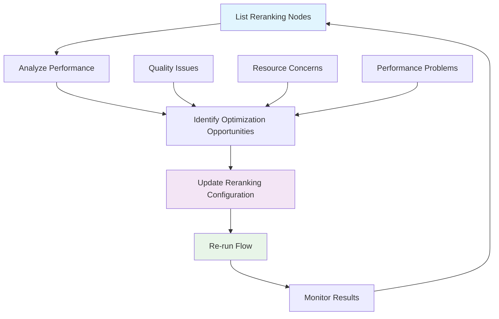
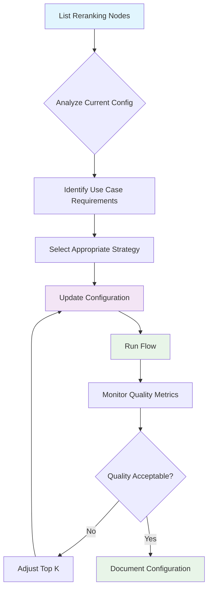
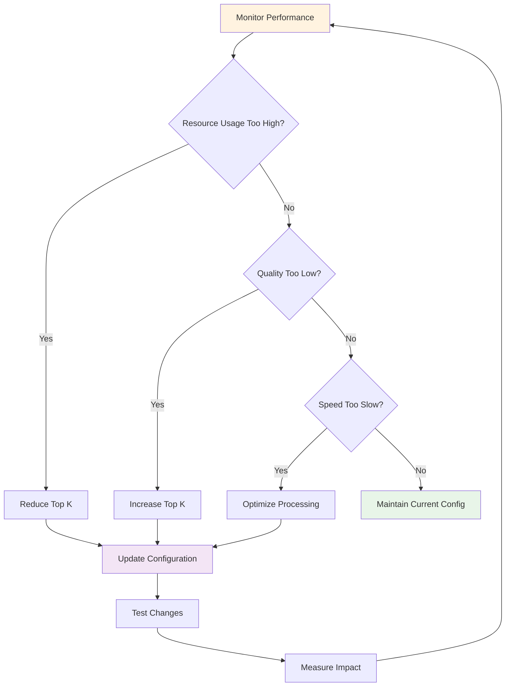
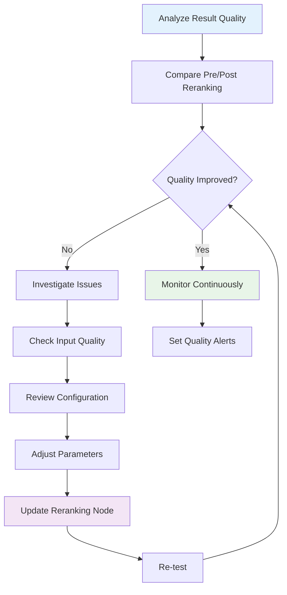

This guide provides a comprehensive overview of GraphorLM's reranking endpoints, which enable sophisticated document reordering using Large Language Model intelligence. Reranking nodes represent the final quality enhancement layer in RAG (Retrieval-Augmented Generation) pipelines, using advanced AI scoring to optimize result relevance and user satisfaction.

## What are Reranking Nodes?

Reranking nodes are intelligent processing components that use Large Language Models (like GPT-4o) to evaluate and reorder documents retrieved by your RAG system. Unlike traditional similarity-based ranking, reranking leverages deep contextual understanding to assess true semantic relevance, dramatically improving the quality of results delivered to users.

### Key Characteristics

- **LLM-Powered Intelligence**: Use advanced language models for sophisticated relevance scoring
- **Contextual Understanding**: Analyze documents with deep semantic comprehension beyond simple keyword matching
- **Quality Enhancement**: Significantly improve result precision and user satisfaction
- **Performance-Aware Processing**: Balance quality improvements with processing efficiency
- **Flexible Configuration**: Adaptable to different use cases and quality requirements

### How Reranking Works

1. **Input Reception**: Receive documents from retrieval nodes along with query context
2. **LLM Analysis**: Use language models to score each document's relevance to the query
3. **Intelligent Scoring**: Generate nuanced relevance scores based on semantic understanding
4. **Smart Reordering**: Reorganize documents by computed relevance scores
5. **Top K Selection**: Return the most relevant documents up to configured limit
6. **Quality Optimization**: Deliver enhanced results to downstream components or users

## Available Endpoints

GraphorLM provides two primary endpoints for managing reranking nodes:

### Core Endpoints

| Endpoint | Method | Purpose | Key Use Cases |
|----------|--------|---------|---------------|
| **[List Reranking Nodes](/api-reference/flows/nodes/reranking/list)** | `GET` | Retrieve reranking node configurations and status | Monitoring, analysis, configuration review |
| **[Update Reranking Configuration](/api-reference/flows/nodes/reranking/update)** | `PATCH` | Modify reranking parameters and settings | Optimization, tuning, strategy adjustment |

### Endpoint Relationships



## Core Concepts

### Reranking Node Structure

Each reranking node contains several key components:

```json
{
  "id": "reranking-1748287628687",
  "type": "reranking", 
  "position": { "x": 800, "y": 300 },
  "style": { "height": 200, "width": 300 },
  "data": {
    "name": "LLM Reranking",
    "config": {
      "topK": 10
    },
    "result": {
      "updated": true,
      "processing": false,
      "waiting": false,
      "has_error": false,
      "updatedMetrics": true,
      "total_reranked": 847
    }
  }
}
```

### Configuration Parameters

#### Top K Selection
- **topK**: Maximum number of documents to return after reranking
- **null**: Process and return all retrieved documents (unlimited)
- **integer**: Specific limit for performance optimization

### Advanced Internal Parameters

While not directly configurable via public API, reranking nodes use sophisticated internal parameters:

#### Processing Configuration
- **batch_size**: Parallel processing capacity (typically 3)
- **max_retries**: Error handling resilience (typically 2)

#### Token Management
- **context_usage_ratio**: LLM context utilization (typically 60%)
- **safety_margin**: Processing safety buffer (typically 90%)
- **prompt_overhead_buffer**: Template overhead allocation (typically 200 tokens)
- **template_variable_buffer**: Variable expansion buffer (typically 100 tokens)
- **fallback_max_tokens**: Conservative fallback limit (typically 1500 tokens)

#### Quality Control
- **min_score**: Minimum relevance threshold (typically 0.0)
- **max_score**: Maximum relevance ceiling (typically 1.0)  
- **default_score**: Fallback score for parsing failures (typically 0.5)

### Result Metrics

#### Processing Status
- **updated**: Configuration current with processing
- **processing**: Currently executing reranking
- **waiting**: Awaiting dependency completion
- **has_error**: Processing encountered errors
- **updatedMetrics**: Metrics have been computed

#### Performance Metrics
- **total_reranked**: Total documents processed through reranking

## Reranking Strategies Guide

### Strategy Selection Matrix

| Use Case | Top K | Performance | Processing Time | Quality Focus | Best For |
|----------|-------|-------------|----------------|---------------|----------|
| **Critical Decisions** | 3-5 | Fast | Low | Maximum Precision | Medical, Legal, Financial |
| **Customer Support** | 5-8 | Fast | Low | High Precision | Help desks, FAQ systems |
| **General Q&A** | 8-12 | Good | Medium | Balanced | Knowledge bases, chatbots |
| **Content Discovery** | 12-20 | Moderate | Medium-High | Comprehensive | Search, recommendations |
| **Research Applications** | 20-30 | Slow | High | Thorough Coverage | Academic, analysis |
| **Exploratory Analysis** | null | Slowest | Very High | Complete Coverage | Research projects |

### Detailed Strategy Configurations

#### High-Precision Strategy
**Configuration**: `{"topK": 5}`

```json
{
  "use_case": "Critical decisions, maximum accuracy",
  "characteristics": {
    "precision": "Maximum",
    "recall": "Limited", 
    "processing_time": "Minimal",
    "speed": "Fast",
    "quality": "Highest relevance"
  },
  "ideal_for": [
    "Medical diagnosis support",
    "Legal research",
    "Financial advice systems", 
    "Safety-critical applications"
  ],
  "trade_offs": {
    "benefits": ["Minimal noise", "Fastest processing", "Lowest resource usage"],
    "limitations": ["May miss relevant results", "Limited diversity"]
  }
}
```

#### Balanced Strategy  
**Configuration**: `{"topK": 10}`

```json
{
  "use_case": "General applications, optimal balance",
  "characteristics": {
    "precision": "High",
    "recall": "Good",
    "processing_time": "Moderate", 
    "speed": "Good",
    "quality": "Excellent balance"
  },
  "ideal_for": [
    "Customer support systems",
    "Knowledge base search",
    "General chatbots",
    "Educational platforms"
  ],
  "trade_offs": {
    "benefits": ["Optimal quality-performance balance", "Good processing efficiency", "Wide applicability"],
    "limitations": ["Not ideal for extreme precision or recall needs"]
  }
}
```

#### Comprehensive Strategy
**Configuration**: `{"topK": 25}`

```json
{
  "use_case": "Research, thorough coverage",
  "characteristics": {
    "precision": "Good",
    "recall": "High",
    "processing_time": "Extended",
    "speed": "Moderate", 
    "quality": "Comprehensive coverage"
  },
  "ideal_for": [
    "Academic research",
    "Market analysis", 
    "Competitive intelligence",
    "Comprehensive reviews"
  ],
  "trade_offs": {
    "benefits": ["Thorough coverage", "High recall", "Research-grade quality"],
    "limitations": ["Higher resource usage", "Slower processing", "May include less relevant results"]
  }
}
```

#### Unlimited Strategy
**Configuration**: `{"topK": null}`

```json
{
  "use_case": "Complete analysis, no limits", 
  "characteristics": {
    "precision": "Variable", 
    "recall": "Maximum",
    "processing_time": "Maximum",
    "speed": "Slowest",
    "quality": "Complete processing"
  },
  "ideal_for": [
    "Comprehensive research projects",
    "Complete document analysis", 
    "Exhaustive investigations",
    "Resource-unlimited scenarios"
  ],
  "trade_offs": {
    "benefits": ["No limits", "Maximum coverage", "Complete analysis"],
    "limitations": ["Highest resource usage", "Longest processing time", "May include irrelevant results"]
  }
}
```

## Common Workflows

### 1. Initial Setup and Optimization



### 2. Performance Optimization Loop



### 3. Quality Assurance Workflow  



## Authentication & URL Structure

### Authentication Requirements

All reranking endpoints require valid API token authentication:

```http
Authorization: Bearer YOUR_API_TOKEN
```

### URL Pattern

Reranking endpoints follow the standard GraphorLM flow URL structure:

```
https://{flow_name}.flows.graphorlm.com/reranking[/{node_id}]
```

**Components:**
- `{flow_name}`: Your specific flow identifier
- `reranking`: Endpoint category for reranking operations
- `{node_id}`: Specific node identifier (for update operations)

### Examples

```bash
# List all reranking nodes
GET https://my-rag-pipeline.flows.graphorlm.com/reranking

# Update specific reranking node
PATCH https://my-rag-pipeline.flows.graphorlm.com/reranking/reranking-1748287628687
```

## Response Formats

### Standard Node Response

All reranking endpoints return nodes in consistent format:

```json
{
  "id": "reranking-1748287628687",
  "type": "reranking",
  "position": { "x": 800, "y": 300 },
  "style": { "height": 200, "width": 300 },
  "data": {
    "name": "LLM Reranking",
    "config": {
      "topK": 10
    },
    "result": {
      "updated": true,
      "processing": false, 
      "waiting": false,
      "has_error": false,
      "updatedMetrics": true,
      "total_reranked": 847
    }
  }
}
```

### Update Response Format

Configuration updates return operation status:

```json
{
  "success": true,
  "message": "Reranking node 'reranking-1748287628687' updated successfully",
  "node_id": "reranking-1748287628687"
}
```

## Error Handling

### Common Error Scenarios

#### Configuration Errors
```json
{
  "detail": "topK must be a positive integer or null"
}
```

#### Resource Errors
```json
{
  "detail": "Reranking node not found"
}
```

#### Processing Errors
```json
{
  "detail": "Failed to update reranking node configuration"
}
```

### Error Resolution Strategies

1. **Validation Errors**: Check parameter types and ranges
2. **Not Found Errors**: Verify flow and node identifiers  
3. **Processing Errors**: Review system status and retry
4. **Authentication Errors**: Validate API token permissions

## Integration Examples

### Complete Reranking Management System

```javascript
class RerankingManager {
  constructor(flowName, apiToken) {
    this.flowName = flowName;
    this.apiToken = apiToken;
    this.baseUrl = `https://${flowName}.flows.graphorlm.com`;
    this.strategies = {
      'critical': { topK: 3, description: 'Maximum precision for critical decisions' },
      'support': { topK: 5, description: 'Focused results for customer support' },
      'balanced': { topK: 10, description: 'Optimal balance for general use' },
      'research': { topK: 20, description: 'Comprehensive coverage for research' },
      'unlimited': { topK: null, description: 'Complete analysis without limits' }
    };
  }

  async getAllRerankingNodes() {
    const response = await fetch(`${this.baseUrl}/reranking`, {
      headers: { 'Authorization': `Bearer ${this.apiToken}` }
    });
    
    if (!response.ok) {
      throw new Error(`Failed to fetch reranking nodes: ${response.statusText}`);
    }
    
    return await response.json();
  }

  async updateNodeConfiguration(nodeId, config) {
    const response = await fetch(`${this.baseUrl}/reranking/${nodeId}`, {
      method: 'PATCH',
      headers: {
        'Authorization': `Bearer ${this.apiToken}`,
        'Content-Type': 'application/json'
      },
      body: JSON.stringify({ config })
    });

    if (!response.ok) {
      throw new Error(`Failed to update node: ${response.statusText}`);
    }
    
    return await response.json();
  }

  async optimizeForStrategy(nodeId, strategyName) {
    const strategy = this.strategies[strategyName];
    if (!strategy) {
      throw new Error(`Unknown strategy: ${strategyName}`);
    }

    console.log(`🎯 Applying ${strategyName} strategy`);
    console.log(`Configuration: Top K = ${strategy.topK || 'Unlimited'}`);
    console.log(`Description: ${strategy.description}`);

    try {
      const result = await this.updateNodeConfiguration(nodeId, { topK: strategy.topK });
      console.log(`✅ Strategy applied successfully: ${result.message}`);
      return result;
    } catch (error) {
      console.error(`❌ Strategy application failed: ${error.message}`);
      throw error;
    }
  }

  async analyzePerformance() {
    const nodes = await this.getAllRerankingNodes();
    
    const analysis = {
      totalNodes: nodes.length,
      nodeAnalysis: [],
      recommendations: [],
      resourceEstimates: {},
      performanceMetrics: {}
    };

    for (const node of nodes) {
      const config = node.data.config;
      const result = node.data.result || {};
      
      const nodeAnalysis = {
        id: node.id,
        name: node.data.name,
        topK: config.topK,
        status: this.getNodeStatus(result),
        resourceLevel: this.estimateResourceUsage(config.topK),
        performanceLevel: this.estimatePerformance(config.topK),
        totalReranked: result.total_reranked || 0,
        hasMetrics: result.updatedMetrics || false
      };

      analysis.nodeAnalysis.push(nodeAnalysis);

      // Generate recommendations
      if (nodeAnalysis.resourceLevel === 'very_high' && nodeAnalysis.totalReranked > 1000) {
        analysis.recommendations.push({
          nodeId: node.id,
          type: 'resource_optimization',
          message: `Consider reducing Top K for ${node.data.name} to optimize resource usage`
        });
      }

      if (nodeAnalysis.status === 'error') {
        analysis.recommendations.push({
          nodeId: node.id,
          type: 'error_resolution',
          message: `Address processing errors in ${node.data.name}`
        });
      }
    }

    return analysis;
  }

  getNodeStatus(result) {
    if (result.has_error) return 'error';
    if (result.processing) return 'processing';
    if (result.waiting) return 'waiting';
    if (result.updated) return 'updated';
    return 'needs_update';
  }

  estimateResourceUsage(topK) {
    if (topK === null) return 'very_high';
    if (topK <= 5) return 'low';
    if (topK <= 15) return 'medium';
    if (topK <= 25) return 'high';
    return 'very_high';
  }

  estimatePerformance(topK) {
    if (topK === null) return 'slow';
    if (topK <= 5) return 'fast';
    if (topK <= 15) return 'good';
    return 'moderate';
  }

  async generateOptimizationReport() {
    console.log('🔍 Generating Reranking Optimization Report');
    console.log('==========================================');
    
    const analysis = await this.analyzePerformance();
    
    console.log(`\n📊 Overview:`);
    console.log(`Total Nodes: ${analysis.totalNodes}`);
    
    const statusCounts = {};
    const resourceCounts = {};
    
    analysis.nodeAnalysis.forEach(node => {
      statusCounts[node.status] = (statusCounts[node.status] || 0) + 1;
      resourceCounts[node.resourceLevel] = (resourceCounts[node.resourceLevel] || 0) + 1;
    });
    
    console.log(`\n📈 Status Distribution:`);
    Object.entries(statusCounts).forEach(([status, count]) => {
      console.log(`   ${status}: ${count} node(s)`);
    });
    
    console.log(`\n⚡ Resource Distribution:`);
    Object.entries(resourceCounts).forEach(([resource, count]) => {
      console.log(`   ${resource}: ${count} node(s)`);
    });
    
    console.log(`\n🎯 Node Details:`);
    analysis.nodeAnalysis.forEach(node => {
      console.log(`\n   📋 ${node.name} (${node.id})`);
      console.log(`      Top K: ${node.topK || 'Unlimited'}`);
      console.log(`      Status: ${node.status}`);
      console.log(`      Resource Level: ${node.resourceLevel}`);
      console.log(`      Performance: ${node.performanceLevel}`);
      console.log(`      Total Reranked: ${node.totalReranked}`);
    });
    
    if (analysis.recommendations.length > 0) {
      console.log(`\n💡 Recommendations:`);
      analysis.recommendations.forEach(rec => {
        console.log(`   • ${rec.message}`);
      });
    }
    
    return analysis;
  }
}

// Usage Example
const manager = new RerankingManager('my-rag-pipeline', 'YOUR_API_TOKEN');

// Generate comprehensive analysis
manager.generateOptimizationReport().catch(console.error);

// Apply specific optimization strategy
manager.optimizeForStrategy('reranking-node-123', 'balanced').catch(console.error);
```

### Performance Monitoring and Alert System

```python
import requests
import json
from typing import Dict, List, Any
from datetime import datetime

class RerankingPerformanceMonitor:
    def __init__(self, flow_name: str, api_token: str):
        self.flow_name = flow_name
        self.api_token = api_token
        self.base_url = f"https://{flow_name}.flows.graphorlm.com"
        
        # Processing complexity based on Top K
        self.complexity_factors = {
            None: 5.0,  # Unlimited - highest complexity
            1: 0.2, 2: 0.4, 3: 0.6, 4: 0.8, 5: 1.0,
            10: 2.0, 15: 3.0, 20: 4.0, 25: 5.0
        }
        
        # Performance alert thresholds
        self.performance_thresholds = {
            'warning': 3.0,   # 3x baseline processing time
            'critical': 5.0   # 5x baseline processing time
        }
    
    async def get_all_nodes(self) -> List[Dict]:
        """Retrieve all reranking nodes"""
        response = requests.get(
            f"{self.base_url}/reranking",
            headers={"Authorization": f"Bearer {self.api_token}"}
        )
        response.raise_for_status()
        return response.json()
    
    def calculate_performance_impact(self, nodes: List[Dict]) -> Dict[str, Any]:
        """Calculate performance impact across all nodes"""
        performance_analysis = {
            "total_nodes": len(nodes),
            "performance_breakdown": {},
            "total_complexity": 0,
            "high_complexity_nodes": [],
            "optimization_opportunities": [],
            "alerts": []
        }
        
        for node in nodes:
            node_id = node["id"]
            node_name = node["data"]["name"]
            top_k = node["data"]["config"].get("topK")
            total_reranked = node["data"].get("result", {}).get("total_reranked", 0)
            
            # Calculate processing complexity
            complexity = self.complexity_factors.get(top_k, 1.0)
            if top_k and top_k > 25:
                complexity = top_k / 5.0  # Linear scaling for high values
            
            performance_analysis["total_complexity"] += complexity
            performance_analysis["performance_breakdown"][node_id] = {
                "name": node_name,
                "top_k": top_k,
                "complexity_factor": complexity,
                "total_reranked": total_reranked,
                "processing_load": complexity * total_reranked if total_reranked else 0
            }
            
            # Identify high-complexity nodes
            if complexity >= self.performance_thresholds["critical"]:
                performance_analysis["high_complexity_nodes"].append({
                    "node_id": node_id,
                    "name": node_name,
                    "top_k": top_k,
                    "complexity_factor": complexity,
                    "severity": "critical"
                })
                
                performance_analysis["alerts"].append({
                    "type": "high_complexity",
                    "severity": "critical",
                    "node_id": node_id,
                    "message": f"Critical: {node_name} has very high processing complexity ({complexity}x)"
                })
            elif complexity >= self.performance_thresholds["warning"]:
                performance_analysis["high_complexity_nodes"].append({
                    "node_id": node_id,
                    "name": node_name,
                    "top_k": top_k,
                    "complexity_factor": complexity,
                    "severity": "warning"
                })
                
                performance_analysis["alerts"].append({
                    "type": "moderate_complexity",
                    "severity": "warning",
                    "node_id": node_id,
                    "message": f"Warning: {node_name} has high processing complexity ({complexity}x)"
                })
            
            # Identify optimization opportunities
            if top_k and top_k > 15 and total_reranked > 500:
                performance_analysis["optimization_opportunities"].append({
                    "node_id": node_id,
                    "name": node_name,
                    "current_top_k": top_k,
                    "suggested_top_k": min(15, top_k),
                    "performance_improvement": f"{((complexity - 3.0) / complexity * 100):.1f}%",
                    "rationale": "High processing volume with high Top K - consider reduction for better performance"
                })
        
        return performance_analysis
    
    def generate_performance_report(self, performance_analysis: Dict[str, Any]) -> None:
        """Generate detailed performance analysis report"""
        print("⚡ Reranking Performance Analysis Report")
        print("=" * 50)
        print(f"Flow: {self.flow_name}")
        print(f"Analysis Date: {datetime.now().strftime('%Y-%m-%d %H:%M:%S')}")
        print(f"Total Nodes Analyzed: {performance_analysis['total_nodes']}")
        print(f"Combined Processing Complexity: {performance_analysis['total_complexity']:.1f}x baseline")
        
        # Alerts
        if performance_analysis["alerts"]:
            print(f"\n🚨 Performance Alerts ({len(performance_analysis['alerts'])}):")
            for alert in performance_analysis["alerts"]:
                icon = "🔴" if alert["severity"] == "critical" else "🟡"
                print(f"   {icon} {alert['message']}")
        else:
            print(f"\n✅ No performance alerts - all nodes within acceptable ranges")
        
        # High-complexity nodes
        if performance_analysis["high_complexity_nodes"]:
            print(f"\n📊 High-Complexity Nodes ({len(performance_analysis['high_complexity_nodes'])}):")
            for node in performance_analysis["high_complexity_nodes"]:
                severity_icon = "🔴" if node["severity"] == "critical" else "🟡"
                print(f"   {severity_icon} {node['name']}")
                print(f"      Top K: {node['top_k'] or 'Unlimited'}")
                print(f"      Complexity Factor: {node['complexity_factor']}x")
        
        # Optimization opportunities
        if performance_analysis["optimization_opportunities"]:
            print(f"\n💡 Optimization Opportunities ({len(performance_analysis['optimization_opportunities'])}):")
            for opp in performance_analysis["optimization_opportunities"]:
                print(f"   🔧 {opp['name']}")
                print(f"      Current Top K: {opp['current_top_k']}")
                print(f"      Suggested Top K: {opp['suggested_top_k']}")
                print(f"      Performance Improvement: {opp['performance_improvement']}")
                print(f"      Rationale: {opp['rationale']}")
        
        # Detailed breakdown
        print(f"\n📋 Detailed Performance Breakdown:")
        for node_id, details in performance_analysis["performance_breakdown"].items():
            print(f"\n   📄 {details['name']} ({node_id})")
            print(f"      Top K: {details['top_k'] or 'Unlimited'}")
            print(f"      Complexity Factor: {details['complexity_factor']}x")
            print(f"      Total Reranked: {details['total_reranked']}")
            print(f"      Processing Load: {details['processing_load']:.0f}")
    
    async def monitor_and_alert(self) -> Dict[str, Any]:
        """Perform performance monitoring and generate alerts"""
        try:
            nodes = await self.get_all_nodes()
            performance_analysis = self.calculate_performance_impact(nodes)
            
            # Generate report
            self.generate_performance_report(performance_analysis)
            
            # Return structured data for integration
            return {
                "success": True,
                "timestamp": datetime.now().isoformat(),
                "performance_analysis": performance_analysis,
                "action_required": len(performance_analysis["alerts"]) > 0
            }
            
        except Exception as e:
            print(f"❌ Performance monitoring failed: {e}")
            return {
                "success": False,
                "error": str(e),
                "timestamp": datetime.now().isoformat()
            }
    
    async def auto_optimize_performance(self, max_complexity: float = 3.0) -> Dict[str, Any]:
        """Automatically optimize high-complexity nodes"""
        print(f"🤖 Auto-optimizing nodes with complexity factor > {max_complexity}x")
        
        nodes = await self.get_all_nodes()
        optimization_results = []
        
        for node in nodes:
            node_id = node["id"]
            node_name = node["data"]["name"]
            current_top_k = node["data"]["config"].get("topK")
            
            if current_top_k is None:
                # Unlimited - suggest reasonable limit
                suggested_top_k = 20
                reason = "Unlimited processing has high resource consumption"
            elif current_top_k > 20:
                # Very high - reduce significantly
                suggested_top_k = min(15, current_top_k // 2)
                reason = f"Top K {current_top_k} is too high for optimal performance"
            else:
                continue  # Node is already optimized
            
            try:
                # Update node configuration
                response = requests.patch(
                    f"{self.base_url}/reranking/{node_id}",
                    headers={
                        "Authorization": f"Bearer {self.api_token}",
                        "Content-Type": "application/json"
                    },
                    json={"config": {"topK": suggested_top_k}}
                )
                response.raise_for_status()
                
                optimization_results.append({
                    "node_id": node_id,
                    "name": node_name,
                    "success": True,
                    "old_top_k": current_top_k,
                    "new_top_k": suggested_top_k,
                    "reason": reason
                })
                
                print(f"✅ Optimized {node_name}: {current_top_k or 'Unlimited'} → {suggested_top_k}")
                
            except Exception as e:
                optimization_results.append({
                    "node_id": node_id,
                    "name": node_name,
                    "success": False,
                    "error": str(e)
                })
                
                print(f"❌ Failed to optimize {node_name}: {e}")
        
        return {
            "optimized_nodes": len([r for r in optimization_results if r["success"]]),
            "failed_optimizations": len([r for r in optimization_results if not r["success"]]),
            "results": optimization_results
        }

# Usage
monitor = RerankingPerformanceMonitor("my-rag-pipeline", "YOUR_API_TOKEN")

# Run performance analysis
analysis = await monitor.monitor_and_alert()

# Auto-optimize if needed
if analysis["action_required"]:
    optimization = await monitor.auto_optimize_performance(max_complexity=4.0)
    print(f"Auto-optimization completed: {optimization['optimized_nodes']} nodes optimized")
```

## Best Practices

### Configuration Management

#### Strategic Planning
- **Define Use Cases**: Clearly identify primary use cases before configuration
- **Set Quality Targets**: Establish measurable quality and performance goals
- **Resource Planning**: Plan for processing resource requirements
- **Testing Protocol**: Implement systematic A/B testing for configuration changes

#### Configuration Validation
- **Parameter Ranges**: Keep Top K values reasonable (typically 1-50)
- **Resource Awareness**: Monitor resource implications of configuration changes
- **Quality Metrics**: Establish quality measurement baselines
- **Performance Monitoring**: Track processing time and system load

### Performance Optimization

#### Quality vs Performance Balance
- **Start Conservative**: Begin with lower Top K values and increase as needed
- **Measure Impact**: Quantify quality improvements from reranking
- **Resource Control**: Monitor and control processing resource usage
- **Strategic Usage**: Use higher Top K only where quality impact justifies resource usage

#### Processing Efficiency
- **Batch Optimization**: Group reranking operations for efficiency
- **Resource Planning**: Plan for increased processing time with higher Top K
- **Error Handling**: Implement robust error handling and retry logic
- **Monitoring Setup**: Establish comprehensive monitoring and alerting

### Quality Assurance

#### Continuous Improvement
- **Regular Assessment**: Periodically review reranking effectiveness
- **User Feedback**: Collect and analyze user satisfaction metrics
- **A/B Testing**: Compare different Top K configurations systematically
- **Baseline Tracking**: Maintain quality baselines for comparison

#### Integration Quality
- **End-to-End Testing**: Test complete RAG pipeline including reranking
- **Edge Case Handling**: Test with diverse query types and document sets
- **Regression Testing**: Ensure configuration changes don't degrade quality
- **Documentation**: Maintain clear documentation of configuration decisions

## Relationship with Other Endpoints

### Integration with Retrieval Nodes
- **Input Dependency**: Reranking nodes process output from retrieval nodes
- **Quality Synergy**: Retrieval quality directly impacts reranking effectiveness
- **Configuration Coordination**: Align retrieval Top K with reranking needs
- **Performance Coupling**: Retrieval and reranking performance are interconnected

### Flow Management Integration
- **[Run Flow](/api-reference/flows/run)**: Execute complete pipeline including reranking
- **[List Flows](/api-reference/flows/list)**: Overview of flows containing reranking nodes  
- **[Deploy Flow](/api-reference/flows/deploy)**: Deploy optimized reranking configurations

### Dataset and Processing Chain
- **Upstream Dependencies**: Dataset → Chunking → Retrieval → **Reranking**
- **Configuration Cascade**: Changes in upstream nodes may require reranking adjustment
- **Quality Pipeline**: Each stage contributes to final result quality

## Use Cases and Applications

### Customer Support Systems
**Configuration**: `{"topK": 5-8}`
- **Goal**: Provide precise, relevant answers to customer queries
- **Benefits**: Reduced support ticket resolution time, improved satisfaction
- **Considerations**: Balance precision with coverage for edge cases

### Knowledge Base Search
**Configuration**: `{"topK": 10-15}`
- **Goal**: Help users find relevant information efficiently
- **Benefits**: Better search experience, reduced time to information
- **Considerations**: Optimize for diverse query types and user expertise levels

### Research and Analysis Platforms
**Configuration**: `{"topK": 20-30}`
- **Goal**: Provide comprehensive, thorough results for research
- **Benefits**: Enhanced research quality, better insight discovery
- **Considerations**: Higher resource usage justified by research value

### Critical Decision Support
**Configuration**: `{"topK": 3-5}`
- **Goal**: Maximum precision for high-stakes decisions
- **Benefits**: Reduced risk, improved decision quality
- **Considerations**: May sacrifice some recall for precision

### Content Discovery Systems
**Configuration**: `{"topK": 15-25}`
- **Goal**: Help users discover relevant content and recommendations
- **Benefits**: Improved engagement, better content utilization
- **Considerations**: Balance diversity with relevance

## Migration and Maintenance

### Configuration Migration
- **Gradual Changes**: Implement Top K changes incrementally
- **Testing Phases**: Test new configurations before full deployment
- **Rollback Plans**: Maintain ability to revert configuration changes
- **Documentation**: Document migration rationale and results

### Ongoing Maintenance
- **Regular Reviews**: Schedule periodic configuration reviews
- **Performance Monitoring**: Continuously monitor resource usage and quality metrics
- **Update Coordination**: Coordinate reranking updates with system changes
- **Version Control**: Maintain configuration version history

### Optimization Cycles
- **Monthly Reviews**: Assess reranking performance and resource usage monthly
- **Quarterly Optimization**: Implement major optimization changes quarterly
- **Annual Strategy Review**: Review overall reranking strategy annually
- **Continuous Monitoring**: Monitor key metrics continuously

## Troubleshooting

<AccordionGroup>
  <Accordion icon="exclamation-triangle" title="High Resource Usage">
    **Symptoms**: High processing resource consumption, system strain
    
    **Common Causes**:
    - Top K values too high for use case requirements
    - Unlimited processing (topK: null) without proper controls
    - High query volume with resource-intensive configurations
    - Multiple nodes with high Top K values
    
    **Solutions**:
    - Review and reduce Top K values where appropriate
    - Implement resource monitoring and alerts
    - Optimize configurations based on actual usage patterns
    - Consider tiered strategies for different query types
  </Accordion>
  
  <Accordion icon="ban" title="Poor Result Quality">
    **Symptoms**: Users report irrelevant results, low satisfaction scores
    
    **Common Causes**:
    - Top K value too low, missing relevant results
    - Poor input quality from retrieval stage
    - Inappropriate strategy for use case
    - LLM model not suitable for domain
    
    **Solutions**:
    - Increase Top K value to include more results
    - Review and optimize retrieval node configuration
    - Analyze query patterns and adjust strategy
    - Test different reranking approaches
  </Accordion>
  
  <Accordion icon="clock" title="Slow Processing Performance">
    **Symptoms**: Long response times, user complaints about speed
    
    **Common Causes**:
    - Very high Top K values requiring extensive LLM processing
    - Unlimited processing without proper controls
    - System resource constraints
    - Network or API latency issues
    
    **Solutions**:
    - Reduce Top K values for better performance
    - Implement processing optimizations
    - Monitor system resources and scale as needed
    - Review API usage patterns and optimize calls
  </Accordion>
  
  <Accordion icon="chart-line" title="Inconsistent Results">
    **Symptoms**: Result quality varies significantly between similar queries
    
    **Common Causes**:
    - LLM model variability in scoring
    - Inconsistent input quality from retrieval
    - Configuration not suitable for query diversity
    - Processing errors or timeouts
    
    **Solutions**:
    - Implement more robust error handling
    - Review configuration for query type diversity
    - Add quality monitoring and alerting
    - Consider ensemble approaches for consistency
  </Accordion>
  
  <Accordion icon="wifi" title="Configuration Changes Not Applied">
    **Symptoms**: Updated configurations don't seem to take effect
    
    **Common Causes**:
    - Flow not re-run after configuration changes
    - Caching preventing updates from taking effect
    - Error in configuration update process
    - Node status not properly updated
    
    **Solutions**:
    - Re-run the flow after configuration changes
    - Check node status to ensure updates are applied
    - Verify configuration update success
    - Clear any relevant caches
  </Accordion>
</AccordionGroup>

## Advanced Features

### Intelligent Resource Management
- **Dynamic Top K**: Adjust Top K based on query complexity and available resources
- **Performance Prediction**: Predict processing resource needs before execution
- **Resource Alerts**: Automatic alerts when approaching resource thresholds
- **Usage Analytics**: Detailed analysis of reranking usage patterns

### Quality Optimization
- **A/B Testing Framework**: Built-in support for comparing reranking strategies
- **Quality Metrics**: Comprehensive quality measurement and tracking
- **User Feedback Integration**: Incorporate user feedback into optimization
- **Performance Benchmarking**: Compare against baseline and competitor systems

### Enterprise Features
- **Multi-Tenant Support**: Separate reranking configurations for different users/teams
- **Audit Logging**: Complete audit trail of configuration changes
- **Compliance Support**: Meet regulatory requirements for decision traceability
- **Integration APIs**: RESTful APIs for integration with enterprise systems

### Future Enhancements
- **Custom Models**: Support for domain-specific reranking models
- **Real-Time Learning**: Adaptive reranking based on user interactions
- **Multi-Modal Support**: Reranking across text, images, and other content types
- **Explainable AI**: Detailed explanations of reranking decisions

## Next Steps

Ready to start optimizing your reranking nodes? Here are the recommended next steps:

<CardGroup cols={2}>
  <Card
    title="List Reranking Nodes"
    icon="list"
    href="/api-reference/flows/nodes/reranking/list"
  >
    Start by examining your current reranking node configurations and performance metrics
  </Card>
  <Card
    title="Update Reranking Configuration"
    icon="sliders"
    href="/api-reference/flows/nodes/reranking/update"
  >
    Optimize your reranking nodes with appropriate Top K values for your use case
  </Card>
  <Card
    title="API Tokens Guide"
    icon="key"
    href="/guides/api-tokens"
  >
    Learn how to generate and manage API tokens for reranking endpoint access
  </Card>
  <Card
    title="Flow Management"
    icon="diagram-project"
    href="/api-reference/flows/overview"
  >
    Explore other flow management endpoints to complete your RAG pipeline
  </Card>
</CardGroup>

---

**Additional Resources:**
- [RAG Pipeline Best Practices](/guides/rag-optimization)
- [Performance Optimization Strategies](/guides/performance-optimization)
- [Quality Measurement Guide](/guides/quality-metrics)
- [Integration Examples](/examples/reranking-integration)
