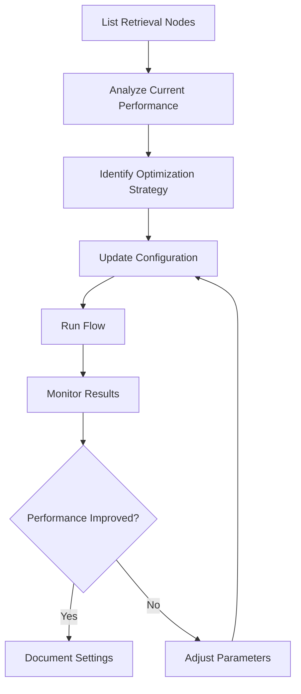

Retrieval endpoints allow you to manage the search and document retrieval components of your flows in GraphorLM. Retrieval nodes are the core components that perform similarity search operations, finding the most relevant documents to answer user queries in your RAG (Retrieval-Augmented Generation) systems.

## What are Retrieval Nodes?

Retrieval nodes are critical components in GraphorLM flows that:

- **Execute Similarity Search**: Perform vector-based document retrieval using various search strategies
- **Filter Results**: Apply score thresholds and ranking to ensure quality results
- **Optimize Performance**: Balance speed and accuracy through configurable parameters
- **Enable RAG Systems**: Provide the retrieval foundation for question-answering and content generation


## Available Endpoints

GraphorLM provides comprehensive REST API endpoints for retrieval management:

<CardGroup cols={2}>
  <Card
    title="List Retrieval Nodes"
    icon="list"
    href="/api-reference/flows/nodes/retrieval/list"
  >
    Retrieve all retrieval nodes from a specific flow with their configurations and performance metrics
  </Card>
  <Card
    title="Update Retrieval Configuration"
    icon="sliders"
    href="/api-reference/flows/nodes/retrieval/update"
  >
    Modify retrieval node settings including search types, thresholds, and optimization parameters
  </Card>
</CardGroup>

## Core Concepts

### Retrieval Node Structure

Each retrieval node contains:

```json
{
  "id": "retrieval-1748287628686",
  "type": "retrieval",
  "position": { "x": 500, "y": 200 },
  "data": {
    "name": "Document Retrieval",
    "config": {
      "searchType": "hybrid",
      "topK": 15,
      "scoreThreshold": 0.75,
      "retrievalQuery": "Find relevant information about: {query}"
    },
    "result": {
      "updated": true,
      "processing": false,
      "updatedMetrics": true,
      "total_retrievals": 1247,
      "lastRun": "2024-01-15T14:25:00Z"
    }
  }
}
```

### Key Components

| Component | Description |
|-----------|-------------|
| **ID** | Unique identifier for the retrieval node |
| **Config** | Search parameters and optimization settings |
| **Result** | Performance metrics and processing status |
| **Position** | Visual placement in the flow editor |

### Search Configuration Parameters

Retrieval nodes support multiple configuration options:

#### Search Types
- **Similarity**: Vector-based semantic similarity matching
- **Hybrid**: Combines semantic and keyword search strategies
- **Keyword**: Traditional term-based search for exact matches
- **Semantic**: Advanced contextual understanding and concept matching

#### Optimization Parameters
- **topK**: Maximum number of documents to retrieve (1-100)
- **scoreThreshold**: Minimum similarity score for results (0.0-1.0)
- **retrievalQuery**: Custom query template for specialized patterns

## Search Strategy Guide

### Similarity Search
- **Best for**: General-purpose document retrieval
- **Characteristics**: Fast vector similarity matching
- **Recommended Settings**: topK: 10-20, threshold: 0.7-0.9
- **Use Cases**: FAQ systems, knowledge bases, general Q&A

```json
{
  "searchType": "similarity",
  "topK": 15,
  "scoreThreshold": 0.8
}
```

### Hybrid Search
- **Best for**: Balanced precision and recall
- **Characteristics**: Combines multiple search methods
- **Recommended Settings**: topK: 15-25, threshold: 0.6-0.8
- **Use Cases**: Complex queries, mixed content types, comprehensive search

```json
{
  "searchType": "hybrid",
  "topK": 20,
  "scoreThreshold": 0.7
}
```

### Keyword Search
- **Best for**: Fast exact term matching
- **Characteristics**: Traditional text-based search
- **Recommended Settings**: topK: 10-15, threshold: 0.5-0.7
- **Use Cases**: Product search, catalog lookups, structured data

```json
{
  "searchType": "keyword",
  "topK": 12,
  "scoreThreshold": 0.6
}
```

### Semantic Search
- **Best for**: Conceptual and contextual understanding
- **Characteristics**: Deep query intent analysis
- **Recommended Settings**: topK: 8-15, threshold: 0.7-0.9
- **Use Cases**: Research queries, technical documentation, expert systems

```json
{
  "searchType": "semantic",
  "topK": 10,
  "scoreThreshold": 0.8
}
```

## Common Workflows

### Setting Up Retrieval Optimization

1. **List Current Nodes**: Use the [List Retrieval Nodes](/api-reference/flows/nodes/retrieval/list) endpoint to review existing configurations
2. **Analyze Performance**: Review metrics and identify optimization opportunities
3. **Update Configuration**: Use the [Update Retrieval Configuration](/api-reference/flows/nodes/retrieval/update) endpoint to apply optimizations
4. **Test and Validate**: Re-run the flow and monitor performance improvements

### Performance Tuning Workflow



### Optimizing for Different Goals

#### High Precision Configuration
- Increase `scoreThreshold` to 0.8+
- Use `similarity` or `semantic` search
- Reduce `topK` to 5-10 results
- Monitor for reduced recall

#### High Recall Configuration  
- Lower `scoreThreshold` to 0.5-0.6
- Use `hybrid` search strategy
- Increase `topK` to 20-30 results
- Monitor for increased noise

#### Balanced Performance
- Set `scoreThreshold` to 0.7
- Use `semantic` or `hybrid` search
- Configure `topK` to 15 results
- Regular performance monitoring

## Authentication & URL Structure

All retrieval endpoints follow consistent patterns:

### Base URL Structure
```
https://{flow_name}.flows.graphorlm.com/retrieval[/{node_id}]
```

### Authentication
Every request requires a valid API token:

```http
Authorization: Bearer YOUR_API_TOKEN
```

<Note>
Generate API tokens through the [API Tokens guide](/guides/api-tokens).
</Note>

### HTTP Methods
- **GET**: List and retrieve retrieval node information
- **PATCH**: Update retrieval node configurations

## Response Formats

### Standard Response Structure

All retrieval endpoints return consistent JSON responses:

```json
{
  "id": "retrieval-node-id",
  "type": "retrieval", 
  "data": {
    "name": "Node Name",
    "config": { /* configuration object */ },
    "result": { /* performance metrics */ }
  }
}
```

### Configuration Object
```json
{
  "searchType": "hybrid",
  "topK": 15,
  "scoreThreshold": 0.75,
  "retrievalQuery": "Find information about: {query}"
}
```

### Result Object
```json
{
  "updated": true,
  "processing": false,
  "waiting": false,
  "has_error": false,
  "updatedMetrics": true,
  "total_retrievals": 1247
}
```

## Error Handling

### Common Error Codes

| Status Code | Description | Solution |
|-------------|-------------|----------|
| **400** | Invalid configuration parameters | Validate search type, topK range, threshold bounds |
| **401** | Authentication failure | Check API token validity |
| **404** | Node or flow not found | Verify flow name and node ID |
| **422** | Validation error | Review required fields and value constraints |
| **500** | Server error | Contact support if persistent |

### Error Response Format
```json
{
  "detail": "Descriptive error message explaining the issue"
}
```

## Integration Examples

### Retrieval Performance Monitor

```javascript
class RetrievalMonitor {
  constructor(flowName, apiToken) {
    this.flowName = flowName;
    this.apiToken = apiToken;
  }

  async getPerformanceOverview() {
    const nodes = await this.listNodes();
    return {
      totalNodes: nodes.length,
      searchTypeDistribution: this.analyzeSearchTypes(nodes),
      averageTopK: this.calculateAverageTopK(nodes),
      performanceMetrics: this.extractMetrics(nodes)
    };
  }

  async optimizeForUseCase(nodeId, useCase) {
    const strategies = {
      'ecommerce': { searchType: 'hybrid', topK: 20, scoreThreshold: 0.6 },
      'support': { searchType: 'similarity', topK: 10, scoreThreshold: 0.8 },
      'research': { searchType: 'semantic', topK: 15, scoreThreshold: 0.75 }
    };
    
    return await this.updateConfiguration(nodeId, strategies[useCase]);
  }
}
```

### Configuration Validator

```python
class RetrievalConfigValidator:
    def validate_and_recommend(self, config):
        recommendations = []
        
        # Analyze search type compatibility
        if config['searchType'] == 'similarity' and config['topK'] > 20:
            recommendations.append("Consider reducing topK for similarity search")
        
        # Check threshold appropriateness
        if config['scoreThreshold'] > 0.9:
            recommendations.append("High threshold may be too restrictive")
        
        return {
            'valid': self.is_valid(config),
            'recommendations': recommendations
        }
```

## Best Practices

### Configuration Management
- **Start Conservative**: Begin with moderate settings and adjust based on performance
- **Monitor Continuously**: Track retrieval quality and user satisfaction metrics
- **Test Incrementally**: Make small changes and measure impact
- **Document Changes**: Keep track of configuration rationale and performance impact

### Performance Optimization
- **Balance Quality vs Speed**: Choose search types based on response time requirements
- **Optimize for Content**: Adjust parameters based on document characteristics
- **Use Custom Queries**: Implement domain-specific query templates when needed
- **Regular Auditing**: Periodically review and optimize configurations

### Search Strategy Selection
- **Understand Your Data**: Choose search types that match your content characteristics
- **Know Your Users**: Optimize based on typical query patterns and expectations
- **Consider Scale**: Factor in performance requirements and system resources
- **Plan for Growth**: Design configurations that scale with increasing content volume

### Threshold Management
- **Quality First**: Prioritize relevant results over quantity
- **User Feedback**: Use retrieval feedback to optimize threshold settings
- **Content Dependent**: Adjust based on content quality and embedding performance
- **Iterative Tuning**: Continuously refine based on performance metrics

## Relationship with Other Endpoints

### Dataset Integration
Retrieval nodes work closely with dataset nodes:
- Dataset nodes provide the source documents
- Retrieval nodes search through processed content
- Both must be configured compatibly for optimal results

### Chunking Integration  
Chunking configuration affects retrieval performance:
- Chunk size impacts retrieval granularity
- Chunk overlap affects context preservation
- Embedding models must be compatible between chunking and retrieval

### Flow Execution
Retrieval nodes are executed as part of flow runs:
- Configuration changes require flow re-execution
- Performance metrics are updated during execution
- Results are cached for subsequent queries

## Use Cases & Applications

### E-commerce Product Search
- **Strategy**: Hybrid search for comprehensive product discovery
- **Configuration**: High topK (20-30), moderate threshold (0.6-0.7)
- **Custom Query**: `"Find products related to: {query}"`

### Customer Support Systems
- **Strategy**: Similarity search for accurate FAQ matching
- **Configuration**: Moderate topK (10-15), high threshold (0.8+)
- **Custom Query**: `"Find support articles about: {query}"`

### Research & Knowledge Management
- **Strategy**: Semantic search for conceptual understanding
- **Configuration**: Balanced topK (15), moderate-high threshold (0.75)
- **Custom Query**: `"Find research on: {query}"`

### Legal Document Search
- **Strategy**: Hybrid search for comprehensive legal research
- **Configuration**: High topK (25+), moderate threshold (0.7)
- **Custom Query**: `"Find legal precedents for: {query}"`

### Technical Documentation
- **Strategy**: Semantic search for contextual help
- **Configuration**: Moderate topK (12-18), high threshold (0.8)
- **Custom Query**: `"Find technical documentation about: {query}"`

## Migration & Maintenance

### Configuration Migration
When updating retrieval configurations:

1. **Backup Current Settings**: Document existing configurations
2. **Test in Stages**: Apply changes incrementally
3. **Monitor Performance**: Track metrics before and after changes
4. **Rollback Plan**: Maintain ability to revert if needed

### Regular Maintenance Tasks

#### Weekly Reviews
- Monitor retrieval performance metrics
- Review error rates and failed queries
- Check system resource utilization

#### Monthly Optimizations
- Analyze query patterns and adjust configurations
- Review and update custom query templates
- Evaluate search strategy effectiveness

#### Quarterly Audits
- Comprehensive performance analysis
- Configuration optimization review
- User feedback integration
- Scaling requirements assessment

### Performance Monitoring

Track key metrics:
- **Retrieval Accuracy**: Relevance of returned results
- **Response Time**: Speed of retrieval operations
- **Success Rate**: Percentage of successful retrievals
- **User Satisfaction**: Feedback on result quality

## Troubleshooting Guide

### Common Issues

<AccordionGroup>
  <Accordion icon="search" title="Poor Retrieval Quality">
    **Symptoms**: Irrelevant results, low user satisfaction
    **Solutions**:
    - Increase `scoreThreshold` to filter low-quality results
    - Experiment with different `searchType` values
    - Review chunking configuration for optimal chunk sizes
    - Consider custom `retrievalQuery` templates
  </Accordion>
  
  <Accordion icon="clock" title="Slow Response Times">
    **Symptoms**: Long retrieval delays, timeout errors
    **Solutions**:
    - Reduce `topK` to retrieve fewer results
    - Use `keyword` searchType for faster responses
    - Optimize `scoreThreshold` to reduce candidate set
    - Consider system scaling for large document volumes
  </Accordion>
  
  <Accordion icon="chart-line" title="Inconsistent Performance">
    **Symptoms**: Variable result quality, unpredictable response times
    **Solutions**:
    - Standardize configurations across similar nodes
    - Implement performance monitoring and alerting
    - Review system resource allocation
    - Consider load balancing for high-traffic scenarios
  </Accordion>
  
  <Accordion icon="exclamation-triangle" title="Configuration Errors">
    **Symptoms**: Update failures, validation errors
    **Solutions**:
    - Validate parameter ranges and data types
    - Check required field completeness
    - Verify search type compatibility
    - Review custom query template syntax
  </Accordion>
</AccordionGroup>

## Advanced Features

### Custom Query Templates
Create domain-specific query optimization:

```json
{
  "retrievalQuery": "Search {domain} documentation for: {query}"
}
```

Common template patterns:
- Product search: `"Find {category} products matching: {query}"`
- Support articles: `"Locate help content for: {query}"`
- Research papers: `"Find academic papers about: {query}"`

### Multi-Strategy Configurations
Design retrieval chains with different strategies:

1. **Primary Retrieval**: High precision similarity search
2. **Fallback Retrieval**: Broader hybrid search if primary fails
3. **Specialized Retrieval**: Domain-specific semantic search

### Performance Profiling
Advanced monitoring capabilities:

- Query pattern analysis
- Response time distribution
- Result quality scoring  
- User interaction tracking

## Getting Started

### Quick Setup Guide

1. **List Current Nodes**: Review existing retrieval configurations
   ```bash
   curl -H "Authorization: Bearer TOKEN" \
     https://your-flow.flows.graphorlm.com/retrieval
   ```

2. **Choose Strategy**: Select search type based on your use case
3. **Configure Parameters**: Set topK and scoreThreshold appropriately  
4. **Test & Iterate**: Run queries and optimize based on results

### Next Steps

After mastering basic retrieval management:

<CardGroup cols={2}>
  <Card
    title="Advanced Configuration"
    icon="cogs"
  >
    Explore custom query templates and multi-strategy setups
  </Card>
  <Card
    title="Performance Optimization"
    icon="chart-line"
  >
    Implement monitoring and automated optimization workflows
  </Card>
  <Card  
    title="Integration Patterns"
    icon="puzzle-piece"
  >
    Learn advanced integration patterns with other flow components
  </Card>
  <Card
    title="Scaling Strategies" 
    icon="expand"
  >
    Plan for high-volume and enterprise-scale deployments
  </Card>
</CardGroup>

## API Reference

For detailed endpoint documentation:

<CardGroup cols={2}>
  <Card
    title="List Retrieval Nodes"
    icon="list"
    href="/api-reference/flows/nodes/retrieval/list"
  >
    Complete reference for listing and analyzing retrieval nodes
  </Card>
  <Card
    title="Update Configuration"
    icon="sliders"
    href="/api-reference/flows/nodes/retrieval/update"
  >
    Detailed guide for modifying retrieval node settings
  </Card>
</CardGroup>
