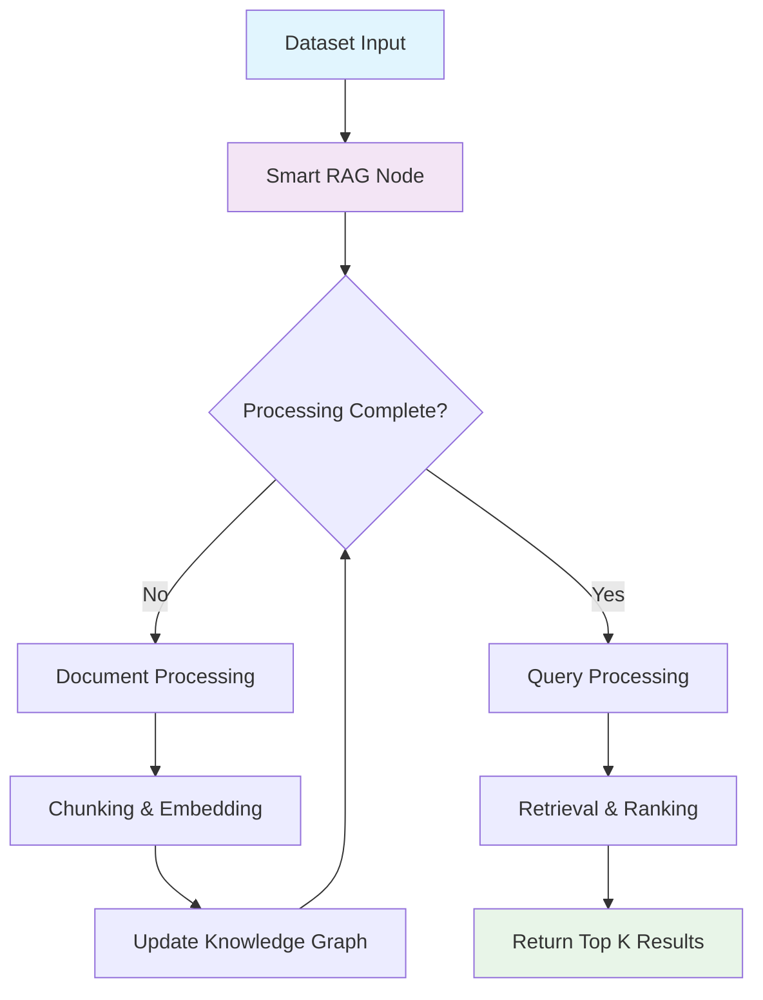
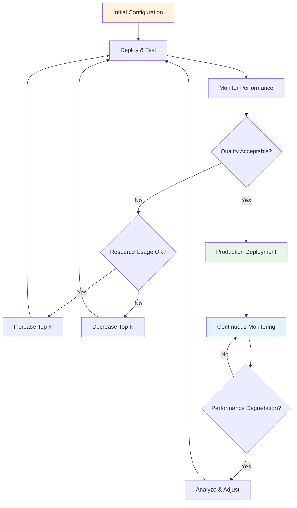
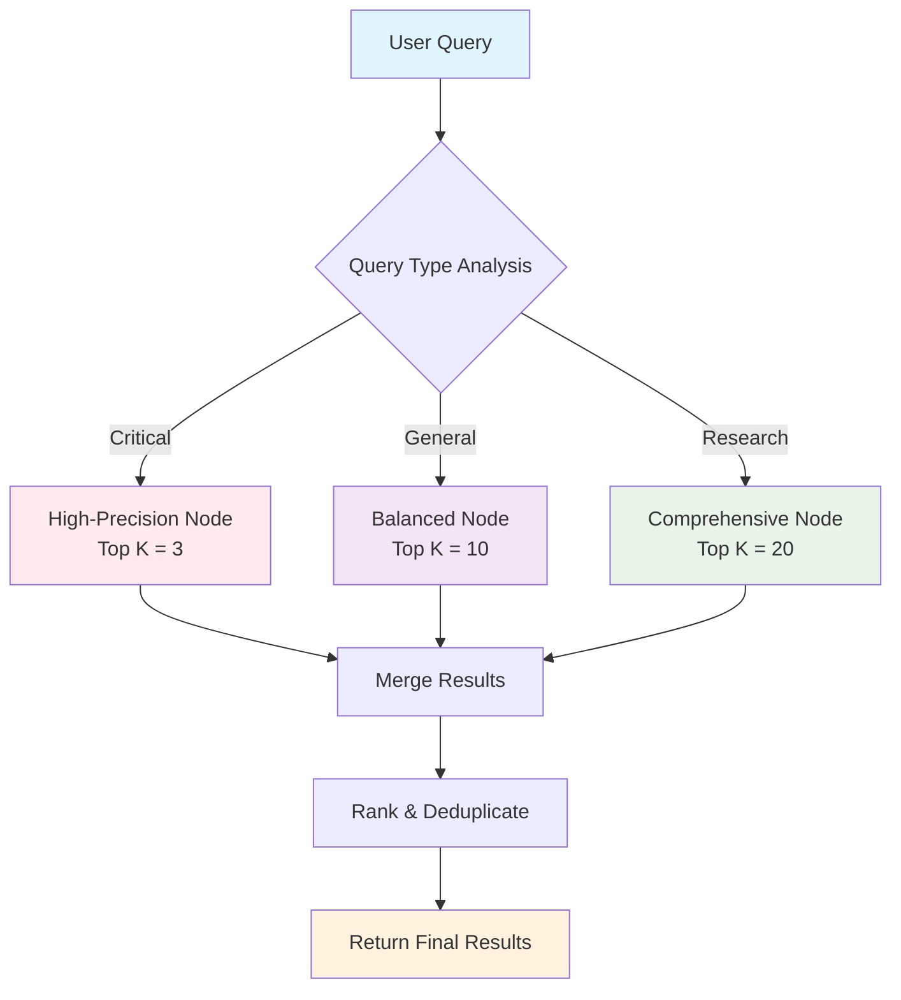

Smart RAG nodes are intelligent RAG (Retrieval-Augmented Generation) components that combine document processing, chunking, and retrieval operations into a single, optimized unit. This comprehensive guide covers all aspects of managing smart RAG nodes, from configuration to advanced optimization strategies.

## What are Smart RAG Nodes?

Smart RAG nodes are all-in-one RAG components that automatically handle:

- **Document Processing**: Intelligent document ingestion and preparation
- **Chunking**: Automated text segmentation with optimal chunk sizes
- **Embedding Generation**: Vector embeddings for semantic search
- **Retrieval**: Query-based document retrieval with configurable Top K
- **Quality Metrics**: Built-in evaluation and performance tracking

### Key Benefits

- **Simplified Workflow**: Single node handles multiple RAG operations
- **Optimized Performance**: Integrated processing reduces overhead
- **Intelligent Defaults**: Pre-configured settings for common use cases
- **Scalable Architecture**: Efficient handling of large document collections
- **Quality Monitoring**: Built-in metrics for retrieval effectiveness

## Available Endpoints

Smart RAG nodes are managed through two primary endpoints:

| Endpoint | Method | Purpose | Documentation |
|----------|---------|---------|---------------|
| **List Smart RAG Nodes** | `GET` | Retrieve all smart RAG nodes from a flow | [📄 List Documentation](/api-reference/flows/smart-rag/list) |
| **Update Smart RAG Configuration** | `PATCH` | Modify smart RAG node settings | [🔧 Update Documentation](/api-reference/flows/smart-rag/update) |

### Base URL Structure

```
https://{flow_name}.flows.graphorlm.com/smart-rag
```

- **{flow_name}**: Your flow identifier
- All endpoints require API token authentication
- Content-Type: `application/json` for update operations

## Core Concepts

### Node Structure

Smart RAG nodes follow the standard GraphorLM node structure:

```json
{
  "id": "smart-rag-1748287628685",
  "type": "smart-rag",
  "position": {"x": 500, "y": 300},
  "style": {"height": 200, "width": 320},
  "data": {
    "name": "Intelligent Document Processing",
    "config": {
      "topK": 10
    },
    "result": {
      "updated": true,
      "processing": false,
      "waiting": false,
      "has_error": false,
      "updatedMetrics": true,
      "total_processed": 1250,
      "total_chunks": 420,
      "total_retrieved": 85
    }
  }
}
```

### Configuration Parameters

Smart RAG nodes have a focused configuration approach:

| Parameter | Type | Default | Description |
|-----------|------|---------|-------------|
| `topK` | integer \| null | 5 | Number of top results to retrieve. Set to `null` for unlimited processing |

### Result Metrics

Smart RAG nodes provide comprehensive result tracking:

| Field | Type | Description |
|-------|------|-------------|
| `updated` | boolean | Node processing status with current configuration |
| `processing` | boolean | Whether the node is currently processing |
| `waiting` | boolean | Whether the node is waiting for dependencies |
| `has_error` | boolean | Error status indicator |
| `updatedMetrics` | boolean | Whether evaluation metrics have been computed |
| `total_processed` | integer | Total number of documents processed |
| `total_chunks` | integer | Number of chunks generated during processing |
| `total_retrieved` | integer | Number of documents retrieved in recent queries |

## Smart RAG Strategies

Smart RAG nodes support multiple operational strategies based on the Top K configuration:

### High-Precision Strategy

**Configuration**: `topK: 3-5`

```json
{
  "config": {
    "topK": 5
  }
}
```

**Characteristics**:
- **Focus**: Maximum relevance per result
- **Resource Usage**: Low system overhead
- **Processing Speed**: Fastest retrieval times
- **Quality Profile**: High precision, moderate recall

**Best For**:
- Critical decision support systems
- Expert knowledge applications
- Factual question answering
- High-stakes information retrieval

**Trade-offs**:
- **Strengths**: Fast, resource-efficient, highly relevant results
- **Limitations**: May miss edge cases or broader context

### Balanced Strategy

**Configuration**: `topK: 8-12`

```json
{
  "config": {
    "topK": 10
  }
}
```

**Characteristics**:
- **Focus**: Optimal balance of precision and coverage
- **Resource Usage**: Moderate system consumption
- **Processing Speed**: Good retrieval performance
- **Quality Profile**: Balanced precision and recall

**Best For**:
- General-purpose knowledge management
- Customer support applications
- Educational content retrieval
- Business intelligence queries

**Trade-offs**:
- **Strengths**: Good overall performance, versatile application
- **Limitations**: Not specialized for extreme precision or coverage

### Comprehensive Strategy

**Configuration**: `topK: 15-25`

```json
{
  "config": {
    "topK": 20
  }
}
```

**Characteristics**:
- **Focus**: Thorough coverage and exploration
- **Resource Usage**: Higher system consumption
- **Processing Speed**: Moderate retrieval times
- **Quality Profile**: High recall, good precision

**Best For**:
- Research and discovery applications
- Content exploration systems
- Comprehensive analysis tools
- Academic research platforms

**Trade-offs**:
- **Strengths**: Comprehensive coverage, discovery potential
- **Limitations**: Higher resource requirements, longer processing

### Unlimited Strategy

**Configuration**: `topK: null`

```json
{
  "config": {
    "topK": null
  }
}
```

**Characteristics**:
- **Focus**: Complete document analysis
- **Resource Usage**: Maximum system consumption
- **Processing Speed**: Longest processing times
- **Quality Profile**: Maximum recall, comprehensive coverage

**Best For**:
- Exhaustive research projects
- Complete document analysis
- Investigation and audit systems
- Resource-unlimited scenarios

**Trade-offs**:
- **Strengths**: Complete coverage, no missed information
- **Limitations**: Highest resource usage, longest processing times

## Strategy Selection Matrix

| Use Case | Precision Need | Coverage Need | Resource Constraints | Recommended Strategy |
|----------|---------------|---------------|---------------------|---------------------|
| Critical Decisions | High | Low | High | High-Precision (3-5) |
| General Q&A | Medium | Medium | Medium | Balanced (8-12) |
| Research | Medium | High | Low | Comprehensive (15-25) |
| Exhaustive Analysis | Low | Maximum | None | Unlimited (null) |
| Real-time Systems | High | Low | High | High-Precision (3-5) |
| Content Discovery | Low | High | Medium | Comprehensive (15-25) |

## Common Workflows

### Basic Smart RAG Workflow



### Configuration Optimization Workflow



### Multi-Strategy Implementation



## Authentication & Authorization

All smart RAG endpoints require API token authentication:

```http
Authorization: Bearer YOUR_API_TOKEN
```

### Token Requirements
- **Scope**: Must have flow management permissions
- **Expiry**: Check token validity before operations
- **Security**: Use HTTPS for all API communications

<Note>
Generate API tokens through the [API Tokens guide](/guides/api-tokens).
</Note>

## Response Formats

### Standard Success Response

```json
{
  "success": true,
  "message": "Operation completed successfully",
  "node_id": "smart-rag-1748287628685"
}
```

### Error Response Format

```json
{
  "detail": "Descriptive error message"
}
```

### Common Status Codes

| Code | Meaning | Action Required |
|------|---------|-----------------|
| 200 | Success | Continue with result |
| 400 | Bad Request | Check request format |
| 401 | Unauthorized | Verify API token |
| 404 | Not Found | Check flow/node existence |
| 422 | Validation Error | Review configuration parameters |
| 500 | Server Error | Contact support if persistent |

## Integration Examples

### Smart RAG Performance Monitor

```python
import requests
import time
from typing import Dict, List, Any, Optional

class SmartRagPerformanceMonitor:
    def __init__(self, flow_name: str, api_token: str):
        self.flow_name = flow_name
        self.api_token = api_token
        self.base_url = f"https://{flow_name}.flows.graphorlm.com"
        self.headers = {"Authorization": f"Bearer {api_token}"}
    
    def get_all_nodes(self) -> List[Dict[str, Any]]:
        """Retrieve all smart RAG nodes"""
        response = requests.get(f"{self.base_url}/smart-rag", headers=self.headers)
        response.raise_for_status()
        return response.json()
    
    def analyze_performance(self) -> Dict[str, Any]:
        """Comprehensive performance analysis"""
        nodes = self.get_all_nodes()
        
        analysis = {
            "summary": {
                "total_nodes": len(nodes),
                "active_nodes": 0,
                "processing_nodes": 0,
                "error_nodes": 0,
                "nodes_with_metrics": 0
            },
            "resource_usage": {
                "low": 0,
                "medium": 0,
                "high": 0,
                "unlimited": 0
            },
            "performance_distribution": {},
            "throughput_metrics": {
                "total_processed": 0,
                "total_chunks": 0,
                "total_retrieved": 0,
                "processing_efficiency": 0
            },
            "quality_indicators": {
                "metrics_enabled": 0,
                "avg_retrieval_rate": 0
            },
            "recommendations": []
        }
        
        total_top_k = 0
        nodes_with_top_k = 0
        
        for node in nodes:
            config = node.get("data", {}).get("config", {})
            result = node.get("data", {}).get("result", {})
            
            # Node status analysis
            if result.get("processing"):
                analysis["summary"]["processing_nodes"] += 1
            elif result.get("has_error"):
                analysis["summary"]["error_nodes"] += 1
            elif result.get("updated"):
                analysis["summary"]["active_nodes"] += 1
            
            # Metrics tracking
            if result.get("updatedMetrics"):
                analysis["summary"]["nodes_with_metrics"] += 1
                analysis["quality_indicators"]["metrics_enabled"] += 1
            
            # Resource usage categorization
            top_k = config.get("topK")
            if top_k is None:
                analysis["resource_usage"]["unlimited"] += 1
            elif top_k <= 5:
                analysis["resource_usage"]["low"] += 1
            elif top_k <= 15:
                analysis["resource_usage"]["medium"] += 1
            else:
                analysis["resource_usage"]["high"] += 1
            
            # Performance distribution
            if top_k is not None:
                performance_key = f"topK_{top_k}"
                analysis["performance_distribution"][performance_key] = (
                    analysis["performance_distribution"].get(performance_key, 0) + 1
                )
                total_top_k += top_k
                nodes_with_top_k += 1
            
            # Throughput metrics
            if result.get("total_processed"):
                analysis["throughput_metrics"]["total_processed"] += result["total_processed"]
            if result.get("total_chunks"):
                analysis["throughput_metrics"]["total_chunks"] += result["total_chunks"]
            if result.get("total_retrieved"):
                analysis["throughput_metrics"]["total_retrieved"] += result["total_retrieved"]
        
        # Calculate averages and efficiency
        if nodes_with_top_k > 0:
            avg_top_k = total_top_k / nodes_with_top_k
            analysis["performance_distribution"]["average_top_k"] = round(avg_top_k, 1)
        
        # Processing efficiency calculation
        total_processed = analysis["throughput_metrics"]["total_processed"]
        total_chunks = analysis["throughput_metrics"]["total_chunks"]
        if total_processed > 0:
            analysis["throughput_metrics"]["processing_efficiency"] = round(
                total_chunks / total_processed, 2
            )
        
        # Retrieval rate calculation
        total_retrieved = analysis["throughput_metrics"]["total_retrieved"]
        if total_chunks > 0:
            analysis["quality_indicators"]["avg_retrieval_rate"] = round(
                (total_retrieved / total_chunks) * 100, 1
            )
        
        # Generate recommendations
        analysis["recommendations"] = self._generate_recommendations(analysis)
        
        return analysis
    
    def _generate_recommendations(self, analysis: Dict[str, Any]) -> List[str]:
        """Generate optimization recommendations"""
        recommendations = []
        summary = analysis["summary"]
        resource_usage = analysis["resource_usage"]
        quality = analysis["quality_indicators"]
        
        # Node health recommendations
        if summary["error_nodes"] > 0:
            recommendations.append(
                f"Address {summary['error_nodes']} nodes with errors to improve system reliability"
            )
        
        if summary["processing_nodes"] > summary["total_nodes"] * 0.3:
            recommendations.append(
                "High percentage of nodes are processing - consider resource allocation review"
            )
        
        # Resource optimization recommendations
        if resource_usage["unlimited"] > 0:
            recommendations.append(
                f"Review {resource_usage['unlimited']} unlimited nodes for resource optimization opportunities"
            )
        
        if resource_usage["high"] > resource_usage["low"] + resource_usage["medium"]:
            recommendations.append(
                "Consider balancing resource usage - many nodes use high Top K values"
            )
        
        # Quality improvement recommendations
        metrics_coverage = quality["metrics_enabled"] / summary["total_nodes"] * 100
        if metrics_coverage < 80:
            recommendations.append(
                f"Enable metrics on more nodes - currently only {metrics_coverage:.1f}% have metrics enabled"
            )
        
        # Performance recommendations
        avg_retrieval_rate = quality["avg_retrieval_rate"]
        if avg_retrieval_rate > 0:
            if avg_retrieval_rate < 10:
                recommendations.append(
                    "Low retrieval rate detected - consider increasing Top K values for better coverage"
                )
            elif avg_retrieval_rate > 50:
                recommendations.append(
                    "High retrieval rate - consider optimizing Top K values for better efficiency"
                )
        
        return recommendations
    
    def print_performance_report(self, analysis: Dict[str, Any]):
        """Print formatted performance report"""
        print("🤖 Smart RAG Performance Analysis Report")
        print("=" * 50)
        print(f"Flow: {self.flow_name}")
        print(f"Analysis Date: {time.strftime('%Y-%m-%d %H:%M:%S')}")
        
        # Summary section
        summary = analysis["summary"]
        print(f"\n📊 Node Summary:")
        print(f"  Total Nodes: {summary['total_nodes']}")
        print(f"  Active Nodes: {summary['active_nodes']}")
        print(f"  Processing Nodes: {summary['processing_nodes']}")
        print(f"  Error Nodes: {summary['error_nodes']}")
        print(f"  Nodes with Metrics: {summary['nodes_with_metrics']}")
        
        # Resource usage section
        resource = analysis["resource_usage"]
        print(f"\n⚡ Resource Usage Distribution:")
        print(f"  Low Usage (≤5): {resource['low']} nodes")
        print(f"  Medium Usage (6-15): {resource['medium']} nodes")
        print(f"  High Usage (>15): {resource['high']} nodes")
        print(f"  Unlimited Usage: {resource['unlimited']} nodes")
        
        # Performance metrics
        perf = analysis["performance_distribution"]
        if "average_top_k" in perf:
            print(f"\n🎯 Performance Metrics:")
            print(f"  Average Top K: {perf['average_top_k']}")
        
        # Throughput analysis
        throughput = analysis["throughput_metrics"]
        print(f"\n📈 Throughput Analysis:")
        print(f"  Total Documents Processed: {throughput['total_processed']:,}")
        print(f"  Total Chunks Generated: {throughput['total_chunks']:,}")
        print(f"  Total Documents Retrieved: {throughput['total_retrieved']:,}")
        print(f"  Processing Efficiency: {throughput['processing_efficiency']} chunks/doc")
        
        # Quality indicators
        quality = analysis["quality_indicators"]
        print(f"\n🎯 Quality Indicators:")
        print(f"  Metrics Coverage: {(quality['metrics_enabled']/summary['total_nodes']*100):.1f}%")
        if quality["avg_retrieval_rate"] > 0:
            print(f"  Average Retrieval Rate: {quality['avg_retrieval_rate']}%")
        
        # Recommendations
        if analysis["recommendations"]:
            print(f"\n💡 Optimization Recommendations:")
            for i, rec in enumerate(analysis["recommendations"], 1):
                print(f"  {i}. {rec}")
        
        print("\n" + "=" * 50)

# Usage example
monitor = SmartRagPerformanceMonitor("my-rag-pipeline", "YOUR_API_TOKEN")
analysis = monitor.analyze_performance()
monitor.print_performance_report(analysis)
```

### Smart RAG Configuration Optimizer

```javascript
class SmartRagConfigurationOptimizer {
  constructor(flowName, apiToken) {
    this.flowName = flowName;
    this.apiToken = apiToken;
    this.baseUrl = `https://${flowName}.flows.graphorlm.com`;
  }

  async getAllNodes() {
    const response = await fetch(`${this.baseUrl}/smart-rag`, {
      headers: { 'Authorization': `Bearer ${this.apiToken}` }
    });
    
    if (!response.ok) {
      throw new Error(`Failed to fetch nodes: ${response.statusText}`);
    }
    
    return await response.json();
  }

  async optimizeConfiguration(nodeId, targetProfile = 'balanced') {
    const profiles = {
      'precision': { topK: 5, description: 'High-precision, low resource usage' },
      'balanced': { topK: 10, description: 'Balanced precision and coverage' },
      'comprehensive': { topK: 20, description: 'High coverage, thorough results' },
      'unlimited': { topK: null, description: 'Complete analysis, maximum resources' }
    };

    const profile = profiles[targetProfile];
    if (!profile) {
      throw new Error(`Invalid profile: ${targetProfile}. Available: ${Object.keys(profiles).join(', ')}`);
    }

    console.log(`🎯 Optimizing node ${nodeId} for ${targetProfile} profile`);
    console.log(`   Configuration: Top K = ${profile.topK || 'unlimited'}`);
    console.log(`   Description: ${profile.description}`);

    const response = await fetch(`${this.baseUrl}/smart-rag/${nodeId}`, {
      method: 'PATCH',
      headers: {
        'Authorization': `Bearer ${this.apiToken}`,
        'Content-Type': 'application/json'
      },
      body: JSON.stringify({ config: { topK: profile.topK } })
    });

    if (!response.ok) {
      throw new Error(`Optimization failed: ${response.statusText}`);
    }

    const result = await response.json();
    console.log(`✅ ${result.message}`);
    return result;
  }

  async batchOptimization(optimizations) {
    console.log(`🔄 Starting batch optimization for ${optimizations.length} nodes`);
    const results = [];

    for (const { nodeId, profile } of optimizations) {
      try {
        const result = await this.optimizeConfiguration(nodeId, profile);
        results.push({ nodeId, profile, success: true, result });
        
        // Small delay to avoid overwhelming the API
        await new Promise(resolve => setTimeout(resolve, 500));
      } catch (error) {
        console.error(`❌ Failed to optimize ${nodeId}: ${error.message}`);
        results.push({ nodeId, profile, success: false, error: error.message });
      }
    }

    this.generateBatchReport(results);
    return results;
  }

  generateBatchReport(results) {
    console.log('\n📋 Batch Optimization Report');
    console.log('============================');
    
    const successful = results.filter(r => r.success);
    const failed = results.filter(r => !r.success);
    
    console.log(`Total Operations: ${results.length}`);
    console.log(`Successful: ${successful.length}`);
    console.log(`Failed: ${failed.length}`);
    
    if (successful.length > 0) {
      console.log('\n✅ Successful Optimizations:');
      successful.forEach(({ nodeId, profile }) => {
        console.log(`   ${nodeId} → ${profile} profile`);
      });
    }
    
    if (failed.length > 0) {
      console.log('\n❌ Failed Optimizations:');
      failed.forEach(({ nodeId, profile, error }) => {
        console.log(`   ${nodeId} (${profile}): ${error}`);
      });
    }
  }

  async recommendOptimizations() {
    const nodes = await this.getAllNodes();
    const recommendations = [];

    console.log('🔍 Analyzing nodes for optimization opportunities...\n');

    for (const node of nodes) {
      const config = node.data.config || {};
      const result = node.data.result || {};
      const topK = config.topK;
      const nodeName = node.data.name;

      let recommendation = null;

      // Analysis logic
      if (result.has_error) {
        recommendation = {
          nodeId: node.id,
          nodeName,
          currentTopK: topK,
          issue: 'Node has errors',
          suggestedProfile: 'precision',
          reason: 'Reduce resource usage to address stability issues',
          priority: 'high'
        };
      } else if (result.processing && topK > 20) {
        recommendation = {
          nodeId: node.id,
          nodeName,
          currentTopK: topK,
          issue: 'Long processing time with high Top K',
          suggestedProfile: 'balanced',
          reason: 'Balance performance and quality',
          priority: 'medium'
        };
      } else if (topK === null && !result.updatedMetrics) {
        recommendation = {
          nodeId: node.id,
          nodeName,
          currentTopK: topK,
          issue: 'Unlimited processing without metrics',
          suggestedProfile: 'comprehensive',
          reason: 'Limit resource usage and enable monitoring',
          priority: 'medium'
        };
      } else if (topK && topK < 3) {
        recommendation = {
          nodeId: node.id,
          nodeName,
          currentTopK: topK,
          issue: 'Very low Top K may limit coverage',
          suggestedProfile: 'balanced',
          reason: 'Improve result coverage while maintaining efficiency',
          priority: 'low'
        };
      }

      if (recommendation) {
        recommendations.push(recommendation);
      }
    }

    this.printRecommendations(recommendations);
    return recommendations;
  }

  printRecommendations(recommendations) {
    if (recommendations.length === 0) {
      console.log('✅ No optimization recommendations - all nodes appear well-configured');
      return;
    }

    console.log(`💡 Found ${recommendations.length} optimization opportunities:\n`);

    const byPriority = {
      high: recommendations.filter(r => r.priority === 'high'),
      medium: recommendations.filter(r => r.priority === 'medium'),
      low: recommendations.filter(r => r.priority === 'low')
    };

    ['high', 'medium', 'low'].forEach(priority => {
      if (byPriority[priority].length > 0) {
        const icon = priority === 'high' ? '🔴' : priority === 'medium' ? '🟡' : '🟢';
        console.log(`${icon} ${priority.toUpperCase()} Priority (${byPriority[priority].length} items):`);
        
        byPriority[priority].forEach(rec => {
          console.log(`   📍 ${rec.nodeName} (${rec.nodeId})`);
          console.log(`      Issue: ${rec.issue}`);
          console.log(`      Current Top K: ${rec.currentTopK || 'unlimited'}`);
          console.log(`      Suggested: ${rec.suggestedProfile} profile`);
          console.log(`      Reason: ${rec.reason}\n`);
        });
      }
    });
  }
}

// Usage examples
const optimizer = new SmartRagConfigurationOptimizer('my-rag-pipeline', 'YOUR_API_TOKEN');

// Single node optimization
optimizer.optimizeConfiguration('smart-rag-123', 'balanced').catch(console.error);

// Batch optimization
const batchOps = [
  { nodeId: 'smart-rag-123', profile: 'precision' },
  { nodeId: 'smart-rag-456', profile: 'balanced' },
  { nodeId: 'smart-rag-789', profile: 'comprehensive' }
];
optimizer.batchOptimization(batchOps).catch(console.error);

// Get recommendations
optimizer.recommendOptimizations().catch(console.error);
```

## Best Practices

### Configuration Management

- **Start with Defaults**: Begin with balanced configuration (Top K = 10) and adjust based on results
- **Incremental Changes**: Make small adjustments and measure impact before larger changes
- **Environment-Specific Settings**: Use different configurations for development, staging, and production
- **Documentation**: Maintain clear records of configuration decisions and their rationale

### Performance Optimization

#### Resource Management
- **Monitor System Impact**: Track resource usage across different Top K settings
- **Balance Quality vs Efficiency**: Higher Top K improves coverage but increases resource consumption
- **Scaling Considerations**: Plan resource allocation for peak query volumes
- **Graceful Degradation**: Implement fallback strategies for resource constraints

#### Processing Efficiency
- **Batch Operations**: Process multiple queries efficiently through smart batching
- **Caching Strategies**: Implement intelligent caching for frequently accessed results
- **Load Distribution**: Balance processing load across multiple smart RAG nodes
- **Asynchronous Processing**: Use background processing for non-critical operations

### Quality Assurance

#### Metrics and Monitoring
- **Enable Metrics**: Activate evaluation metrics on all production nodes
- **Regular Assessment**: Schedule periodic quality reviews and optimizations
- **User Feedback Integration**: Incorporate user feedback into quality measurements
- **Comparative Analysis**: Compare performance across different configurations

#### Continuous Improvement
- **A/B Testing**: Test different configurations with real user queries
- **Performance Baselines**: Establish and maintain performance benchmarks
- **Quality Regression Detection**: Monitor for quality degradation over time
- **Optimization Cycles**: Implement regular optimization review cycles

### Operational Excellence

#### Monitoring and Alerting
- **Health Checks**: Implement comprehensive node health monitoring
- **Performance Alerts**: Set up alerts for performance degradation
- **Resource Monitoring**: Track system resource consumption patterns
- **Error Tracking**: Monitor and respond to processing errors promptly

#### Maintenance and Updates
- **Regular Reviews**: Schedule monthly configuration reviews
- **Update Coordination**: Coordinate smart RAG updates with system changes
- **Version Control**: Maintain configuration version history
- **Rollback Procedures**: Have tested rollback procedures for configuration changes

### Optimization Cycles
- **Monthly Reviews**: Assess smart RAG performance and resource usage monthly
- **Quarterly Optimization**: Implement major optimization changes quarterly
- **Annual Strategy Review**: Review overall smart RAG strategy annually
- **Continuous Monitoring**: Monitor key metrics continuously

## Troubleshooting

<AccordionGroup>
  <Accordion icon="exclamation-triangle" title="High Resource Usage">
    **Symptoms**: High processing resource consumption, system strain
    
    **Common Causes**:
    - Top K values too high for use case requirements
    - Unlimited processing (topK: null) without proper controls
    - High query volume with resource-intensive configurations
    - Multiple nodes with high Top K values
    
    **Solutions**:
    - Review and reduce Top K values where appropriate
    - Implement resource monitoring and alerts
    - Optimize configurations based on actual usage patterns
    - Consider tiered strategies for different query types
  </Accordion>
  
  <Accordion icon="ban" title="Poor Result Quality">
    **Symptoms**: Users report irrelevant results, low satisfaction scores
    
    **Common Causes**:
    - Top K value too low, missing relevant results
    - Poor input quality from document processing
    - Inappropriate strategy for use case
    - Outdated or insufficient training data
    
    **Solutions**:
    - Increase Top K value to include more results
    - Review and optimize document input quality
    - Analyze query patterns and adjust strategy
    - Enable metrics to track quality improvements
  </Accordion>
  
  <Accordion icon="clock" title="Slow Processing Performance">
    **Symptoms**: Long response times, user complaints about speed
    
    **Common Causes**:
    - Very high Top K values requiring extensive processing
    - Unlimited processing without proper controls
    - System resource constraints
    - Large document collections without optimization
    
    **Solutions**:
    - Reduce Top K values for performance-critical applications
    - Implement processing optimizations
    - Monitor system resources and scale as needed
    - Optimize document processing pipeline
  </Accordion>
  
  <Accordion icon="chart-line" title="Inconsistent Results">
    **Symptoms**: Result quality varies significantly between similar queries
    
    **Common Causes**:
    - Variable document quality in different collections
    - Inconsistent chunking or processing
    - Configuration not suitable for query diversity
    - Processing errors or timeouts
    
    **Solutions**:
    - Standardize document processing procedures
    - Review configuration for query type diversity
    - Add quality monitoring and alerting
    - Implement error handling and retry mechanisms
  </Accordion>
  
  <Accordion icon="wifi" title="Configuration Changes Not Applied">
    **Symptoms**: Updated configurations don't seem to take effect
    
    **Common Causes**:
    - Flow not re-run after configuration changes
    - Caching preventing updates from taking effect
    - Error in configuration update process
    - Node status not properly updated
    
    **Solutions**:
    - Re-run the flow after configuration changes
    - Check node status to ensure updates are applied
    - Verify configuration update success
    - Clear any relevant caches
  </Accordion>
</AccordionGroup>

## Advanced Features

### Intelligent Resource Management
- **Dynamic Top K**: Adjust Top K based on query complexity and available resources
- **Performance Prediction**: Predict processing resource needs before execution
- **Resource Alerts**: Automatic alerts when approaching resource thresholds
- **Usage Analytics**: Detailed analysis of smart RAG usage patterns

### Quality Optimization
- **A/B Testing Framework**: Built-in support for comparing smart RAG strategies
- **Quality Regression Detection**: Automatic detection of quality degradation
- **User Feedback Integration**: Incorporate user ratings into optimization
- **Contextual Adaptation**: Adjust behavior based on query context

### Integration Capabilities
- **Multi-Flow Coordination**: Coordinate smart RAG nodes across multiple flows
- **External System Integration**: Connect with external knowledge bases
- **Real-time Updates**: Dynamic configuration updates without downtime
- **API Ecosystem**: Rich API ecosystem for custom integrations

## Use Cases by Industry

### Technology & Software
- **Documentation Search**: Technical documentation and API reference
- **Code Knowledge**: Code repository search and analysis
- **Support Systems**: Technical support and troubleshooting
- **Decision**: Precision-focused strategy (Top K = 3-5)

### Healthcare & Life Sciences
- **Medical Research**: Research paper and clinical trial analysis
- **Knowledge Management**: Medical knowledge base queries
- **Diagnostic Support**: Symptom and diagnosis information
- **Decision**: Comprehensive strategy (Top K = 15-20)

### Financial Services
- **Regulatory Compliance**: Regulation and compliance document search
- **Market Research**: Financial analysis and market intelligence
- **Risk Assessment**: Risk evaluation and compliance checking
- **Decision**: Balanced strategy (Top K = 8-12)

### Education & Research
- **Academic Research**: Research paper and literature review
- **Educational Content**: Learning material and course content
- **Knowledge Discovery**: Exploratory research and analysis
- **Decision**: Unlimited strategy (Top K = null) for comprehensive coverage

### Legal Services
- **Case Law Research**: Legal precedent and case analysis
- **Document Review**: Contract and legal document analysis
- **Compliance Checking**: Regulatory compliance verification
- **Decision**: Comprehensive strategy (Top K = 15-25)

## Migration and Maintenance

### From Traditional RAG
1. **Assessment**: Evaluate current RAG pipeline components
2. **Mapping**: Map existing functionality to smart RAG features
3. **Configuration**: Set up equivalent smart RAG configurations
4. **Testing**: Validate performance and quality equivalence
5. **Gradual Migration**: Phase migration to minimize disruption

### Version Management
- **Configuration Versioning**: Track configuration changes over time
- **Rollback Procedures**: Quick rollback to previous configurations
- **Change Documentation**: Document all configuration changes
- **Impact Assessment**: Evaluate impact of changes before implementation

### Capacity Planning
- **Growth Projection**: Plan for increased query volumes
- **Resource Scaling**: Scale resources based on usage patterns
- **Performance Benchmarking**: Maintain performance benchmarks
- **Optimization Scheduling**: Schedule regular optimization reviews

## Relationship with Other Endpoints

Smart RAG nodes integrate with the broader GraphorLM ecosystem:

### Dataset Integration
- **Input Source**: Dataset nodes provide document input to smart RAG nodes
- **File Management**: Smart RAG automatically processes files from connected datasets
- **Update Coordination**: Dataset changes trigger smart RAG reprocessing

### Flow Management
- **Flow Orchestration**: Smart RAG nodes participate in larger flow orchestrations
- **Dependency Management**: Proper handling of node dependencies and execution order
- **State Management**: Coordinate processing state across flow components

### Metrics and Evaluation
- **Quality Metrics**: Integration with evaluation and metrics systems
- **Performance Tracking**: Built-in performance and resource usage tracking
- **Reporting**: Comprehensive reporting integration with GraphorLM analytics

## Next Steps

Explore related documentation to maximize your smart RAG implementation:

<CardGroup cols={2}>
  <Card
    title="List Smart RAG Nodes"
    icon="list"
    href="/api-reference/flows/smart-rag/list"
  >
    Learn how to retrieve and analyze smart RAG node configurations
  </Card>
  <Card
    title="Update Smart RAG Configuration"
    icon="cog"
    href="/api-reference/flows/smart-rag/update"
  >
    Master smart RAG configuration management and optimization
  </Card>
  <Card
    title="Dataset Management"
    icon="database"
    href="/api-reference/flows/datasets/overview"
  >
    Understand how datasets integrate with smart RAG nodes
  </Card>
  <Card
    title="Flow Orchestration"
    icon="diagram-project"
    href="/api-reference/flows/overview"
  >
    Learn about comprehensive flow management
  </Card>
</CardGroup>
