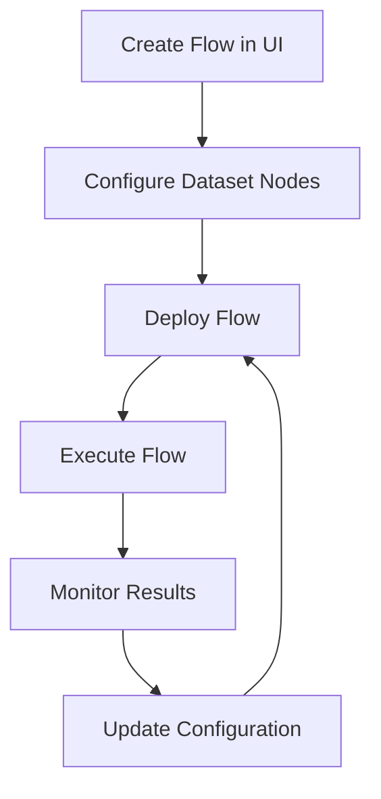

The Flows API provides complete control over your RAG pipelines in GraphorLM. From deploying flows to managing dataset configurations, these endpoints enable you to build, deploy, and execute intelligent document processing workflows programmatically.

## What are Flows?

Flows are visual representations of your RAG pipelines that define how documents are processed, chunked, indexed, and queried. Each flow consists of interconnected nodes that perform specific functions in your data processing pipeline.


### Core Flow Components

- **Dataset Nodes**: Connect source documents to your pipeline
- **Processing Nodes**: Handle chunking, embedding, and indexing
- **LLM Nodes**: Integrate language models for generation
- **Logic Nodes**: Add custom processing and routing logic

## Available API Endpoints

The Flows API is organized into two main categories:

### Flow Management

Core endpoints for managing flow lifecycles:

<CardGroup cols={2}>
  <Card
    title="List Flows"
    icon="list"
    href="/api-reference/flows/list"
  >
    Retrieve all flows in your project with status and deployment information
  </Card>
  <Card
    title="Run Flow"
    icon="play"
    href="/api-reference/flows/run"
  >
    Execute deployed flows with queries and receive processed results
  </Card>
  <Card
    title="Deploy Flow"
    icon="rocket"
    href="/api-reference/flows/deploy"
  >
    Deploy flows to make them accessible via the public API
  </Card>
</CardGroup>

### Dataset Management

Specialized endpoints for managing dataset nodes within flows:

<CardGroup cols={2}>
  <Card
    title="Dataset Overview"
    icon="database"
    href="/api-reference/flows/datasets/overview"
  >
    Comprehensive guide to dataset node management
  </Card>
  <Card
    title="List Dataset Nodes"
    icon="list"
    href="/api-reference/flows/datasets/list"
  >
    Retrieve dataset nodes from flows with configurations
  </Card>
  <Card
    title="Update Dataset"
    icon="pen-to-square"
    href="/api-reference/flows/datasets/update"
  >
    Modify dataset node configurations and file selections
  </Card>
</CardGroup>

## Authentication

All Flows API endpoints require authentication using API tokens:

```http
Authorization: Bearer YOUR_API_TOKEN
```

<Note>
Learn how to generate and manage API tokens in the [API Tokens guide](/guides/api-tokens).
</Note>

## URL Structure

Flow endpoints follow consistent URL patterns based on their purpose:

### Global Flow Operations
```
https://flows.graphorlm.com
```
Used for project-wide operations like listing all flows.

### Flow-Specific Operations
```
https://{flow_name}.flows.graphorlm.com[/{endpoint}]
```
Used for operations on specific flows, including execution and dataset management.

## Common Workflow Patterns

### Complete Flow Lifecycle

Here's a typical workflow for managing flows from creation to execution:



### 1. Flow Creation and Configuration

```javascript
// Check existing flows
const flows = await fetch('https://flows.graphorlm.com', {
  headers: { 'Authorization': 'Bearer YOUR_API_TOKEN' }
});

// Configure dataset nodes
const datasets = await fetch('https://my-flow.flows.graphorlm.com/datasets', {
  headers: { 'Authorization': 'Bearer YOUR_API_TOKEN' }
});
```

### 2. Flow Deployment

```javascript
// Deploy the flow
const deployResult = await fetch('https://my-flow.flows.graphorlm.com/deploy', {
  method: 'POST',
  headers: {
    'Authorization': 'Bearer YOUR_API_TOKEN',
    'Content-Type': 'application/json'
  },
  body: JSON.stringify({
    tool_description: "Advanced RAG pipeline for technical documentation"
  })
});
```

### 3. Flow Execution

```javascript
// Execute the deployed flow
const result = await fetch('https://my-flow.flows.graphorlm.com', {
  method: 'POST',
  headers: {
    'Authorization': 'Bearer YOUR_API_TOKEN',
    'Content-Type': 'application/json'
  },
  body: JSON.stringify({
    query: "What are the key features of attention mechanisms?",
    page: 1,
    page_size: 10
  })
});
```

## Response Formats

### Flow Object Structure

```json
{
  "name": "my-rag-pipeline",
  "description": "Advanced RAG pipeline for technical documentation",
  "status": "Deployed",
  "url": "https://my-rag-pipeline.flows.graphorlm.com"
}
```

### Dataset Node Structure

```json
{
  "id": "dataset-1748287628684",
  "type": "dataset",
  "position": { "x": 100, "y": 200 },
  "data": {
    "name": "Research Papers",
    "config": {
      "files": ["attention.pdf", "transformer.pdf"]
    },
    "result": {
      "updated": false,
      "lastRun": "2024-01-15T10:30:00Z"
    }
  }
}
```

### Execution Results

```json
{
  "items": [
    {
      "page_content": "Attention mechanisms allow models to focus on relevant parts...",
      "metadata": {
        "source": "attention.pdf",
        "page": 3,
        "relevance_score": 0.95
      }
    }
  ],
  "total": 1,
  "page": 1,
  "page_size": 10,
  "total_pages": 1
}
```

## Error Handling

The Flows API uses standard HTTP status codes and provides detailed error messages:

| Status Code | Description | Common Causes |
|-------------|-------------|---------------|
| **400** | Bad Request | Invalid parameters, malformed JSON |
| **401** | Unauthorized | Invalid or missing API token |
| **404** | Not Found | Flow doesn't exist, node not found |
| **500** | Internal Server Error | Processing errors, system issues |

### Error Response Format

```json
{
  "detail": "Descriptive error message explaining the issue"
}
```

## Integration Examples

### Flow Management Client

```javascript
class FlowManager {
  constructor(apiToken) {
    this.apiToken = apiToken;
    this.headers = {
      'Authorization': `Bearer ${apiToken}`,
      'Content-Type': 'application/json'
    };
  }

  async listFlows() {
    const response = await fetch('https://flows.graphorlm.com', {
      headers: this.headers
    });
    return await response.json();
  }

  async deployFlow(flowName, toolDescription) {
    const response = await fetch(`https://${flowName}.flows.graphorlm.com/deploy`, {
      method: 'POST',
      headers: this.headers,
      body: JSON.stringify({ tool_description: toolDescription })
    });
    return await response.json();
  }

  async executeFlow(flowName, query, options = {}) {
    const { page = 1, pageSize = 10 } = options;
    const response = await fetch(`https://${flowName}.flows.graphorlm.com`, {
      method: 'POST',
      headers: this.headers,
      body: JSON.stringify({
        query,
        page,
        page_size: pageSize
      })
    });
    return await response.json();
  }

  async getDatasetNodes(flowName) {
    const response = await fetch(`https://${flowName}.flows.graphorlm.com/datasets`, {
      headers: this.headers
    });
    return await response.json();
  }

  async updateDatasetNode(flowName, nodeId, files) {
    const response = await fetch(`https://${flowName}.flows.graphorlm.com/datasets/${nodeId}`, {
      method: 'PATCH',
      headers: this.headers,
      body: JSON.stringify({
        config: { files }
      })
    });
    return await response.json();
  }
}

// Usage
const flowManager = new FlowManager('YOUR_API_TOKEN');

// Complete workflow example
async function setupAndRunFlow() {
  try {
    // 1. List available flows
    const flows = await flowManager.listFlows();
    console.log('Available flows:', flows);

    const flowName = 'my-rag-pipeline';

    // 2. Configure dataset nodes
    const datasets = await flowManager.getDatasetNodes(flowName);
    if (datasets.length > 0) {
      await flowManager.updateDatasetNode(
        flowName,
        datasets[0].id,
        ['attention.pdf', 'transformer.pdf', 'bert.pdf']
      );
    }

    // 3. Deploy the flow
    const deployResult = await flowManager.deployFlow(
      flowName,
      'Advanced RAG pipeline for AI research papers'
    );
    console.log('Deployment result:', deployResult);

    // 4. Execute the flow
    const result = await flowManager.executeFlow(
      flowName,
      'What are the key innovations in transformer architecture?'
    );
    console.log('Execution result:', result);

  } catch (error) {
    console.error('Workflow failed:', error);
  }
}
```

### Python Integration

```python
import requests
from typing import Dict, List, Any, Optional

class GraphorLMFlowAPI:
    def __init__(self, api_token: str):
        self.api_token = api_token
        self.headers = {
            "Authorization": f"Bearer {api_token}",
            "Content-Type": "application/json"
        }
        self.base_url = "https://flows.graphorlm.com"
    
    def list_flows(self) -> Dict[str, Any]:
        """List all flows in the project"""
        response = requests.get(self.base_url, headers=self.headers)
        response.raise_for_status()
        return response.json()
    
    def deploy_flow(self, flow_name: str, tool_description: Optional[str] = None) -> Dict[str, Any]:
        """Deploy a flow"""
        url = f"https://{flow_name}.flows.graphorlm.com/deploy"
        payload = {}
        if tool_description:
            payload["tool_description"] = tool_description
        
        response = requests.post(url, headers=self.headers, json=payload)
        response.raise_for_status()
        return response.json()
    
    def execute_flow(self, flow_name: str, query: str, page: int = 1, page_size: int = 10) -> Dict[str, Any]:
        """Execute a deployed flow"""
        url = f"https://{flow_name}.flows.graphorlm.com"
        payload = {
            "query": query,
            "page": page,
            "page_size": page_size
        }
        
        response = requests.post(url, headers=self.headers, json=payload)
        response.raise_for_status()
        return response.json()
    
    def get_dataset_nodes(self, flow_name: str) -> List[Dict[str, Any]]:
        """Get dataset nodes from a flow"""
        url = f"https://{flow_name}.flows.graphorlm.com/datasets"
        response = requests.get(url, headers=self.headers)
        response.raise_for_status()
        return response.json()
    
    def update_dataset_node(self, flow_name: str, node_id: str, files: List[str]) -> Dict[str, Any]:
        """Update a dataset node configuration"""
        url = f"https://{flow_name}.flows.graphorlm.com/datasets/{node_id}"
        payload = {
            "config": {
                "files": files
            }
        }
        
        response = requests.patch(url, headers=self.headers, json=payload)
        response.raise_for_status()
        return response.json()

# Advanced workflow example
class RAGPipelineManager:
    def __init__(self, api_token: str):
        self.api = GraphorLMFlowAPI(api_token)
    
    def setup_research_pipeline(self, flow_name: str, research_papers: List[str]):
        """Set up a complete research pipeline"""
        try:
            print(f"🚀 Setting up research pipeline: {flow_name}")
            
            # 1. Get current dataset configuration
            datasets = self.api.get_dataset_nodes(flow_name)
            print(f"Found {len(datasets)} dataset nodes")
            
            # 2. Update dataset with research papers
            for dataset in datasets:
                if dataset['data']['name'] == 'Research Papers':
                    result = self.api.update_dataset_node(
                        flow_name, 
                        dataset['id'], 
                        research_papers
                    )
                    print(f"✅ Updated dataset {dataset['id']}: {result['message']}")
            
            # 3. Deploy the flow
            deploy_result = self.api.deploy_flow(
                flow_name, 
                f"Research pipeline for {len(research_papers)} papers"
            )
            print(f"🚀 Deployed: {deploy_result['message']}")
            
            # 4. Test with sample queries
            test_queries = [
                "What are the main contributions of these papers?",
                "How do the proposed methods compare?",
                "What are the key limitations mentioned?"
            ]
            
            print("\n📊 Testing pipeline with sample queries:")
            for query in test_queries:
                result = self.api.execute_flow(flow_name, query, page_size=3)
                print(f"Query: {query}")
                print(f"Results: {len(result['items'])} items found")
                if result['items']:
                    print(f"Top result: {result['items'][0]['page_content'][:100]}...")
                print("---")
            
            print("✅ Pipeline setup complete!")
            return True
            
        except Exception as e:
            print(f"❌ Pipeline setup failed: {e}")
            return False

# Usage
manager = RAGPipelineManager("YOUR_API_TOKEN")
research_papers = [
    "attention_is_all_you_need.pdf",
    "bert_pretraining.pdf",
    "gpt_architecture.pdf",
    "transformer_survey.pdf"
]

manager.setup_research_pipeline("ai-research-pipeline", research_papers)
```

## Best Practices

### Flow Development Lifecycle

1. **Planning Phase**
   - Design your flow architecture in the GraphorLM UI
   - Identify required datasets and processing steps
   - Plan your API integration strategy

2. **Configuration Phase**
   - Use the API to configure dataset nodes programmatically
   - Validate file availability before deployment
   - Test configurations with small datasets first

3. **Deployment Phase**
   - Deploy flows with descriptive tool descriptions
   - Monitor deployment status and handle errors
   - Verify deployment success before proceeding

4. **Execution Phase**
   - Start with simple queries to test functionality
   - Implement proper error handling and retry logic
   - Monitor performance and optimize as needed

### Performance Optimization

- **Batch Operations**: Update multiple dataset nodes in parallel
- **Caching**: Cache flow metadata and configurations
- **Pagination**: Use appropriate page sizes for large result sets
- **Connection Pooling**: Reuse HTTP connections for multiple requests

### Error Prevention

- **Validation**: Always validate inputs before API calls
- **Status Checking**: Monitor flow and dataset status regularly
- **Graceful Degradation**: Handle API failures gracefully
- **Logging**: Implement comprehensive logging for debugging

### Security Best Practices

- **Token Management**: Securely store and rotate API tokens
- **Environment Separation**: Use different tokens for dev/staging/prod
- **Input Sanitization**: Validate all user inputs before processing
- **Rate Limiting**: Implement client-side rate limiting

## Monitoring and Troubleshooting

### Health Monitoring

```javascript
async function monitorFlowHealth(flowName, apiToken) {
  const flowManager = new FlowManager(apiToken);
  
  try {
    // Check flow deployment status
    const flows = await flowManager.listFlows();
    const targetFlow = flows.flows.find(f => f.name === flowName);
    
    if (!targetFlow) {
      throw new Error(`Flow ${flowName} not found`);
    }
    
    if (targetFlow.status !== 'Deployed') {
      console.warn(`⚠️ Flow ${flowName} is not deployed (status: ${targetFlow.status})`);
      return false;
    }
    
    // Check dataset node status
    const datasets = await flowManager.getDatasetNodes(flowName);
    const outdatedNodes = datasets.filter(d => !d.data.result?.updated);
    
    if (outdatedNodes.length > 0) {
      console.warn(`⚠️ Found ${outdatedNodes.length} outdated dataset nodes`);
      return false;
    }
    
    // Test flow execution
    const testResult = await flowManager.executeFlow(
      flowName, 
      "health check query", 
      { pageSize: 1 }
    );
    
    console.log(`✅ Flow ${flowName} is healthy (${testResult.total} results available)`);
    return true;
    
  } catch (error) {
    console.error(`❌ Flow ${flowName} health check failed:`, error.message);
    return false;
  }
}
```

### Common Issues and Solutions

<AccordionGroup>
  <Accordion icon="exclamation-triangle" title="Flow Not Found">
    **Causes**: Incorrect flow name, missing permissions, flow not created
    
    **Solutions**:
    - Verify flow name spelling and case sensitivity
    - Check API token permissions
    - Ensure flow exists in the correct project
  </Accordion>
  
  <Accordion icon="clock" title="Deployment Failures">
    **Causes**: Invalid configuration, missing files, processing errors
    
    **Solutions**:
    - Validate all dataset configurations before deployment
    - Check that all referenced files exist and are processed
    - Review flow configuration for errors
  </Accordion>
  
  <Accordion icon="ban" title="Execution Timeouts">
    **Causes**: Complex queries, large datasets, resource constraints
    
    **Solutions**:
    - Simplify queries or break them into smaller parts
    - Optimize dataset configurations
    - Contact support for resource scaling
  </Accordion>
  
  <Accordion icon="database" title="Dataset Configuration Issues">
    **Causes**: Missing files, outdated nodes, invalid file references
    
    **Solutions**:
    - Use the List Sources endpoint to verify file availability
    - Update dataset nodes with valid file lists
    - Redeploy flows after configuration changes
  </Accordion>
</AccordionGroup>

## Advanced Use Cases

### Multi-Environment Deployment

```python
class MultiEnvironmentFlowManager:
    def __init__(self, environments: Dict[str, str]):
        """
        environments: dict mapping env_name to api_token
        """
        self.apis = {
            env: GraphorLMFlowAPI(token) 
            for env, token in environments.items()
        }
    
    def promote_flow_configuration(self, flow_name: str, from_env: str, to_env: str):
        """Promote flow configuration from one environment to another"""
        try:
            # Get configuration from source environment
            source_datasets = self.apis[from_env].get_dataset_nodes(flow_name)
            
            # Apply configuration to target environment
            target_datasets = self.apis[to_env].get_dataset_nodes(flow_name)
            
            for source_dataset in source_datasets:
                # Find matching dataset in target environment
                matching_target = next(
                    (d for d in target_datasets if d['data']['name'] == source_dataset['data']['name']),
                    None
                )
                
                if matching_target:
                    files = source_dataset['data']['config'].get('files', [])
                    self.apis[to_env].update_dataset_node(
                        flow_name,
                        matching_target['id'],
                        files
                    )
                    print(f"✅ Promoted dataset {matching_target['id']} to {to_env}")
            
            # Deploy in target environment
            deploy_result = self.apis[to_env].deploy_flow(
                flow_name,
                f"Promoted from {from_env}"
            )
            print(f"🚀 Deployed to {to_env}: {deploy_result['message']}")
            
        except Exception as e:
            print(f"❌ Promotion failed: {e}")
```

### Automated Testing Pipeline

```javascript
class FlowTestSuite {
  constructor(flowName, apiToken) {
    this.flowManager = new FlowManager(apiToken);
    this.flowName = flowName;
  }

  async runTestSuite() {
    const testCases = [
      {
        name: "Basic Query Test",
        query: "What is machine learning?",
        expectedMinResults: 1
      },
      {
        name: "Specific Topic Test",
        query: "attention mechanisms in transformers",
        expectedMinResults: 1
      },
      {
        name: "Empty Query Test",
        query: "",
        expectError: true
      }
    ];

    const results = [];

    for (const testCase of testCases) {
      try {
        const result = await this.flowManager.executeFlow(
          this.flowName,
          testCase.query
        );

        const passed = testCase.expectError ? 
          false : // Should have thrown an error
          result.total >= testCase.expectedMinResults;

        results.push({
          test: testCase.name,
          passed,
          results: result.total,
          expected: testCase.expectedMinResults
        });

      } catch (error) {
        const passed = testCase.expectError || false;
        results.push({
          test: testCase.name,
          passed,
          error: error.message
        });
      }
    }

    return results;
  }
}
```

## Next Steps

Ready to start building with the Flows API? Here's your roadmap:

### Getting Started

<CardGroup cols={2}>
  <Card
    title="List Flows"
    icon="list"
    href="/api-reference/flows/list"
  >
    Start by exploring your existing flows and their status
  </Card>
  <Card
    title="Deploy Flow"
    icon="rocket"
    href="/api-reference/flows/deploy"
  >
    Learn how to deploy your flows for public access
  </Card>
</CardGroup>

### Advanced Usage

<CardGroup cols={2}>
  <Card
    title="Dataset Management"
    icon="database"
    href="/api-reference/flows/datasets/overview"
  >
    Master dataset node configuration and management
  </Card>
  <Card
    title="Run Flow"
    icon="play"
    href="/api-reference/flows/run"
  >
    Execute your deployed flows and process queries
  </Card>
</CardGroup>

### Integration Guides

<CardGroup cols={2}>
  <Card
    title="Data Ingestion"
    icon="file-lines"
    href="/guides/data-ingestion"
  >
    Learn about uploading and processing source documents
  </Card>
  <Card
    title="Integrate Workflow"
    icon="plug"
    href="/guides/integrate-workflow"
  >
    Advanced patterns for production integrations
  </Card>
  <Card
    title="API Tokens"
    icon="key"
    href="/guides/api-tokens"
  >
    Generate and manage authentication tokens
  </Card>
  <Card
    title="Evaluation"
    icon="chart-bar"
    href="/guides/evaluation"
  >
    Test and optimize your RAG pipeline performance
  </Card>
</CardGroup>

The Flows API provides the foundation for building sophisticated, production-ready RAG applications. Whether you're automating content management, building intelligent search systems, or creating custom AI workflows, these endpoints give you the tools to succeed.
