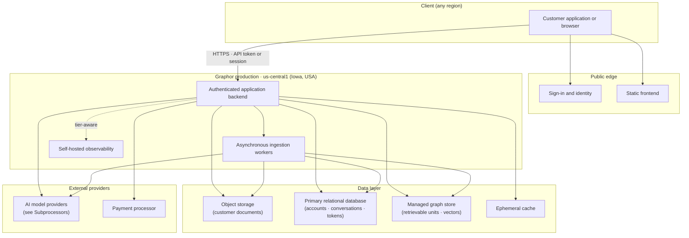
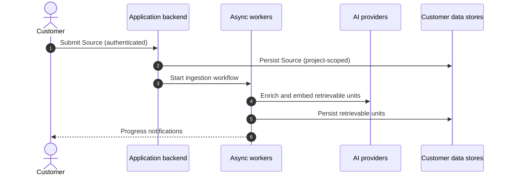
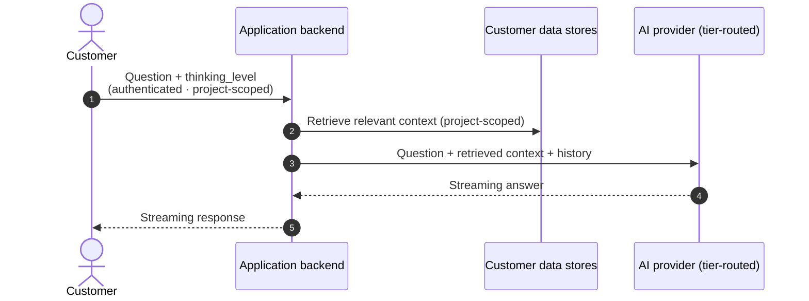

## About this page

This page is the **conceptual public view** of the Graphor production architecture. It is intended for security and privacy reviewers who need to understand how the platform is put together at the layer at which trust commitments apply.

A more **detailed Architecture Whitepaper**, with per-component implementation specifics, deployment topology, and the supporting operational runbooks, is available to enterprise customers under NDA on request via [privacy@graphorlm.com](mailto:privacy@graphorlm.com).

## 1. Conceptual overview

The Graphor production environment is organized into five conceptual subsystem groups (Client, Public edge, Graphor production, Data layer, External providers). Customer interactions are authenticated at the edge, authorized at the application layer, and scoped to a single Project before any customer-content store is touched. The per-component breakdown across these groups is in [§4](#4-per-layer-summary).

The full per-component region inventory — including the region of every external dependency — is in [Data Residency §1](/trust/data-residency#1-per-component-residency). The complete subprocessor list is in [Subprocessors](/trust/subprocessors).

## 2. Ingestion flow

When a customer uploads a Source (document, web URL, code repository, transcript), the following sequence runs end to end:

The original document and the retrievable units derived from it remain in the customer's Project until the customer issues a delete via the [DSR API](/trust/data-retention#3-the-dsr-api). The full delete cascade is documented in [Data Retention §2](/trust/data-retention#2-the-delete-cascade).

## 3. Query flow

When the customer asks a question or runs a structured extraction, the following sequence runs:

Tier routing per request is determined by the `thinking_level` parameter. The specific provider for each tier and the customer-controllable parameters are documented in [Model Use and Training §1.2](/trust/model-use-and-training#12-query-time-per-sourcesask-or-data-extraction-request).

## 4. Per-layer summary

The five layers in the conceptual diagram, and where each is documented in detail:

| Layer | Role | Customer data touched | Documented at |
|-------|------|------------------------|----------------|
| **Client** | Customer application or browser. | None (resides with the customer). | — |
| **Public edge** | Static frontend assets and sign-in / identity provider. The frontend serves no customer data itself; the identity provider handles authentication. | Account Information only at sign-in. | [Subprocessors §6](/trust/subprocessors#6-authentication) |
| **Application backend** | Stateless authenticated HTTP and streaming surface. Scopes every request to a single Project, orchestrates workflows, routes inference. | Customer Content and Derived Content transit, nothing persisted on the backend instances. | [Tenant Isolation §1](/trust/tenant-isolation#1-isolation-by-layer) |
| **Asynchronous workers** | Long-running ingestion workflow — parsing, chunking, enrichment, embedding, indexing. | Customer Content during parsing, Derived Content during indexing. | [Subprocessors §2](/trust/subprocessors#2-cloud-infrastructure-production) |
| **Self-hosted observability** | Operational tracing for the application backend. Tier-aware: enterprise default OFF; free / pro default ON with a Brazilian-PII mask. | Tier-dependent. See [Data Retention §4](/trust/data-retention#4-observability-traces). | [Subprocessors §4](/trust/subprocessors#4-observability-tier-dependent) |
| **Customer data stores** | Object storage for original documents; relational and graph stores for metadata, retrievable units, and history; an ephemeral cache for in-flight operations. | All four customer-data categories: Customer Content, Derived Content, Account Information, Billing identifiers. | [Data Retention §1](/trust/data-retention#1-retention-by-data-category), [Data Residency §1](/trust/data-residency#1-per-component-residency) |
| **External AI providers** | Tier-routed model inference and embeddings. | Per-request: question and retrieved context. Per-build: chunked text for embedding. | [Subprocessors §3](/trust/subprocessors#3-ai-model-providers), [Model Use and Training](/trust/model-use-and-training) |
| **External payment processor** | Subscription processing. | Billing identifiers only; never Customer Content. | [Subprocessors §5](/trust/subprocessors#5-payment-and-billing) |

## 5. Public network surface

The customer-facing surface is intentionally narrow:

| Surface | URL | Purpose | Authentication |
|---------|-----|---------|----------------|
| Marketing site | `https://graphorlm.com` | Product information, pricing, legal pages. | None. |
| Documentation | `https://docs.graphorlm.com` | This site. | None. |
| Application UI | `https://app.graphorlm.com` | Customer-facing application. | Sign-in via the identity provider → session cookie. |
| REST and streaming API | Paths under `https://app.graphorlm.com` | Programmatic access. | API token (`Authorization: Bearer <token>`) — see [Tenant Isolation §2](/trust/tenant-isolation#2-api-tokens). |
| MCP endpoints | Per-Project, issued at Project creation | Model Context Protocol transports for external AI clients. | API token. |

All HTTPS traffic is served on managed certificates. TLS 1.2 or above is enforced; older protocol versions are rejected at the load balancer. Per-route security headers (HSTS, CSP, X-Content-Type-Options, Referrer-Policy) are set on every response from the application backend.

There is no public surface other than the five above — no SSH, no administrative console, no direct database access path. Internal operational tooling (CI/CD, monitoring, alerting) runs entirely on the Synapse-controlled side of the network and is not customer-reachable.

## 6. What is NOT in the architecture

Stating these explicitly avoids confusion for security reviewers comparing Graphor against other vendors:

- **No customer-deployed agents.** Graphor does not require a customer-side daemon, gateway, or VPC peering. Integration is via the public surface listed above.
- **No SSO into a customer-owned identity provider** today. Sign-in is via the managed identity provider in [§5](#5-public-network-surface). SAML or OIDC-to-customer-IdP is on the enterprise-tier roadmap.
- **No Bring-Your-Own-Cloud (BYOC) deployment.** See [Tenant Isolation §3](/trust/tenant-isolation#3-explicit-non-decisions) for the explicit non-decision.
- **No on-premise deployment.** Graphor is a cloud-only product. On-premise is not on the roadmap.

## 7. Architecture Whitepaper (NDA)

An enterprise-grade Architecture Whitepaper, with per-component implementation details, deployment topology, monitoring and alerting structure, and the operational runbooks for incident response and disaster recovery, is available to customers under NDA on request via [privacy@graphorlm.com](mailto:privacy@graphorlm.com). It is the level of detail typically requested by a SOC 2 auditor or an enterprise security questionnaire that goes beyond the public Trust Center.

## 8. Change history

| Version | Date | Change |
|---------|------|--------|
| 1.0 | 2026-06-21 | Initial publication of the conceptual architecture view. |

When the conceptual architecture, the public network surface, or the layer model changes materially, this table is updated and subscribers to [subprocessors@graphorlm.com](mailto:subprocessors@graphorlm.com) receive an email.

## Contact

- General architecture and security inquiries: [privacy@graphorlm.com](mailto:privacy@graphorlm.com)
- Enterprise deployment options (SSO, BYOC, dedicated tenancy): [privacy@graphorlm.com](mailto:privacy@graphorlm.com)
- Customer support: [support@graphorlm.com](mailto:support@graphorlm.com)
