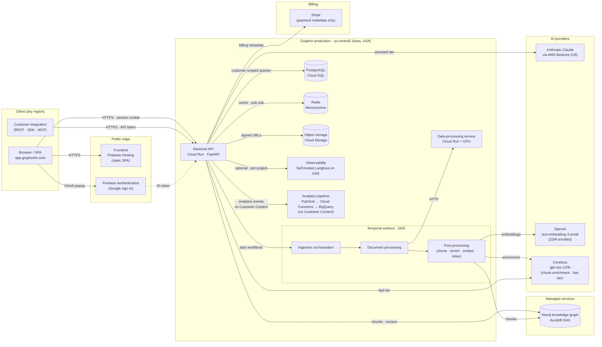
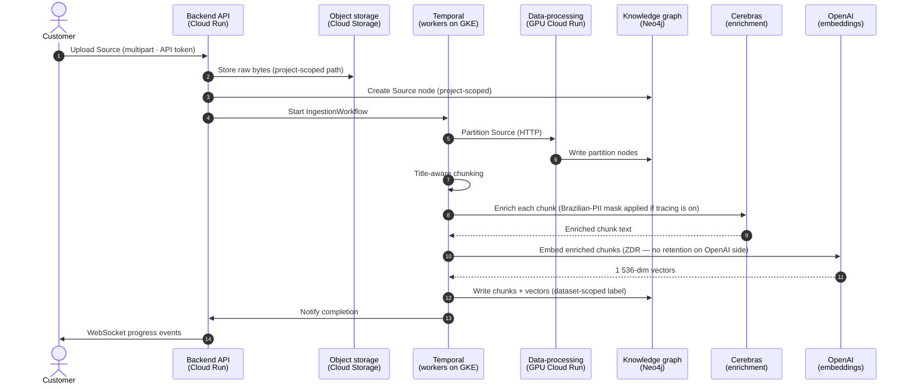

## About this page

This page is the **public, sanitized view** of the Graphor production architecture. It is intended for security and privacy reviewers who need to understand how the platform is put together before reading the more specific Trust Center pages on [subprocessors](/trust/subprocessors), [data retention](/trust/data-retention), [model use](/trust/model-use-and-training), [tenant isolation](/trust/tenant-isolation), and [data residency](/trust/data-residency).

The diagrams and per-component descriptions below exclude operational detail that would not be appropriate to publish (service-account naming patterns, internal hostnames, deployment pipelines, secret-rotation procedures, the specific monitoring and alerting topology). Customers with a legitimate need for that level of detail can request it under NDA via [privacy@graphorlm.com](mailto:privacy@graphorlm.com).

## 1. System overview



Every component is in `us-central1` (Iowa, USA) except AWS Bedrock (US regions only — see [Data Residency §2](/trust/data-residency#2-ai-model-providers)) and the managed Neo4j AuraDB instance (North-American region). The full per-component region inventory is in [Data Residency §1](/trust/data-residency#1-per-component-residency).

## 2. Ingestion flow

When the customer uploads a Source (PDF, DOCX, HTML, audio, video, etc.) or points Graphor at an external URL, GitHub repo, or YouTube video, the following sequence runs:



Once indexing completes, the Source is searchable. The original document bytes remain in the GCS bucket until the customer deletes the Source — see [Data Retention §2](/trust/data-retention#2-the-delete-cascade) for the end-to-end delete cascade.

## 3. Query flow (chat and structured extraction)

When the customer asks a question or runs a structured extraction, the following sequence runs:

```mermaid
sequenceDiagram
    autonumber
    actor Customer
    participant API as Backend API<br/>(Cloud Run)
    participant NEO as Knowledge graph<br/>(Neo4j · vector + FTS)
    participant LLM as AI provider<br/>(tier-based)
    participant PG as Postgres<br/>(conversation history)
    participant OBS as Observability<br/>(Langfuse · tier-aware)

    Customer->>API: Question + thinking_level<br/>(API token + project context)
    API->>NEO: Vector search (dataset-scoped index)
    NEO-->>API: Top-K chunks with provenance
    Note over API,LLM: Tier routing per Model Use §1.2
    API->>LLM: Question + retrieved chunks<br/>+ system prompt + history
    LLM-->>API: Streaming answer
    API->>PG: Persist message (project-scoped)
    API->>OBS: Trace (only if enabled for project; PII-masked)
    API-->>Customer: Streaming response
```

Tier routing:

| `thinking_level` | Tier | Provider |
|------------------|------|----------|
| `fast` | Fast | Cerebras (`gpt-oss-120b`) |
| `balanced`, `accurate` (default), `max` | Standard | Anthropic Claude on AWS Bedrock |

See [Model Use and Training §1.2](/trust/model-use-and-training#12-query-time-per-sourcesask-or-data-extraction-request) for the full tier description and [Tenant Isolation §4](/trust/tenant-isolation#4-observability-traces) for the tier-aware observability behaviour.

## 4. Per-component summary

The table consolidates what each component is, what data it sees, and which Trust Center page covers it in depth.

| Component | What it is | Customer data | More detail |
|-----------|-----------|---------------|-------------|
| **Frontend (SPA)** | React + Vite single-page app served from Firebase Hosting. Contains no customer data — all reads are against the backend API. | None (static) | — |
| **Backend API (Cloud Run)** | FastAPI HTTP + WebSocket service. Authenticates every request, scopes by Project, routes to workflows or AI providers. | Customer Content + Derived Content + Account Information transit; nothing stored on Cloud Run instances (stateless). | [Subprocessors §2](/trust/subprocessors#2-cloud-infrastructure-production), [Tenant Isolation §1](/trust/tenant-isolation#1-isolation-by-layer) |
| **Temporal workers (GKE)** | Three worker pools (orchestration, processing, post-processing) implementing the ingestion workflow. | Customer Content (during partitioning) + Derived Content (during chunking/embedding/indexing). | [Subprocessors §2](/trust/subprocessors#2-cloud-infrastructure-production) |
| **Data-processing service (GPU Cloud Run)** | Document partitioning service (OCR, visual embedding, table extraction). | Customer Content during partitioning. | [Subprocessors §2](/trust/subprocessors#2-cloud-infrastructure-production) |
| **PostgreSQL (Cloud SQL)** | Primary relational store — Account Information, Conversations, Datasets metadata, ApiTokens, billing record identifiers. Backups + PITR enabled. | Account Information + Conversation history + Project metadata. | [Data Retention §1](/trust/data-retention#1-retention-by-data-category), [Data Retention §5](/trust/data-retention#5-backups-and-disaster-recovery) |
| **Knowledge graph (Neo4j AuraDB)** | Source nodes, document partitions, source chunks (with embedding vectors), per-dataset vector and FTS indexes. | Customer Content (graph representation) + Derived Content. | [Subprocessors §2](/trust/subprocessors#2-cloud-infrastructure-production), [Tenant Isolation §1](/trust/tenant-isolation#1-isolation-by-layer) |
| **Redis (Memorystore)** | Ephemeral cache, WebSocket pub/sub, idempotency keys. No Customer Content persisted. | None persistent. | — |
| **Object storage (Cloud Storage)** | Raw uploaded Sources, model artifacts, public assets, certificates. Each bucket scoped to its purpose. | Customer Content in the `datasets` bucket only. | [Data Residency §1](/trust/data-residency#1-per-component-residency), [Tenant Isolation §1](/trust/tenant-isolation#1-isolation-by-layer) |
| **Observability (Langfuse on GKE)** | Self-hosted Langfuse for application tracing. Tier-aware: Enterprise default OFF, Free/Pro default ON with Brazilian-PII mask. | Tier-dependent. See [Data Retention §4](/trust/data-retention#4-observability-traces). | [Subprocessors §4](/trust/subprocessors#4-observability-tier-dependent) |
| **Analytics pipeline (Pub/Sub + Cloud Functions + BigQuery)** | Operational analytics — request counts, flow-execution metadata, no Customer Content. | None (operational metadata only). | — |
| **Firebase Authentication** | Sign-in and identity provider. Does not access Graphor application data. | Account Information only. | [Subprocessors §6](/trust/subprocessors#6-authentication) |
| **Stripe** | Payment processor. Receives billing metadata only — no Customer Content. | Billing Information only. | [Subprocessors §5](/trust/subprocessors#5-payment-and-billing) |
| **AWS Bedrock (Anthropic)** | Standard tier LLM provider. Receives per-request question + retrieved chunks. | Customer Content + Derived Content (per request). | [Model Use §1.2](/trust/model-use-and-training#12-query-time-per-sourcesask-or-data-extraction-request), [Subprocessors §3](/trust/subprocessors#3-ai-model-providers) |
| **OpenAI** | Embeddings provider (and optional reranker — off by default). ZDR enrolled. | Derived Content (chunk text for embedding). | [Model Use §4.3](/trust/model-use-and-training#43-openai-llc--embeddings-and-optional-reranker), [Subprocessors §3](/trust/subprocessors#3-ai-model-providers) |
| **Cerebras** | Chunk enrichment (every build) + fast tier inference (`thinking_level=fast`). Zero retention. | Customer Content + Derived Content. | [Model Use §4.4](/trust/model-use-and-training#44-cerebras-systems-inc--chunk-enrichment-and-fast-tier), [Subprocessors §3](/trust/subprocessors#3-ai-model-providers) |

## 5. Public network surface

The customer-facing surface is intentionally narrow:

| Surface | URL | Purpose | Authentication |
|---------|-----|---------|----------------|
| Marketing site | `https://graphorlm.com` | Product information, pricing, legal pages. | None. |
| Documentation | `https://docs.graphorlm.com` | This site. | None. |
| Application UI | `https://app.graphorlm.com` | Customer-facing application. | Firebase Auth (Google sign-in) → session cookie. |
| REST + WebSocket API | `https://app.graphorlm.com/api/v1/...` (paths under `app.graphorlm.com`) | Programmatic access. | API token (`Authorization: Bearer <token>`) — see [Tenant Isolation §2](/trust/tenant-isolation#2-api-tokens). |
| MCP endpoints | Customer-specific flow endpoints (issued per Project) | Model Context Protocol transports for external AI clients. | API token. |

All HTTPS traffic terminates on Google-managed certificates. TLS 1.2+ is enforced; older protocol versions are rejected at the load balancer. Per-route security headers (HSTS, CSP, X-Content-Type-Options, Referrer-Policy) are set on every response from the API.

There is no public surface other than the four above — no SSH, no admin console, no direct database access path. Internal operational tooling (CI/CD, monitoring, alerting) runs on the Synapse-controlled side of the network only.

## 6. Things that are NOT in the architecture

Stating these explicitly avoids confusion for SI reviewers comparing Graphor against other vendors:

- **No customer-deployed agents.** Graphor does not require a customer-side daemon, gateway, or VPC peering. Integration is via the public REST API and the MCP transports listed above.
- **No SSO into a customer's own identity provider** today. Sign-in is via Firebase Authentication (Google OAuth). SAML / OIDC-to-customer-IdP is on the roadmap for the enterprise tier but is not yet GA.
- **No data warehouse hand-off to the customer** (other than the analytics pipeline described in [§4](#4-per-component-summary), which is operational metadata only). Customer-visible audit logs are described in the [Audit Logs](/trust/audit-logs) page.
- **No customer-managed-cloud (BYOC) deployment** today. See [Tenant Isolation §3](/trust/tenant-isolation#3-explicit-non-decisions) for the explicit non-decision.
- **No on-premise deployment.** Graphor is a cloud-only product. On-premise is not on the roadmap.

## 7. Change history

| Version | Date | Change |
|---------|------|--------|
| 1.0 | 2026-06-21 | Initial publication. |

When the architecture diagram, the per-component table, or the public network surface changes materially, this table is updated and subscribers to [subprocessors@graphorlm.com](mailto:subprocessors@graphorlm.com) receive an email.

## Contact

- General architecture and security inquiries: [privacy@graphorlm.com](mailto:privacy@graphorlm.com)
- Enterprise deployment options (SAML, BYOC, dedicated tenancy): [privacy@graphorlm.com](mailto:privacy@graphorlm.com)
- Customer support: [support@graphorlm.com](mailto:support@graphorlm.com)
