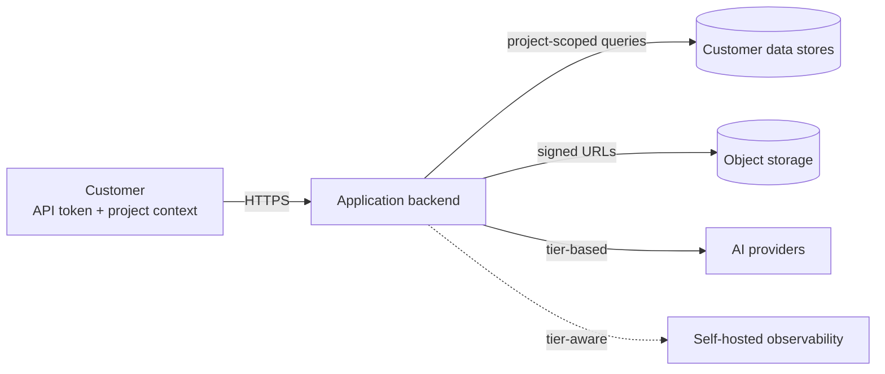

## What this is

The Graphor Trust Center is the canonical, public record of how Graphor handles customer data. It is intended for security, privacy, procurement, and compliance teams evaluating Graphor for use under LGPD, GDPR, and equivalent regimes.

Graphor is operated by **SYNAPSE INOVAÇÃO E TECNOLOGIA LTDA.**, a company organized under the laws of the Federative Republic of Brazil. Every claim on this site is verifiable against the running production system or against a cited third-party document.

This page summarizes the posture across nine dimensions in one place. Each row links to the detail page that owns the topic — when an SI questionnaire asks about a specific area, follow the link and you will find the structured, source-of-truth answer.

## 1. The summary

| Dimension | Posture | Detail |
|-----------|---------|--------|
| **Region** | All production resources in `us-central1` (Iowa, USA). AI model inference served from US AWS regions only (with São Paulo configured as inactive failover). Stg is out of scope — no real customer data. | [Data Residency](/trust/data-residency) |
| **Architecture** | Single cloud project; logical multi-tenancy. Public surface limited to the marketing site, documentation, application UI, REST + streaming API, and per-project MCP endpoints. No SSH, no admin console, no direct database access path. | [Architecture](/trust/architecture) |
| **Subprocessors** | Versioned list of every third party that may process customer data. Marketing-site analytics is consent-gated and absent from legal routes. Subscribe to [subprocessors@graphorlm.com](mailto:subprocessors@graphorlm.com) for change notifications. | [Subprocessors](/trust/subprocessors) |
| **Model use and training** | Customer Content is never used to train any AI model — Graphor's or any subprocessor's. Verbatim citations from each AI provider back the commitment. Tier-based provider declaration via the `thinking_level` request parameter. | [Model Use and Training](/trust/model-use-and-training) |
| **Encryption** | At-rest: cloud-provider-managed AES-256 by default (FIPS 140-2 validated, automatic rotation). Customer-managed encryption keys available on request for enterprise customers — no committed delivery date. In-transit: TLS 1.2+ on every public surface; older protocol versions rejected at the load balancer. | This page §3 + [Architecture §5](/trust/architecture#5-public-network-surface) |
| **Tenant isolation** | Single-tenant logical isolation on shared infrastructure. Per-project API tokens with TTL + last-used auditing. Tier-aware observability (Enterprise default OFF; Free/Pro default ON with Brazilian PII mask). Per-org tokens and IP allowlist are conscious non-decisions. | [Tenant Isolation](/trust/tenant-isolation) |
| **Retention and deletion** | Indefinite retention until the customer explicitly deletes. Every delete cascades end-to-end across the primary database, the managed graph store, object storage, and observability traces. Customer-callable DSR API satisfies LGPD art. 18 / GDPR art. 17. Observability traces are **default OFF on Enterprise tier** (no traces produced); when explicitly opted in by the project owner, Enterprise traces have a **30-day** TTL. Free/Pro tiers have observability **default ON** with a **90-day** TTL. Database backups + point-in-time recovery enabled with a 7-day window. | [Data Retention](/trust/data-retention) |
| **Incident response** | 72-hour breach notification to the affected customer after Graphor internally confirms a customer-data incident. Channel: [privacy@graphorlm.com](mailto:privacy@graphorlm.com). Post-mortem to affected customer within 14 days. | [Incident Response](/trust/incident-response) |
| **Compliance posture** | Synapse does not yet hold its own SOC 2 Type II or ISO 27001 certifications — honest, no aspirational dates. Inherited certifications from subprocessors are summarized in [Compliance §3](/trust/compliance#3-inherited-certifications). | [Compliance](/trust/compliance) |

## 2. Data flow at a glance

The customer interacts with Graphor through one of four authenticated surfaces (UI, REST API, streaming, MCP transports). Each request is authenticated and scoped to a single Project before any customer-content store is touched.

The complete ingestion and query sequences (with sub-component detail) are in [Architecture §2](/trust/architecture#2-ingestion-flow) and [§3](/trust/architecture#3-query-flow).

## 3. Encryption posture

| Layer | Default | Available |
|-------|---------|-----------|
| At-rest, all stores | Cloud-provider-managed AES-256 (FIPS 140-2 validated, automatic rotation) | **Customer-managed encryption keys** on request for the enterprise tier. No committed delivery date — enterprise customers needing customer-managed keys can scope the request via [privacy@graphorlm.com](mailto:privacy@graphorlm.com) and receive a per-customer IaC change. |
| In-transit, every public surface | TLS 1.2+; older protocols rejected at the load balancer; managed certificates | mTLS for customer-to-Graphor on request for enterprise contracts |
| Per-record / column-level encryption | Not applied | Not on the roadmap — application-layer tenant isolation is the primary control |

Encryption posture for the AI-provider subprocessors is governed by each provider's own commitments — see [Model Use and Training §4](/trust/model-use-and-training#4-per-provider-evidence-verbatim) for the verbatim citations.

## 4. The Trust Center pages

| Page | Topic |
|------|-------|
| [Architecture](/trust/architecture) | Conceptual architecture, layer map, ingestion and query sequences, public network surface |
| [Subprocessors](/trust/subprocessors) | Versioned list of every third-party that may process customer data, with related-party disclosure and inherited certifications |
| [Model Use and Training](/trust/model-use-and-training) | Non-training commitment, tier-based provider declaration, verbatim citation table, currently-running model annex |
| [Data Retention](/trust/data-retention) | Per-category retention table, end-to-end delete cascade, DSR API, observability TTL, backup posture |
| [Tenant Isolation](/trust/tenant-isolation) | Application + database + storage + token isolation; tier-aware observability; explicit non-decisions |
| [Data Residency](/trust/data-residency) | Per-component region inventory, AI-provider region detail, international transfer regime, EU + Brazil roadmap |
| [Incident Response](/trust/incident-response) | 72-hour notification SLA, detection and triage process, customer-side reporting path, post-mortem commitment |
| [Compliance](/trust/compliance) | Honest certification status, inherited subprocessor certifications, compensating-controls inventory |
| Legal: [Privacy Policy](/legal/privacy-policy), [Terms of Service](/legal/terms-of-service), [Data Processing Addendum](/legal/dpa-template) | Contractual instruments under which the Trust Center commitments are binding |

## 5. How to read this site

- **For an enterprise SI evaluation**: start with this page for the one-pager, then read [Subprocessors](/trust/subprocessors), [Model Use](/trust/model-use-and-training), and [Data Retention](/trust/data-retention) — they cover the questions on most LGPD/GDPR/EOAB checklists. Use the [DPA template](/legal/dpa-template) to start the contractual conversation.
- **For procurement**: the [Compliance](/trust/compliance) page lists what is certified and what is not, with inherited certifications and compensating controls. Synapse can provide subprocessor audit reports under NDA on request.
- **For privacy / DPO review**: [Privacy Policy](/legal/privacy-policy) (LGPD art. 18 and GDPR art. 15–22 rights), [Data Retention](/trust/data-retention) (the DSR API), [Data Residency](/trust/data-residency) (LGPD art. 33 international-transfer regime).
- **For developer integration questions** (API auth, rate limits, SDK, MCP): the Documentation, SDK, and API Reference tabs of this site.

## 6. Subscribing to changes

When any Trust Center or Legal page changes materially, subscribers to [subprocessors@graphorlm.com](mailto:subprocessors@graphorlm.com) receive a single notification email per change with a summary and the link to the new revision. Material additions to the subprocessor inventory are published **at least 30 days before** they take effect in production, except when the addition is required to remediate an active security incident.

## 7. Change history

| Version | Date | Change |
|---------|------|--------|
| 1.0 | 2026-06-21 | Initial publication of the Trust Center landing page. |

## Contact

- General privacy, security, and DPA inquiries: [privacy@graphorlm.com](mailto:privacy@graphorlm.com)
- Subprocessor and policy change notifications: [subprocessors@graphorlm.com](mailto:subprocessors@graphorlm.com)
- Customer support: [support@graphorlm.com](mailto:support@graphorlm.com)
